# Tài liệu Thiết kế Hệ thống (System Design Document)
## Dự án: Travel Tour Booking – Admin Panel
### Phạm vi tài liệu: Quản lý nhóm quyền · Quản lý tài khoản quản trị · Chỉnh sửa thông tin website · Quản lý thông tin cá nhân

---

> **Thông tin dự án**
> - **Tech Stack:** Node.js (Express 5) · MongoDB Atlas (Mongoose) · Pug SSR · JWT · bcryptjs · Cloudinary · Multer
> - **Kiến trúc:** MVC – Model / View (Pug) / Controller
> - **Tác nhân quản trị:** Admin (toàn quyền) · Manager · Seller (xem use case diagram tổng quát)

---

## MỤC LỤC

1. [PHẦN I – PHÂN TÍCH (ANALYSIS)](#phần-i--phân-tích-analysis)
   - 1.1 [Kịch bản chuẩn và ngoại lệ (Scenarios)](#11-kịch-bản-chuẩn-và-ngoại-lệ-scenarios)
   - 1.2 [Phân tích tĩnh – Trích xuất lớp thực thể (Entity Class Extraction)](#12-phân-tích-tĩnh--trích-xuất-lớp-thực-thể-entity-class-extraction)
   - 1.3 [Phân tích tĩnh – Sơ đồ lớp (Analysis Class Diagram)](#13-phân-tích-tĩnh--sơ-đồ-lớp-analysis-class-diagram)
   - 1.4 [Phân tích động – Sơ đồ tuần tự (Analysis Sequence Diagram)](#14-phân-tích-động--sơ-đồ-tuần-tự-analysis-sequence-diagram)
2. [PHẦN II – THIẾT KẾ (DESIGN)](#phần-ii--thiết-kế-design)
   - 2.1 [Thiết kế lớp thực thể (Entity Classes Design)](#21-thiết-kế-lớp-thực-thể-entity-classes-design)
   - 2.2 [Thiết kế Cơ sở dữ liệu (Database Design)](#22-thiết-kế-cơ-sở-dữ-liệu-database-design)
   - 2.3 [Thiết kế tĩnh – Sơ đồ lớp (Design Class Diagram)](#23-thiết-kế-tĩnh--sơ-đồ-lớp-design-class-diagram)
   - 2.4 [Thiết kế động – Sơ đồ tuần tự (Design Sequence Diagram)](#24-thiết-kế-động--sơ-đồ-tuần-tự-design-sequence-diagram)

---

# PHẦN I – PHÂN TÍCH (ANALYSIS)

## 1.1 Kịch bản chuẩn và ngoại lệ (Scenarios)

> Phương pháp: Mỗi use case được mô tả bằng kịch bản chuẩn (standard scenario) theo từng bước tương tác giữa tác nhân và hệ thống, kèm các kịch bản ngoại lệ (exceptional scenarios) ứng với các bước có thể xảy ra lỗi.

---

### Use case 1: Quản lý nhóm quyền (Manage Roles)

#### Kịch bản chuẩn: Tạo nhóm quyền mới

1. Admin đăng nhập thành công vào hệ thống. Giao diện Admin Panel hiện ra với menu điều hướng bên trái gồm các mục: Dashboard, Danh mục, Tour, Đơn hàng, Khách hàng, Cài đặt.
2. Admin chọn mục **Cài đặt** → chọn **Nhóm quyền**.
3. Hệ thống hiển thị giao diện **Danh sách nhóm quyền** với bảng gồm các cột: Tên nhóm quyền, Mô tả, Ngày tạo, Hành động. Trên cùng có ô tìm kiếm theo tên và nút **+ Tạo nhóm quyền**.
4. Admin nhấn nút **+ Tạo nhóm quyền**.
5. Hệ thống chuyển sang giao diện **Tạo nhóm quyền** với form gồm:
   - Ô nhập **Tên nhóm quyền** (bắt buộc)
   - Ô nhập **Mô tả ngắn**
   - Danh sách checkbox **Phân quyền**: Xem trang tổng quan, Xem danh mục, Tạo danh mục, Sửa danh mục, Xoá danh mục, Xem tour, Tạo tour, Sửa tour, Xoá tour
   - Nút **Tạo mới**
6. Admin nhập tên nhóm quyền là `"Manager"`, mô tả là `"Nhóm quản lý tour và danh mục"`, tích chọn các quyền: Xem trang tổng quan, Xem danh mục, Xem tour, Sửa tour.
7. Admin nhấn nút **Tạo mới**.
8. Hệ thống validate dữ liệu (tên nhóm quyền không được rỗng), ghi nhận `createdBy` là ID của admin hiện tại, lưu bản ghi mới vào collection `roles` (MongoDB Atlas). Slug tự động sinh từ `roleName` qua plugin `mongoose-slug-updater`.
9. Hệ thống trả về JSON `{ code: "success", message: "Nhóm quyền đã được tạo thành công" }`.
10. Giao diện hiển thị toast thông báo **thành công** (Notyf). Trang tự động reload và quay về danh sách nhóm quyền, hiển thị nhóm `"Manager"` vừa tạo ở đầu danh sách.

#### Kịch bản chuẩn: Chỉnh sửa nhóm quyền

1. Tại giao diện danh sách nhóm quyền, Admin tìm kiếm nhóm `"Manager"` bằng ô tìm kiếm, hệ thống lọc và hiển thị kết quả.
2. Admin nhấn nút **Sửa** (icon edit) tương ứng với nhóm `"Manager"`.
3. Hệ thống tải thông tin nhóm quyền theo `id` từ MongoDB, hiển thị giao diện **Sửa nhóm quyền** với các trường được điền sẵn giá trị hiện tại. Danh sách checkbox phân quyền hiển thị các quyền đã chọn ở trạng thái tích.
4. Admin bổ sung thêm quyền **Tạo tour** bằng cách tích thêm checkbox tương ứng.
5. Admin nhấn nút **Cập nhật**.
6. Hệ thống thực hiện `PATCH /admin/setting/role/edit/:id`, gọi `Role.findByIdAndUpdate(id, req.body)` cập nhật trường `rolePermissions` trong MongoDB.
7. Hệ thống trả về JSON `{ code: "success", message: "Nhóm quyền đã được cập nhật thành công" }`.
8. Giao diện hiển thị toast **thành công**. Trang reload về danh sách nhóm quyền.

#### Kịch bản chuẩn: Xoá nhóm quyền

1. Tại danh sách nhóm quyền, Admin nhấn nút **Xoá** (icon delete) trên dòng nhóm cần xoá.
2. Giao diện hiển thị hộp thoại xác nhận.
3. Admin nhấn **Xác nhận**.
4. Hệ thống thực hiện `PATCH /admin/setting/role/delete/:id`, ghi `deleted: true`, `deletedBy`, `deletedAt` vào MongoDB (soft delete).
5. Hệ thống trả về JSON `{ code: "success", message: "Đã xoá nhóm quyền thành công!" }`.
6. Giao diện hiển thị toast **thành công**, nhóm quyền vừa xoá biến mất khỏi danh sách.

#### Kịch bản ngoại lệ

- **Bước 7 (Tạo):** Tên nhóm quyền bị bỏ trống → Hệ thống trả về `{ code: "error", message: "Dữ liệu không hợp lệ!" }`, toast lỗi hiển thị, form không submit.
- **Bước 3 (Sửa/Xoá):** ID nhóm quyền không tồn tại trong DB → Hệ thống trả về `{ code: "error", message: "Nhóm quyền không tồn tại!" }`, chuyển hướng về danh sách.

---

### Use case 2: Quản lý tài khoản quản trị (Manage Admin Accounts)

#### Kịch bản chuẩn: Tạo tài khoản quản trị mới

1. Admin đăng nhập thành công. Menu Admin Panel hiện ra đầy đủ các mục điều hướng.
2. Admin chọn **Cài đặt** → **Tài khoản quản trị**.
3. Hệ thống hiển thị giao diện **Danh sách tài khoản quản trị** với bảng gồm: Avatar, Họ tên, Email, Số điện thoại, Nhóm quyền, Trạng thái, Ngày tạo, Hành động. Bộ lọc phía trên bảng gồm: lọc theo trạng thái (initial / active / inactive), lọc theo nhóm quyền, lọc theo ngày tạo, ô tìm kiếm theo tên.
4. Admin nhấn nút **+ Tạo tài khoản**.
5. Hệ thống hiển thị giao diện **Tạo tài khoản quản trị** với form gồm:
   - Họ tên * (bắt buộc)
   - Email * (bắt buộc, không trùng)
   - Số điện thoại (không trùng)
   - Nhóm quyền * (dropdown chọn từ danh sách roles)
   - Chức vụ
   - Trạng thái (initial / active / inactive)
   - Mật khẩu * (bắt buộc)
   - Ảnh đại diện (upload qua FilePond → Cloudinary)
   - Nút **Tạo mới**
6. Admin điền: Họ tên `"Nguyễn Văn B"`, Email `"nhanvienb@travel.vn"`, SĐT `"0912345678"`, Nhóm quyền chọn `"Manager"`, Chức vụ `"Nhân viên"`, Trạng thái `"active"`, Mật khẩu `"123456"`. Chọn ảnh đại diện qua FilePond.
7. Admin nhấn nút **Tạo mới**.
8. Hệ thống kiểm tra email chưa tồn tại trong DB, kiểm tra SĐT chưa tồn tại. Hash mật khẩu bằng `bcrypt.hash(password, salt)`. Lưu ảnh lên Cloudinary qua Multer, lấy `req.file.path` làm URL avatar. Ghi `createdBy` là ID admin hiện tại. Lưu bản ghi mới vào collection `accounts-admin`.
9. Hệ thống trả về `{ code: "success", message: "Tài khoản quản trị đã được tạo thành công" }`.
10. Giao diện hiển thị toast **thành công**, trang reload về danh sách tài khoản quản trị, tài khoản `"Nguyễn Văn B"` hiển thị ở đầu danh sách với trạng thái **active**.

#### Kịch bản chuẩn: Chỉnh sửa tài khoản quản trị

1. Tại danh sách tài khoản quản trị, Admin lọc theo nhóm quyền `"Manager"`, tìm tài khoản `"Nguyễn Văn B"`.
2. Admin nhấn **Sửa** (icon edit) trên dòng tài khoản `"Nguyễn Văn B"`.
3. Hệ thống tải thông tin tài khoản theo `id`, hiển thị giao diện **Sửa tài khoản quản trị** với các trường điền sẵn giá trị hiện tại. Ảnh đại diện hiển thị trong FilePond preview.
4. Admin đổi Trạng thái từ `"active"` sang `"inactive"` và cập nhật Chức vụ thành `"Trưởng nhóm"`.
5. Admin nhấn **Cập nhật**.
6. Hệ thống thực hiện `PATCH /admin/setting/account-admin/edit/:id`. Nếu có file ảnh mới thì cập nhật `avatar = req.file.path`, ngược lại giữ nguyên. Gọi `AccountAdmin.findByIdAndUpdate(id, req.body)`.
7. Hệ thống trả về `{ code: "success", message: "Tài khoản quản trị đã được cập nhật thành công" }`.
8. Giao diện hiển thị toast **thành công**, trang reload. Tài khoản `"Nguyễn Văn B"` hiển thị trạng thái **inactive**.

#### Kịch bản chuẩn: Xoá tài khoản quản trị (soft delete)

1. Tại danh sách tài khoản quản trị, Admin nhấn **Xoá** trên dòng tài khoản cần xoá.
2. Giao diện hiển thị xác nhận.
3. Admin xác nhận.
4. Hệ thống thực hiện `PATCH /admin/setting/account-admin/delete/:id`, cập nhật `deleted: true`, `status: "inactive"`, `deletedBy`, `deletedAt`.
5. Hệ thống trả về `{ code: "success", message: "Đã xoá tài khoản quản trị!" }`.
6. Tài khoản biến mất khỏi danh sách.

#### Kịch bản ngoại lệ

- **Bước 8 (Tạo):** Email đã tồn tại → `{ code: "error", message: "Email đã tồn tại!" }`.
- **Bước 8 (Tạo):** SĐT đã tồn tại → `{ code: "error", message: "Số điện thoại đã tồn tại!" }`.
- **Bước 3 (Sửa/Xoá):** ID tài khoản không tồn tại → `{ code: "error", message: "Tài khoản quản trị không tồn tại!" }`.
- **Bước 5 (Tạo):** Mật khẩu rỗng hoặc họ tên rỗng → Form validate lỗi phía FE, không submit.

---

### Use case 3: Chỉnh sửa thông tin website (Edit Website Info)

#### Kịch bản chuẩn

1. Admin đăng nhập thành công vào hệ thống.
2. Admin chọn **Cài đặt** → **Thông tin website**.
3. Hệ thống truy vấn `SettingWebsiteInfo.findOne({})` để lấy bản ghi cài đặt duy nhất, hiển thị giao diện **Thông tin website** với form điền sẵn các giá trị hiện tại:
   - Tên website: `"Travel Tour"`
   - Số điện thoại: `"19001234"`
   - Email: `"contact@traveltour.vn"`
   - Địa chỉ: `"123 Nguyễn Huệ, TP.HCM"`
   - Logo: hiển thị ảnh hiện tại trong FilePond preview
   - Favicon: hiển thị icon hiện tại trong FilePond preview
   - Nút **Cập nhật**
4. Admin cập nhật Số điện thoại thành `"19009999"` và chọn ảnh Logo mới qua FilePond.
5. Admin nhấn **Cập nhật**.
6. Hệ thống thực hiện `PATCH /admin/setting/website-info` với `upload.fields([{name:'logo'},{name:'favicon'}])`. Controller lấy `req.files.logo[0].path` làm URL logo mới từ Cloudinary; nếu không upload favicon mới thì giữ `""`.
7. Hệ thống gọi `SettingWebsiteInfo.findOneAndUpdate({}, req.body, { upsert: true })` – nếu chưa có bản ghi thì tự tạo mới.
8. Hệ thống trả về `{ code: "success", message: "Thông tin Website đã được cập nhật thành công" }`.
9. Giao diện hiển thị toast **thành công**. Các thay đổi (SĐT mới, logo mới) được phản ánh ngay khi trang reload.

#### Kịch bản ngoại lệ

- **Bước 6:** File upload vượt quá kích thước giới hạn Cloudinary → Hệ thống ném lỗi 500, giao diện hiển thị toast **lỗi server**.
- **Bước 6:** Kết nối Cloudinary thất bại (API Key sai) → `req.files` không có `path`, dữ liệu không được lưu đúng.

---

### Use case 4: Quản lý thông tin cá nhân (Manage Personal Profile)

#### Kịch bản chuẩn: Chỉnh sửa hồ sơ cá nhân

1. Admin đang làm việc trong Admin Panel. Trên header hiển thị ảnh đại diện và tên tài khoản đang đăng nhập (lấy từ `res.locals.account`).
2. Admin nhấn vào tên/avatar của mình ở header → chọn **Thông tin cá nhân**.
3. Hệ thống render giao diện **Chỉnh sửa thông tin cá nhân** (route `GET /admin/profile/edit`), hiển thị form:
   - Họ tên (input text)
   - Email (input email)
   - Số điện thoại (input text)
   - Chức vụ (input text, readonly)
   - Nhóm quyền (input text, readonly)
   - Ảnh đại diện (FilePond upload)
   - Nút **Cập nhật**
   - Link **Đổi mật khẩu**
4. Admin cập nhật trường Họ tên thành `"Nguyễn Admin"` và chọn ảnh đại diện mới.
5. Admin nhấn **Cập nhật**.
6. Hệ thống thực hiện `PATCH` về API profile, cập nhật thông tin tài khoản trong collection `accounts-admin`.
7. Hệ thống trả về JSON thành công.
8. Giao diện hiển thị toast **thành công**. Header cập nhật tên và avatar mới.

#### Kịch bản chuẩn: Đổi mật khẩu

1. Tại trang Thông tin cá nhân, Admin nhấn link **Đổi mật khẩu**.
2. Hệ thống render giao diện **Đổi mật khẩu** (route `GET /admin/profile/change-password`) với form:
   - Mật khẩu hiện tại
   - Mật khẩu mới
   - Xác nhận mật khẩu mới
   - Nút **Lưu**
3. Admin nhập mật khẩu hiện tại, mật khẩu mới và xác nhận.
4. Admin nhấn **Lưu**.
5. Hệ thống so sánh mật khẩu hiện tại bằng `bcrypt.compare()`, nếu khớp thì hash mật khẩu mới và gọi `AccountAdmin.findByIdAndUpdate()` cập nhật trường `passWord`.
6. Hệ thống trả về `{ code: "success", message: "Đổi mật khẩu thành công" }`.
7. Giao diện hiển thị toast **thành công**, Admin được tự động đăng xuất và chuyển về trang đăng nhập.

#### Kịch bản ngoại lệ

- **Bước 5 (Đổi mật khẩu):** Mật khẩu hiện tại không đúng → `{ code: "error", message: "Mật khẩu hiện tại không chính xác!" }`.
- **Bước 5 (Đổi mật khẩu):** Mật khẩu mới và xác nhận không khớp → Validate FE báo lỗi, form không submit.

---

## 1.2 Phân tích tĩnh – Trích xuất lớp thực thể (Entity Class Extraction)

> Phương pháp: Đọc kịch bản, gạch chân các danh từ quan trọng, loại bỏ trùng lặp và synonym, nhóm thành các lớp thực thể chính.

### Danh từ trích xuất từ 4 kịch bản

| STT | Danh từ gốc | Lớp thực thể | Ghi chú |
|-----|------------|--------------|---------|
| 1 | Admin, Tác nhân | `AccountAdmin` | Tài khoản quản trị viên đăng nhập hệ thống |
| 2 | Nhóm quyền | `Role` | Nhóm phân quyền gán cho tài khoản |
| 3 | Quyền (permission) | Thuộc tính của `Role` | Mảng chuỗi trong `rolePermissions[]` |
| 4 | Thông tin website | `SettingWebsiteInfo` | Bản ghi singleton cấu hình website |
| 5 | Thông tin cá nhân | Thuộc tính của `AccountAdmin` | Không tách thành lớp riêng |
| 6 | Mật khẩu (hash) | Thuộc tính `passWord` của `AccountAdmin` | Được hash bằng bcryptjs |
| 7 | Ảnh đại diện (avatar) | Thuộc tính URL của `AccountAdmin` / `SettingWebsiteInfo` | URL Cloudinary CDN |
| 8 | Token (JWT) | Không phải entity DB | Xử lý trong middleware `verifyToken` |
| 9 | Slug | Thuộc tính của `Role`, `AccountAdmin` | Tự sinh qua `mongoose-slug-updater` |

### Các lớp thực thể chính (3 lớp nghiệp vụ)

```
┌─────────────────┐    ┌──────────────────────┐    ┌───────────────────────┐
│   AccountAdmin  │    │        Role           │    │  SettingWebsiteInfo   │
├─────────────────┤    ├──────────────────────┤    ├───────────────────────┤
│ fullName        │    │ roleName             │    │ nameWebsite           │
│ email           │    │ description          │    │ phone                 │
│ phone           │◄───│ rolePermissions[]    │    │ email                 │
│ role (ref)      │    │ slug                 │    │ address               │
│ positionCompany │    │ createdBy            │    │ logo (URL)            │
│ status          │    │ deleted              │    │ favicon (URL)         │
│ passWord (hash) │    └──────────────────────┘    └───────────────────────┘
│ avatar (URL)    │
│ slug            │
│ createdBy       │
│ deleted         │
└─────────────────┘
```

---

## 1.3 Phân tích tĩnh – Sơ đồ lớp (Analysis Class Diagram)

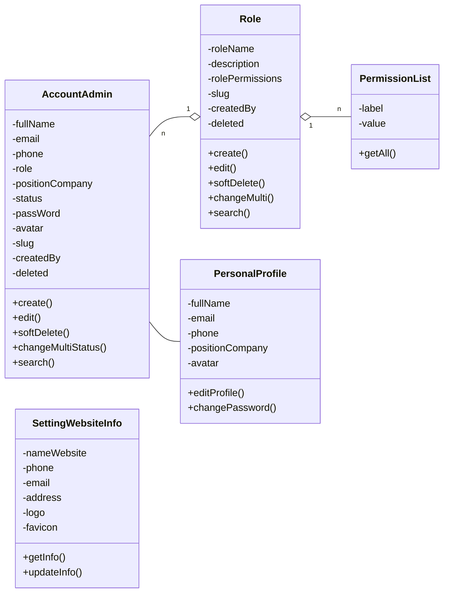

---

## 1.4 Phân tích động – Sơ đồ tuần tự (Analysis Sequence Diagram)

### SD-1: Tạo nhóm quyền mới

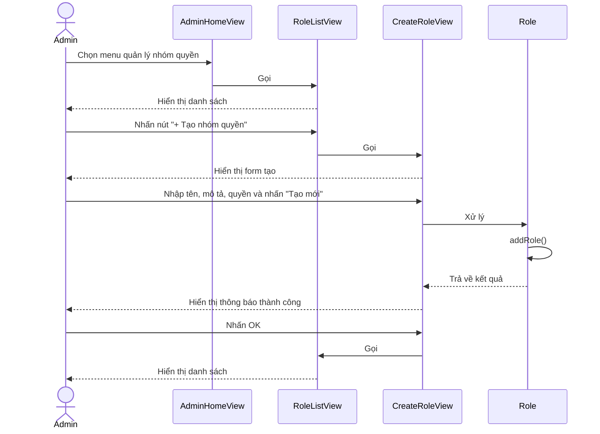

### SD-2: Tạo tài khoản quản trị

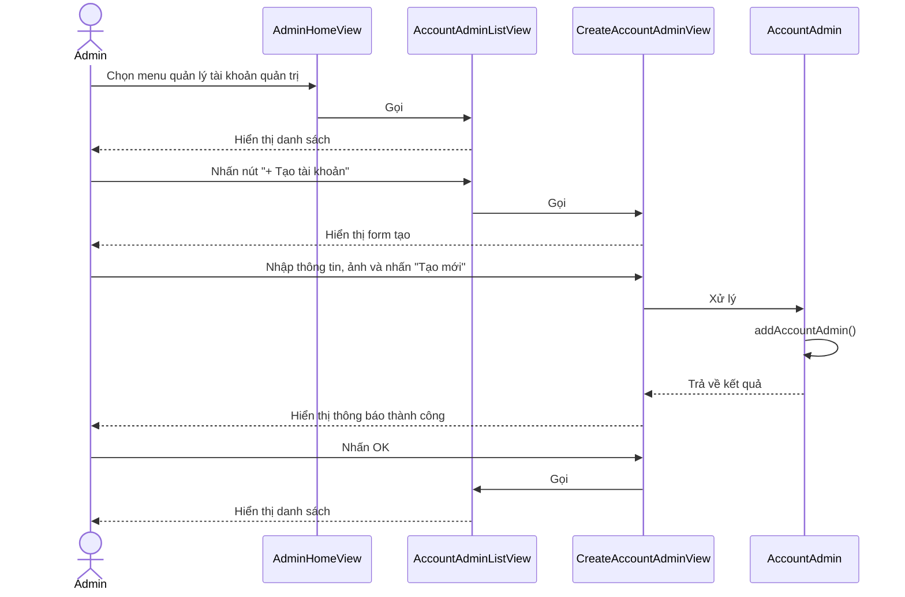

### SD-3: Chỉnh sửa thông tin website

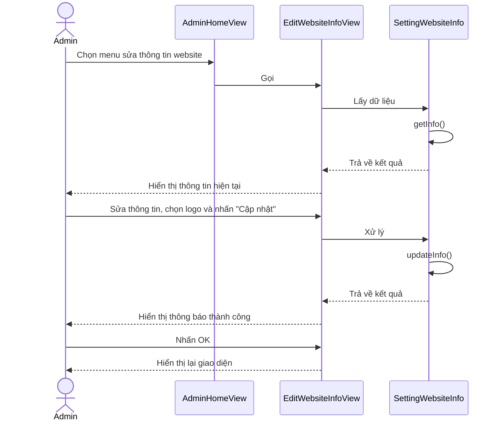

### SD-4: Quản lý thông tin cá nhân

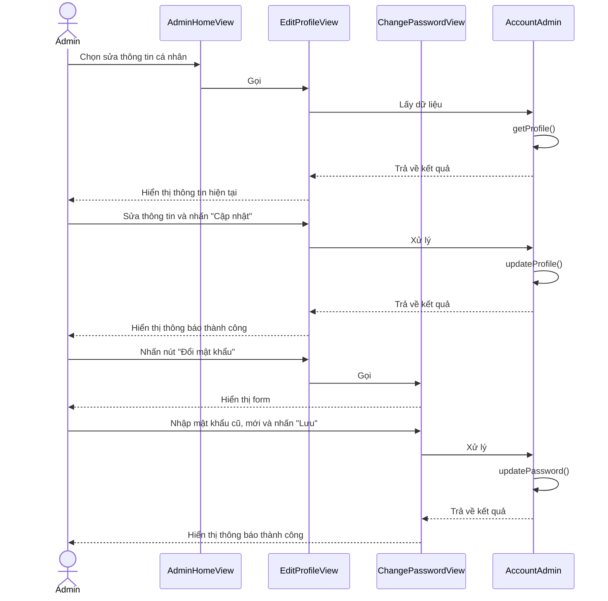

---

# PHẦN II – THIẾT KẾ (DESIGN)

## 2.1 Thiết kế lớp thực thể (Entity Classes Design)

### Lớp `AccountAdmin`

| Thuộc tính | Kiểu dữ liệu | Ràng buộc / Mô tả |
|---|---|---|
| `_id` | `ObjectId` | Khóa chính, tự sinh bởi MongoDB |
| `fullName` | `String` | Họ và tên đầy đủ |
| `email` | `String` | Email đăng nhập, không trùng lặp |
| `phone` | `String` | Số điện thoại, không trùng lặp |
| `role` | `String` (ref ObjectId) | ID nhóm quyền tham chiếu sang collection `roles` |
| `positionCompany` | `String` | Chức vụ trong công ty |
| `status` | `String` | Enum: `"initial"` / `"active"` / `"inactive"` |
| `passWord` | `String` | Mật khẩu đã hash bcrypt (cost factor = 10) |
| `avatar` | `String` | URL Cloudinary CDN |
| `slug` | `String` | Tự sinh từ `fullName`, unique, dùng để tìm kiếm regex |
| `createdBy` | `String` | ID admin tạo tài khoản này |
| `updatedBy` | `String` | ID admin sửa lần cuối |
| `deleted` | `Boolean` | Default `false`. Soft-delete flag |
| `deletedBy` | `String` | ID admin thực hiện xoá |
| `deletedAt` | `Date` | Thời điểm xoá |
| `createdAt` | `Date` | Tự sinh bởi `timestamps: true` |
| `updatedAt` | `Date` | Tự sinh bởi `timestamps: true` |

### Lớp `Role`

| Thuộc tính | Kiểu dữ liệu | Ràng buộc / Mô tả |
|---|---|---|
| `_id` | `ObjectId` | Khóa chính, tự sinh |
| `roleName` | `String` | Tên nhóm quyền |
| `description` | `String` | Mô tả ngắn về nhóm quyền |
| `rolePermissions` | `Array<String>` | Danh sách mã quyền, VD: `["dashboard-view","tour-edit"]` |
| `slug` | `String` | Tự sinh từ `roleName`, unique |
| `createdBy` | `String` | ID admin tạo |
| `updatedBy` | `String` | ID admin sửa lần cuối |
| `deleted` | `Boolean` | Default `false` |
| `deletedBy` | `String` | ID admin xoá |
| `deletedAt` | `Date` | Thời điểm xoá |
| `createdAt` | `Date` | Timestamps |
| `updatedAt` | `Date` | Timestamps |

### Lớp `SettingWebsiteInfo`

| Thuộc tính | Kiểu dữ liệu | Ràng buộc / Mô tả |
|---|---|---|
| `_id` | `ObjectId` | Khóa chính. Chỉ có 1 document duy nhất (singleton) |
| `nameWebsite` | `String` | Tên thương hiệu website |
| `phone` | `String` | Số điện thoại liên hệ chính |
| `email` | `String` | Email liên hệ chính |
| `address` | `String` | Địa chỉ công ty |
| `logo` | `String` | URL logo – Cloudinary CDN |
| `favicon` | `String` | URL favicon – Cloudinary CDN |
| `createdAt` | `Date` | Timestamps |
| `updatedAt` | `Date` | Timestamps |

### Bảng mã quyền (PermissionList – cấu hình tĩnh)

> Định nghĩa tại `configs/variable.config.js`, không lưu vào DB.

| Mã quyền (`value`) | Nhãn hiển thị (`label`) |
|---|---|
| `dashboard-view` | Xem trang tổng quan |
| `category-view` | Xem danh mục |
| `category-create` | Tạo danh mục |
| `category-edit` | Sửa danh mục |
| `category-delete` | Xoá danh mục |
| `tour-view` | Xem tour |
| `tour-create` | Tạo tour |
| `tour-edit` | Sửa tour |
| `tour-delete` | Xoá tour |

---

## 2.2 Thiết kế Cơ sở dữ liệu (Database Design)

> **DBMS:** MongoDB Atlas (NoSQL Document Store)  
> **ODM:** Mongoose v9.x  
> **Pattern:** Singleton document cho `setting-website-info`; Soft-delete pattern cho `accounts-admin` và `roles`.

### Sơ đồ ERD

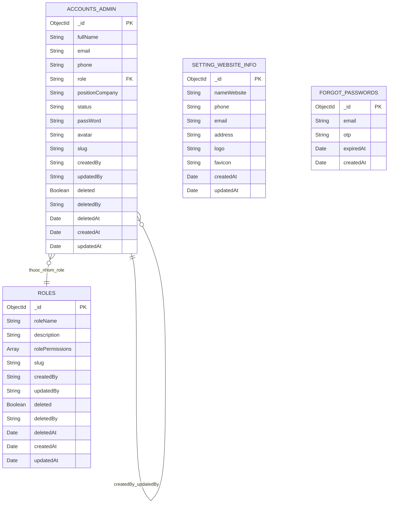

### Mô tả Collections

#### Collection: `accounts-admin`
- **Mục đích:** Lưu trữ toàn bộ tài khoản quản trị viên hệ thống.
- **Index:** `email` (unique), `slug` (unique), `deleted` (để filter nhanh).
- **Liên kết:** Trường `role` lưu `ObjectId.toString()` tham chiếu sang `roles._id`. Join thủ công trong controller.
- **Soft-delete:** Khi xoá: `deleted=true`, `status="inactive"`.

#### Collection: `roles`
- **Mục đích:** Lưu các nhóm phân quyền, mỗi nhóm có danh sách mã quyền.
- **Index:** `slug` (unique), `deleted`.
- **Trường đặc biệt:** `rolePermissions` là mảng chuỗi, VD: `["dashboard-view", "tour-edit"]`.

#### Collection: `setting-website-info`
- **Mục đích:** Lưu thông tin cấu hình website. **Chỉ có duy nhất 1 document.**
- **Thao tác:** Luôn dùng `findOneAndUpdate({}, data, { upsert: true })`.

#### Collection: `forgot-passwords`
- **Mục đích:** Lưu OTP quên mật khẩu. Phục vụ use case xác thực tại `account.controller.js`.

---

## 2.3 Thiết kế tĩnh – Sơ đồ lớp (Design Class Diagram)

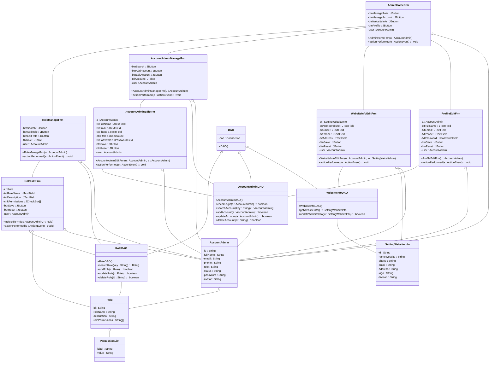

---

## 2.4 Thiết kế động – Sơ đồ tuần tự (Design Sequence Diagram)

### SDD-1: Tạo nhóm quyền

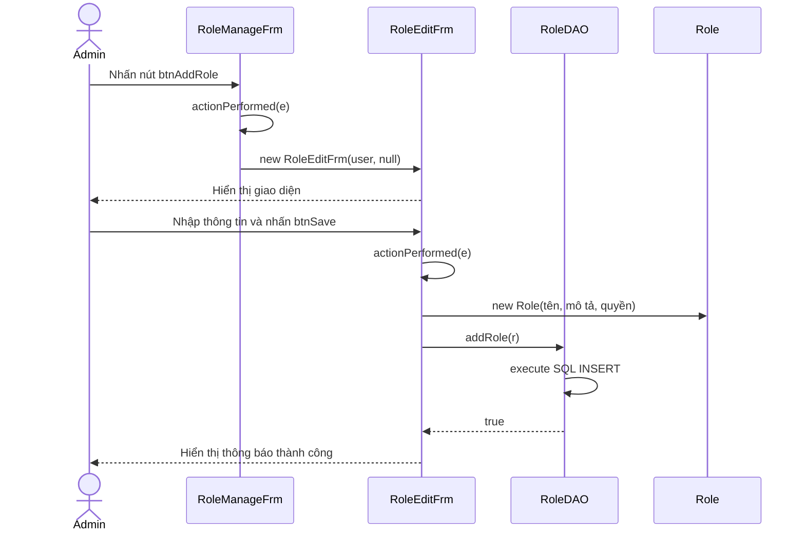

### SDD-2: Tạo tài khoản quản trị

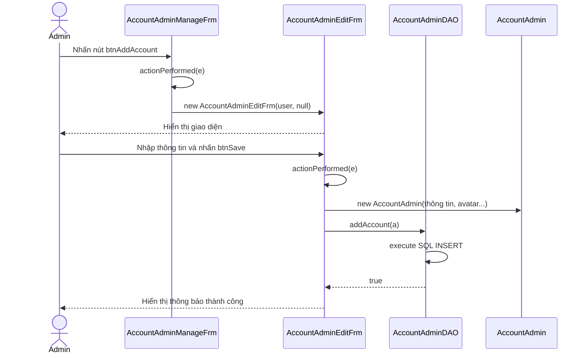

### SDD-3: Chỉnh sửa thông tin website

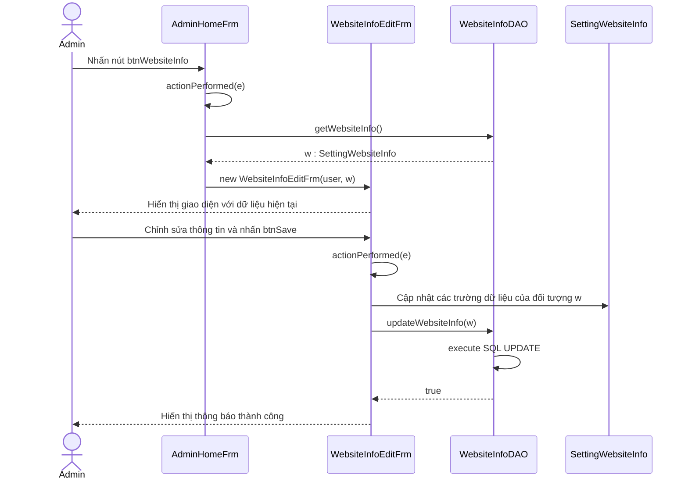

### SDD-4: Chỉnh sửa thông tin cá nhân

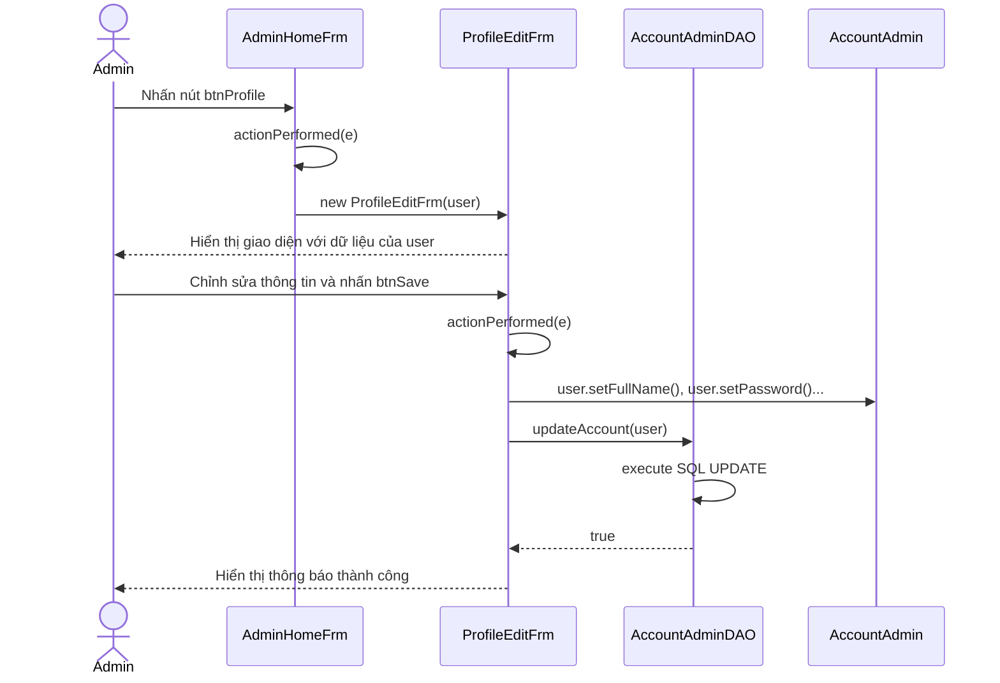

### SDD-5: Xoá hàng loạt

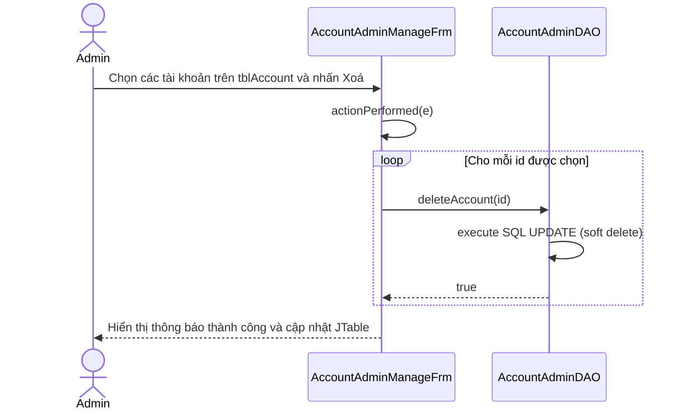

### SDD-6: Tìm kiếm & phân trang

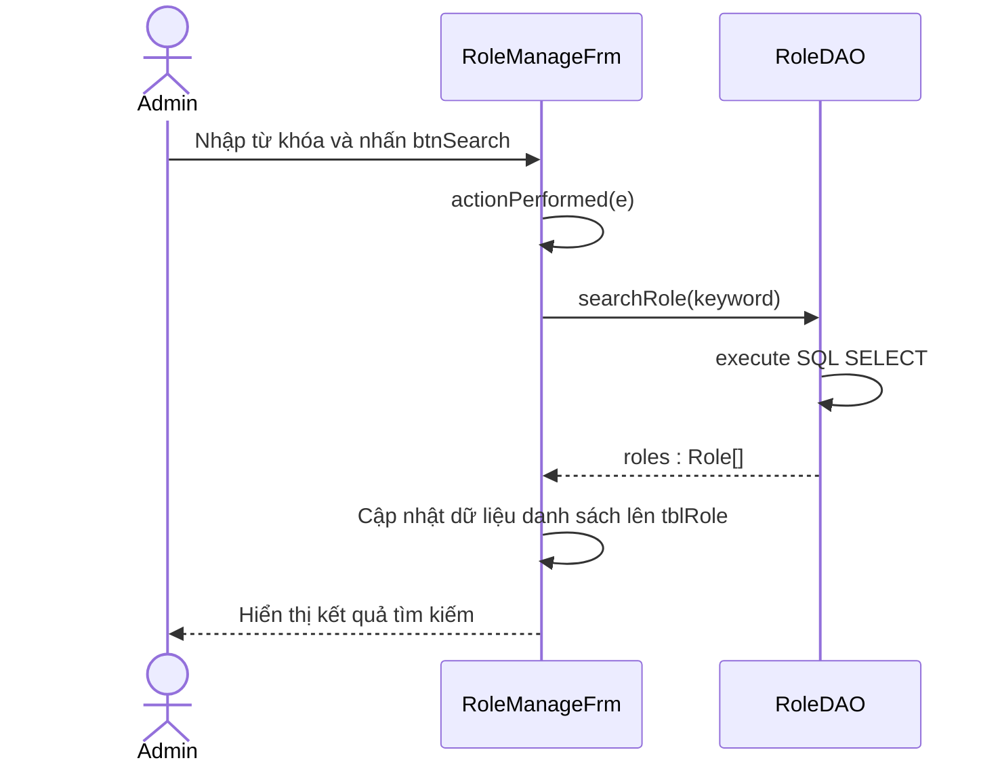

---

## Phụ lục: Sơ đồ Use Case Tổng quát

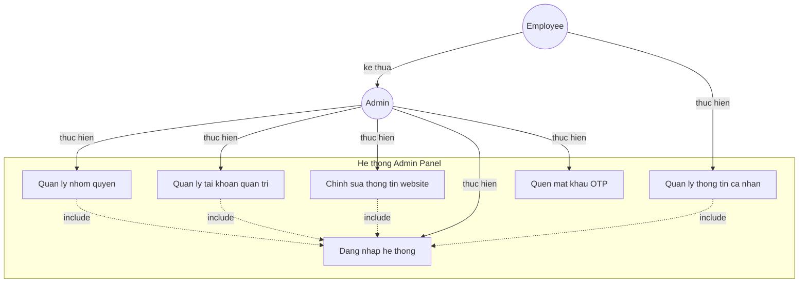

---

*Tài liệu được tổng hợp bởi System Architect – dựa trên phân tích mã nguồn dự án `project-5` và phương pháp thiết kế hướng đối tượng theo chuẩn [Software Design Blog](https://softwaredesign.home.blog/tutorials/hotel-reservation-management-application/).*
