# Tài liệu Thiết kế Hệ thống (System Design Document)
## Dự án: Travel Tour Booking – Admin Panel
### Phạm vi tài liệu: Quản lý nhóm quyền · Quản lý tài khoản quản trị · Chỉnh sửa thông tin website · Quản lý thông tin cá nhân

---

> **Thông tin dự án**
> - **Tech Stack:** Node.js (Express 5) · MongoDB Atlas (Mongoose) · Pug SSR · JWT · bcryptjs · Cloudinary · Multer
> - **Kiến trúc:** MVC – Model / View (Pug) / Controller
> - **Tác nhân quản trị:** Admin (toàn quyền) · Manager · Seller (xem use case diagram tổng quát)

---

## MỤC LỤC

- [PHẦN MỞ ĐẦU – KHẢO SÁT CÁC HỆ THỐNG LIÊN QUAN](#phần-mở-đầu--khảo-sát-các-hệ-thống-liên-quan)
1. [PHẦN I – PHÂN TÍCH (ANALYSIS)](#phần-i--phân-tích-analysis)
   - 1.0 [Sơ đồ Use Case (Use Case Diagram)](#10-sơ-đồ-use-case-use-case-diagram)
   - 1.1 [Kịch bản chuẩn và ngoại lệ (Scenarios)](#11-kịch-bản-chuẩn-và-ngoại-lệ-scenarios)
   - 1.2 [Phân tích tĩnh – Trích xuất lớp thực thể (Entity Class Extraction)](#12-phân-tích-tĩnh--trích-xuất-lớp-thực-thể-entity-class-extraction)
   - 1.3 [Phân tích tĩnh – Sơ đồ lớp (Analysis Class Diagram)](#13-phân-tích-tĩnh--sơ-đồ-lớp-analysis-class-diagram)
   - 1.4 [Phân tích động – Sơ đồ tuần tự (Analysis Sequence Diagram)](#14-phân-tích-động--sơ-đồ-tuần-tự-analysis-sequence-diagram)
2. [PHẦN II – THIẾT KẾ (DESIGN)](#phần-ii--thiết-kế-design)
   - 2.1 [Thiết kế lớp thực thể (Entity Classes Design)](#21-thiết-kế-lớp-thực-thể-entity-classes-design)
   - 2.2 [Thiết kế Cơ sở dữ liệu (Database Design)](#22-thiết-kế-cơ-sở-dữ-liệu-database-design)
   - 2.3 [Thiết kế tĩnh – Sơ đồ lớp (Design Class Diagram)](#23-thiết-kế-tĩnh--sơ-đồ-lớp-design-class-diagram)
   - 2.4 [Thiết kế động – Sơ đồ tuần tự (Design Sequence Diagram)](#24-thiết-kế-động--sơ-đồ-tuần-tự-design-sequence-diagram)

---

# PHẦN MỞ ĐẦU – KHẢO SÁT CÁC HỆ THỐNG LIÊN QUAN

Trước khi tiến hành phân tích và thiết kế hệ thống **Travel Tour Booking (Admin Panel)**, nhóm đã tiến hành khảo sát các mô hình quản trị nội dung linh hoạt và các website du lịch thực tế đang hoạt động. Việc khảo sát chuyên sâu giúp hệ thống định hình rõ ràng phương pháp quản lý quyền hạn (RBAC), tối ưu hóa luồng duyệt tài khoản, và thiết kế giao diện cấu hình thân thiện cho người quản trị. Dưới đây là phân tích chi tiết về 2 nhóm hệ thống tiêu biểu được chọn làm hình mẫu để ứng dụng các ưu điểm vào đồ án.

### 1. Hệ thống Strapi (Headless CMS)
Strapi là một trong những hệ thống Headless CMS mã nguồn mở hàng đầu hiện nay, nổi bật với kiến trúc quản lý dữ liệu linh hoạt. Ưu điểm lớn nhất của Strapi là cơ chế Role-Based Access Control (RBAC) được xây dựng dưới dạng "Ma trận phân quyền" (Permission Matrix) cực kỳ trực quan và mạnh mẽ. Thay vì tạo ra các quyền (roles) cứng nhắc, Strapi liệt kê toàn bộ các module và các thao tác (Create, Read, Update, Delete) dưới dạng bảng ma trận checkbox, cho phép quản trị viên tự do định nghĩa các nhóm quyền mới và cấp quyền chi tiết đến từng trường dữ liệu.

**Ứng dụng vào dự án:** Nhóm đã ứng dụng triệt để mô hình Ma trận phân quyền này vào tính năng *Quản lý Nhóm quyền (Roles)* của hệ thống. Thay vì hard-code các cấp độ quyền hạn, thiết kế bảng `roles` trong MongoDB sử dụng trường `permissions` là một mảng chuỗi (ví dụ: `["tours_view", "tours_create", "accounts_edit"]`) để lưu trữ động các quyền. Trên giao diện Admin, Super Admin thao tác trực tiếp qua ma trận Checkbox để phân quyền một cách dễ hiểu và linh hoạt nhất.

### 2. Các Website lữ hành nội địa tiêu biểu (Vietravel / Saigontourist)
Đây là các hệ thống được phát triển với đặc thù nghiệp vụ quản lý Tour và Khuyến mãi (Promotion) cực kỳ chặt chẽ. Điểm sáng của các hệ thống này là tính đồng bộ thông tin rất cao: các thông tin liên hệ cốt lõi của doanh nghiệp (như Logo, số điện thoại Hotline, Email hỗ trợ, Địa chỉ, thông tin Bản quyền) luôn được hiển thị nhất quán ở mọi vị trí trên trang khách hàng (Client Site). Đồng thời, nghiệp vụ quản lý danh mục (Category) được kết hợp mượt mà với tính năng Khuyến mãi áp dụng cho từng tour cụ thể, mang lại hiệu quả vận hành tối đa.

**Ứng dụng vào dự án:** Kế thừa ưu điểm về tính đồng bộ thông tin, nhóm đã thiết kế một module độc lập mang tên **"Cài đặt Website" (Setting Website Info)**. Thay vì gắn cứng (hard-code) dữ liệu vào giao diện frontend như một số hệ thống cũ, mọi cấu hình được lưu trữ tại model `setting-website-info.model.js` trong Database. Trên giao diện Admin, một form tổng hợp được cung cấp để người quản lý tự do cập nhật Tên website, Logo, SĐT, Link mạng xã hội. Khi có thay đổi, toàn bộ giao diện Client sẽ tự động lấy dữ liệu mới nhất từ CSDL, giúp tối ưu hóa thời gian và triệt tiêu sự phụ thuộc vào bộ phận IT.

### 3. Định hướng thiết kế lõi cho hệ thống Travel Tour Booking (Đồ án)
Đúc kết từ việc phân tích và học hỏi những ưu điểm của các hệ thống trên, kiến trúc Admin Panel của dự án được định hướng phát triển dựa trên 3 trụ cột chính:

- **Phân quyền động (Dynamic RBAC) chặn từ phía Server:** Kế thừa từ Strapi, toàn bộ hệ thống không phụ thuộc vào tên của Role mà phụ thuộc vào mảng quyền hạn. Bất kỳ một request nào (Thêm, Sửa, Xóa) gửi lên Server đều phải đi qua một Middleware kiểm tra quyền (`checkPermission` trong `auth.middleware.js`). Middleware này ngầm đối chiếu hành động của người dùng với danh sách `permissions` lưu trong token/CSDL, đảm bảo tính bảo mật tuyệt đối dù người dùng cố tình truy cập bằng đường dẫn trực tiếp.
- **Bảo mật tối đa luồng tạo tài khoản quản trị:** Hệ thống không cho phép tạo tài khoản và sử dụng được ngay. Áp dụng cơ chế **Kiểm duyệt 2 bước**: Nhân viên đăng ký tài khoản mới sẽ bị đưa vào trạng thái mặc định là `inactive` (vô hiệu hóa) và không có nhóm quyền (`role_id = null`). Quản trị viên cấp cao (Super Admin) bắt buộc phải kiểm tra, sau đó thao tác "Phê duyệt" (đổi sang `active`) và gán Nhóm quyền thì tài khoản mới có hiệu lực đăng nhập.
- **Tập trung hóa cấu hình và cá nhân hóa:** Kế thừa bài học từ các trang web lữ hành lớn, mọi thao tác cấu hình hệ thống (Setting) và chỉnh sửa thông tin cá nhân (Profile / Đổi mật khẩu) được quy tụ về một giao diện tập trung, thân thiện. Giúp giảm thiểu sự phụ thuộc vào đội ngũ kỹ thuật, tăng cường tính tự chủ và năng suất làm việc cho người vận hành hệ thống.

---

# PHẦN I – PHÂN TÍCH (ANALYSIS)

## 1.0 Sơ đồ Use Case (Use Case Diagram)

> **Phạm vi hệ thống:** Admin Panel – Travel Tour Booking  
> **Tác nhân:** Admin (toàn quyền) · Nhân viên (chỉ quản lý thông tin cá nhân).  
> **Điều kiện tiên quyết:** Mọi use case đều yêu cầu **Đăng nhập** thành công trước (`<<include>>`).

---

### Use Case 1: Quản lý nhóm quyền

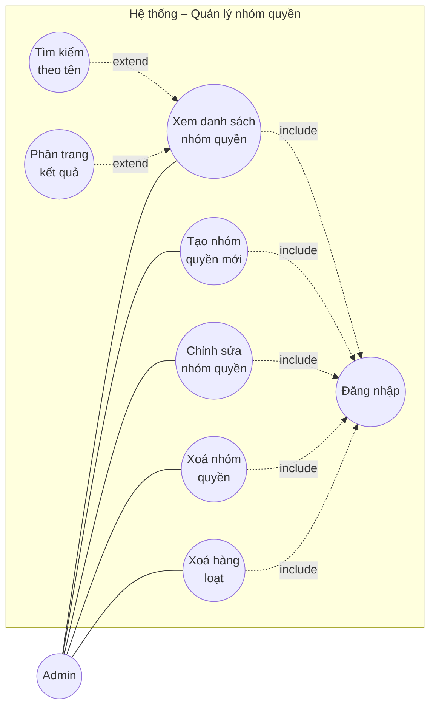
```mermaid
graph LR
    Admin((Admin))

    subgraph SYS1["Hệ thống – Quản lý nhóm quyền"]
        UC_Login1(("Đăng nhập"))
        UC1_List(("Xem danh sách\nnhóm quyền"))
        UC1_Create(("Tạo nhóm\nquyền mới"))
        UC1_Edit(("Chỉnh sửa\nnhóm quyền"))
        UC1_Delete(("Xoá nhóm\nquyền"))
        UC1_Search(("Tìm kiếm\ntheo tên"))
        UC1_Page(("Phân trang\nkết quả"))
        UC1_Multi(("Xoá hàng\nloạt"))
    end

    Admin --- UC1_List
    Admin --- UC1_Create
    Admin --- UC1_Edit
    Admin --- UC1_Delete
    Admin --- UC1_Multi

    UC1_List -.->|include| UC_Login1
    UC1_Create -.->|include| UC_Login1
    UC1_Edit -.->|include| UC_Login1
    UC1_Delete -.->|include| UC_Login1
    UC1_Multi -.->|include| UC_Login1

    UC1_Search -.->|extend| UC1_List
    UC1_Page -.->|extend| UC1_List
```

---

### Use Case 2: Quản lý tài khoản quản trị

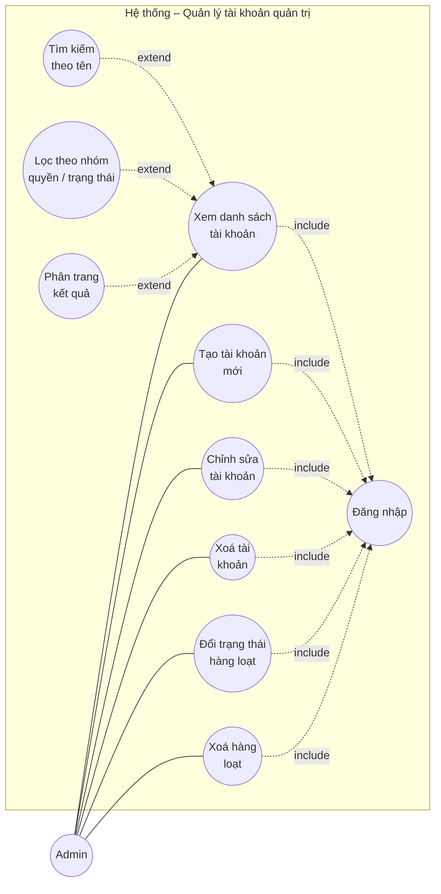
```mermaid
graph LR
    Admin((Admin))

    subgraph SYS2["Hệ thống – Quản lý tài khoản quản trị"]
        UC_Login2(("Đăng nhập"))
        UC2_List(("Xem danh sách\ntài khoản"))
        UC2_Create(("Tạo tài khoản\nmới"))
        UC2_Edit(("Chỉnh sửa\ntài khoản"))
        UC2_Delete(("Xoá tài\nkhoản"))
        UC2_Search(("Tìm kiếm\ntheo tên"))
        UC2_Filter(("Lọc theo nhóm\nquyền / trạng thái"))
        UC2_Page(("Phân trang\nkết quả"))
        UC2_Status(("Đổi trạng thái\nhàng loạt"))
        UC2_DelMulti(("Xoá hàng\nloạt"))
    end

    Admin --- UC2_List
    Admin --- UC2_Create
    Admin --- UC2_Edit
    Admin --- UC2_Delete
    Admin --- UC2_Status
    Admin --- UC2_DelMulti

    UC2_List -.->|include| UC_Login2
    UC2_Create -.->|include| UC_Login2
    UC2_Edit -.->|include| UC_Login2
    UC2_Delete -.->|include| UC_Login2
    UC2_Status -.->|include| UC_Login2
    UC2_DelMulti -.->|include| UC_Login2

    UC2_Search -.->|extend| UC2_List
    UC2_Filter -.->|extend| UC2_List
    UC2_Page -.->|extend| UC2_List
```

---

### Use Case 3: Chỉnh sửa thông tin website

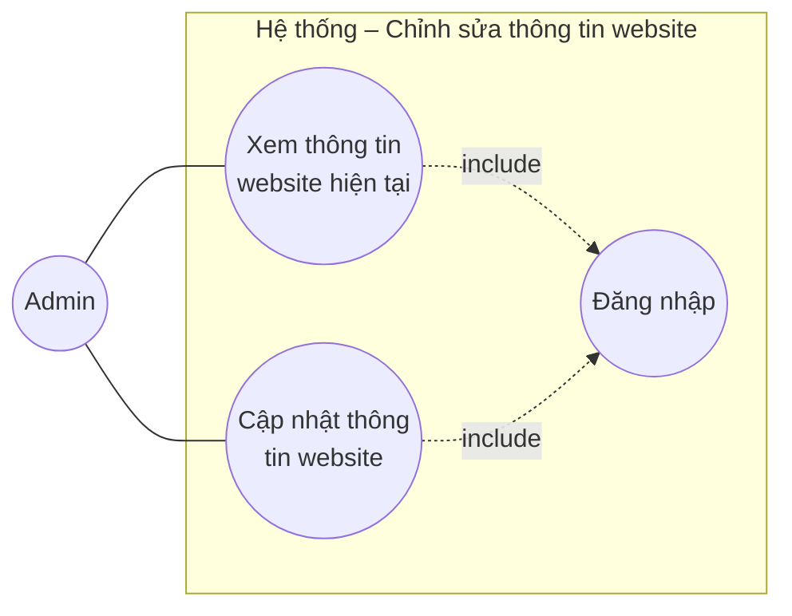
```mermaid
graph LR
    Admin((Admin))

    subgraph SYS3["Hệ thống – Chỉnh sửa thông tin website"]
        UC_Login3(("Đăng nhập"))
        UC3_View(("Xem thông tin\nwebsite hiện tại"))
        UC3_Update(("Cập nhật thông\ntin website"))
    end

    Admin --- UC3_View
    Admin --- UC3_Update

    UC3_View -.->|include| UC_Login3
    UC3_Update -.->|include| UC_Login3
```

---

### Use Case 4: Quản lý thông tin cá nhân

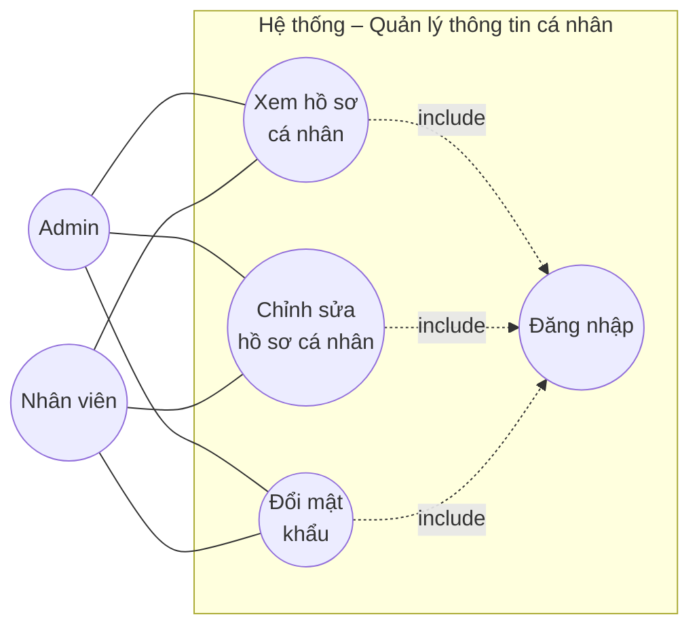
```mermaid
graph LR
    Admin((Admin))
    Employee((Nhân viên))

    subgraph SYS4["Hệ thống – Quản lý thông tin cá nhân"]
        UC_Login4(("Đăng nhập"))
        UC4_View(("Xem hồ sơ\ncá nhân"))
        UC4_Edit(("Chỉnh sửa\nhồ sơ cá nhân"))
        UC4_ChangePw(("Đổi mật\nkhẩu"))
    end

    Admin --- UC4_View
    Admin --- UC4_Edit
    Admin --- UC4_ChangePw
    Employee --- UC4_View
    Employee --- UC4_Edit
    Employee --- UC4_ChangePw

    UC4_View -.->|include| UC_Login4
    UC4_Edit -.->|include| UC_Login4
    UC4_ChangePw -.->|include| UC_Login4
```

---


## 1.1 Kịch bản chuẩn và ngoại lệ (Scenarios)

> Phương pháp: Mỗi use case được mô tả theo bảng kịch bản chuẩn, kèm hàng ngoại lệ liệt kê các trường hợp ngoại lệ có thể xảy ra trong kịch bản.

---

### Use case 1: Quản lý nhóm quyền (Manage Roles)

#### Bảng 1. Kịch bản: Tạo nhóm quyền mới

| Trường | Nội dung |
|---|---|
| **Use Case** | Tạo nhóm quyền mới |
| **Actor** | Admin |
| **Tiền điều kiện** | Admin đã đăng nhập thành công vào hệ thống. |
| **Hậu điều kiện** | Nhóm quyền mới được lưu vào collection `roles`, hiển thị ở đầu danh sách. |
| **Kịch bản chính** | 1. Admin chọn **Cài đặt** → **Nhóm quyền**. Hệ thống hiển thị danh sách nhóm quyền. <br>2. Admin nhấn nút **+ Tạo nhóm quyền**. <br>3. Hệ thống hiển thị form tạo gồm: Tên nhóm quyền (bắt buộc), Mô tả, danh sách checkbox phân quyền và nút **Tạo mới**. <br>4. Admin nhập Tên `"Manager"`, Mô tả `"Nhóm quản lý tour và danh mục"`, tích chọn các quyền: Xem dashboard, Xem/Sửa tour. <br>5. Admin nhấn **Tạo mới**. <br>6. Hệ thống validate dữ liệu, lưu bản ghi vào MongoDB, slug tự sinh từ `roleName`. <br>7. Hệ thống trả về `{ code: "success" }`. Giao diện hiển thị toast thành công, trang reload và hiển thị nhóm `"Manager"` ở đầu danh sách. |
| **Ngoại lệ** | - **Bước 5:** Tên nhóm quyền bị bỏ trống → Hệ thống trả về `{ code: "error", message: "Dữ liệu không hợp lệ!" }`, form không submit. |

#### Bảng 2. Kịch bản: Chỉnh sửa nhóm quyền

| Trường | Nội dung |
|---|---|
| **Use Case** | Chỉnh sửa nhóm quyền |
| **Actor** | Admin |
| **Tiền điều kiện** | Admin đã đăng nhập. Nhóm quyền cần sửa đã tồn tại trong hệ thống. |
| **Hậu điều kiện** | Thông tin nhóm quyền được cập nhật trong MongoDB. |
| **Kịch bản chính** | 1. Tại danh sách nhóm quyền, Admin nhấn nút **Sửa** trên dòng nhóm `"Manager"`. <br>2. Hệ thống tải thông tin nhóm quyền theo `id`, hiển thị form với dữ liệu điền sẵn. <br>3. Admin bổ sung thêm quyền **Tạo tour** bằng cách tích thêm checkbox. <br>4. Admin nhấn **Cập nhật**. <br>5. Hệ thống gọi `Role.findByIdAndUpdate(id, req.body)` cập nhật `rolePermissions`. <br>6. Hệ thống trả về `{ code: "success" }`. Giao diện hiển thị toast thành công, trang reload. |
| **Ngoại lệ** | - **Bước 2:** ID nhóm quyền không tồn tại → `{ code: "error", message: "Nhóm quyền không tồn tại!" }`, chuyển hướng về danh sách. |

#### Bảng 3. Kịch bản: Xoá nhóm quyền

| Trường | Nội dung |
|---|---|
| **Use Case** | Xoá nhóm quyền (Soft Delete) |
| **Actor** | Admin |
| **Tiền điều kiện** | Admin đã đăng nhập và có quyền `role-delete`. |
| **Hậu điều kiện** | Nhóm quyền được đánh dấu `deleted: true` trong MongoDB, biến mất khỏi danh sách. |
| **Kịch bản chính** | 1. Tại danh sách nhóm quyền, Admin nhấn nút **Xoá** trên dòng cần xoá. <br>2. Giao diện hiển thị hộp thoại xác nhận. <br>3. Admin nhấn **Xác nhận**. <br>4. Hệ thống gọi `PATCH /admin/setting/role/delete/:id`, ghi `deleted: true`, `deletedBy`, `deletedAt` vào MongoDB. <br>5. Hệ thống trả về `{ code: "success" }`. Giao diện hiển thị toast thành công, nhóm quyền biến mất khỏi danh sách. |
| **Ngoại lệ** | - **Bước 4:** ID không tồn tại → `{ code: "error", message: "Nhóm quyền không tồn tại!" }`. |

#### Bảng 4. Kịch bản: Xem danh sách & Tìm kiếm nhóm quyền

| Trường | Nội dung |
|---|---|
| **Use Case** | Xem danh sách & Tìm kiếm nhóm quyền |
| **Actor** | Admin |
| **Tiền điều kiện** | Admin đã đăng nhập thành công. |
| **Hậu điều kiện** | Danh sách nhóm quyền được hiển thị đúng với điều kiện tìm kiếm và phân trang. |
| **Kịch bản chính** | 1. Admin chọn **Cài đặt** → **Nhóm quyền**. <br>2. Hệ thống truy vấn `Role.find({ deleted: false })`, áp dụng phân trang (`limit = 3`, `page = 1`), sắp xếp theo `createdAt` giảm dần. <br>3. Hệ thống hiển thị bảng danh sách nhóm quyền. <br>4. Admin nhập từ khóa `"Manager"` vào ô tìm kiếm và nhấn Enter. <br>5. Hệ thống `slugify` từ khóa → tạo regex → truy vấn `Role.find({ slug: regex })`. <br>6. Hệ thống trả về danh sách kết quả. Giao diện cập nhật bảng, URL thay đổi thành `?keyword=manager`. |
| **Ngoại lệ** | - **Bước 6:** Không có nhóm quyền nào khớp từ khóa → Bảng hiển thị trống, thông báo "Không có dữ liệu". |

#### Bảng 5. Kịch bản: Xoá hàng loạt nhóm quyền

| Trường | Nội dung |
|---|---|
| **Use Case** | Xoá hàng loạt nhóm quyền |
| **Actor** | Admin |
| **Tiền điều kiện** | Admin đã đăng nhập và có quyền `role-delete`. Có ít nhất một nhóm quyền trong danh sách. |
| **Hậu điều kiện** | Các nhóm quyền được chọn đều bị đánh dấu `deleted: true`, biến mất khỏi danh sách. |
| **Kịch bản chính** | 1. Tại danh sách nhóm quyền, Admin tích chọn checkbox trên nhiều dòng. <br>2. Admin chọn action **"Xoá"** từ dropdown hành động và nhấn **Áp dụng**. <br>3. Frontend thu thập `listId` các checkbox đã tích, gửi `PATCH /admin/setting/role/change-multi` với body `{ listId: [...], option: "delete" }`. <br>4. Hệ thống gọi `Role.updateMany({ _id: { $in: listId } }, { deleted: true, deletedBy, deletedAt })`. <br>5. Hệ thống trả về `{ code: "success" }`. Giao diện hiển thị toast thành công, trang reload. |
| **Ngoại lệ** | - **Bước 2:** Admin không tích chọn dòng nào mà vẫn nhấn Áp dụng → `listId` rỗng, hệ thống trả về `{ code: "error", message: "Vui lòng chọn ít nhất một mục!" }`. |

---

### Use case 2: Quản lý tài khoản quản trị (Manage Admin Accounts)

#### Bảng 6. Kịch bản: Tạo tài khoản quản trị mới

| Trường | Nội dung |
|---|---|
| **Use Case** | Tạo tài khoản quản trị mới |
| **Actor** | Admin |
| **Tiền điều kiện** | Admin đã đăng nhập. Đã tồn tại ít nhất một nhóm quyền để gán. |
| **Hậu điều kiện** | Tài khoản mới được lưu vào collection `accounts-admin` với mật khẩu đã hash và avatar trên Cloudinary. |
| **Kịch bản chính** | 1. Admin chọn **Cài đặt** → **Tài khoản quản trị** → nhấn **+ Tạo tài khoản**. <br>2. Hệ thống hiển thị form tạo tài khoản gồm: Họ tên, Email, SĐT, Nhóm quyền, Chức vụ, Trạng thái, Mật khẩu, Ảnh đại diện (FilePond). <br>3. Admin điền đầy đủ thông tin: Tên `"Nguyễn Văn B"`, Email `"nhanvienb@travel.vn"`, Nhóm quyền `"Manager"`, Mật khẩu `"123456"`. <br>4. Admin nhấn **Tạo mới**. <br>5. Hệ thống kiểm tra email/SĐT chưa tồn tại, hash mật khẩu, upload ảnh lên Cloudinary, ghi `createdBy`, lưu bản ghi vào DB. <br>6. Hệ thống trả về `{ code: "success" }`. Giao diện hiển thị toast thành công, trang reload về danh sách. |
| **Ngoại lệ** | - **Bước 5:** Email đã tồn tại → `{ code: "error", message: "Email đã tồn tại!" }`. <br>- **Bước 5:** SĐT đã tồn tại → `{ code: "error", message: "Số điện thoại đã tồn tại!" }`. <br>- **Bước 4:** Họ tên hoặc mật khẩu bị bỏ trống → Validate FE báo lỗi, form không submit. |

#### Bảng 7. Kịch bản: Chỉnh sửa tài khoản quản trị

| Trường | Nội dung |
|---|---|
| **Use Case** | Chỉnh sửa tài khoản quản trị |
| **Actor** | Admin |
| **Tiền điều kiện** | Admin đã đăng nhập và có quyền `account-admin-edit`. Tài khoản cần sửa đã tồn tại. |
| **Hậu điều kiện** | Thông tin tài khoản được cập nhật trong MongoDB. |
| **Kịch bản chính** | 1. Tại danh sách tài khoản, Admin nhấn **Sửa** trên dòng tài khoản `"Nguyễn Văn B"`. <br>2. Hệ thống tải thông tin tài khoản theo `id`, hiển thị form với dữ liệu điền sẵn và ảnh preview trong FilePond. <br>3. Admin đổi Trạng thái thành `"inactive"` và Chức vụ thành `"Trưởng nhóm"`. <br>4. Admin nhấn **Cập nhật**. <br>5. Hệ thống gọi `AccountAdmin.findByIdAndUpdate(id, req.body)`. Nếu có ảnh mới thì cập nhật `avatar = req.file.path`, ngược lại giữ nguyên. <br>6. Hệ thống trả về `{ code: "success" }`. Giao diện hiển thị toast thành công, trang reload. |
| **Ngoại lệ** | - **Bước 2:** ID tài khoản không tồn tại → `{ code: "error", message: "Tài khoản quản trị không tồn tại!" }`. |

#### Bảng 8. Kịch bản: Xoá tài khoản quản trị

| Trường | Nội dung |
|---|---|
| **Use Case** | Xoá tài khoản quản trị (Soft Delete) |
| **Actor** | Admin |
| **Tiền điều kiện** | Admin đã đăng nhập và có quyền `account-admin-delete`. |
| **Hậu điều kiện** | Tài khoản được đánh dấu `deleted: true`, `status: "inactive"`, biến mất khỏi danh sách. |
| **Kịch bản chính** | 1. Tại danh sách tài khoản, Admin nhấn **Xoá** trên dòng cần xoá. <br>2. Giao diện hiển thị xác nhận. Admin xác nhận. <br>3. Hệ thống gọi `PATCH /admin/setting/account-admin/delete/:id`, cập nhật `deleted: true`, `status: "inactive"`, `deletedBy`, `deletedAt`. <br>4. Hệ thống trả về `{ code: "success" }`. Tài khoản biến mất khỏi danh sách. |
| **Ngoại lệ** | - **Bước 3:** ID không tồn tại → `{ code: "error", message: "Tài khoản quản trị không tồn tại!" }`. |

#### Bảng 9. Kịch bản: Xem danh sách, Lọc & Tìm kiếm tài khoản

| Trường | Nội dung |
|---|---|
| **Use Case** | Xem danh sách, Lọc & Tìm kiếm tài khoản quản trị |
| **Actor** | Admin |
| **Tiền điều kiện** | Admin đã đăng nhập thành công. |
| **Hậu điều kiện** | Danh sách tài khoản được lọc và hiển thị đúng điều kiện. |
| **Kịch bản chính** | 1. Admin chọn **Cài đặt** → **Tài khoản quản trị**. Hệ thống truy vấn mặc định `{ deleted: false }`, phân trang `limit = 3`. <br>2. Admin sử dụng bộ lọc: chọn Trạng thái `"active"`, Nhóm quyền `"Manager"`, nhập từ khóa `"Nguyễn"`. <br>3. Hệ thống gán điều kiện lọc và tạo regex từ `slugify("Nguyễn")`, truy vấn DB kết hợp phân trang. <br>4. Hệ thống lấy thêm danh sách `roles` để map tên nhóm quyền vào từng tài khoản. <br>5. Giao diện cập nhật bảng kết quả. URL thay đổi thành `?status=active&role=[id]&keyword=nguyen`. |
| **Ngoại lệ** | - **Bước 5:** Không có tài khoản nào khớp → Bảng hiển thị trống, thông báo "Không tìm thấy kết quả". |

#### Bảng 10. Kịch bản: Đổi trạng thái hàng loạt

| Trường | Nội dung |
|---|---|
| **Use Case** | Đổi trạng thái hàng loạt tài khoản quản trị |
| **Actor** | Admin |
| **Tiền điều kiện** | Admin đã đăng nhập và có quyền `account-admin-edit`. |
| **Hậu điều kiện** | Trạng thái của các tài khoản được chọn được cập nhật đồng loạt. |
| **Kịch bản chính** | 1. Tại danh sách tài khoản, Admin tích chọn nhiều checkbox. <br>2. Admin chọn action **"Hoạt động"** hoặc **"Dừng hoạt động"** từ dropdown và nhấn **Áp dụng**. <br>3. Frontend gửi `PATCH /admin/setting/account-admin/change-multi` với body `{ listId: [...], option: "active" }`. <br>4. Hệ thống gọi `AccountAdmin.updateMany({ _id: { $in: listId } }, { status: option, updatedBy })`. <br>5. Hệ thống trả về `{ code: "success" }`. Giao diện toast thành công, trang reload. |
| **Ngoại lệ** | - **Bước 2:** Không tích chọn dòng nào → Frontend báo lỗi "Vui lòng chọn ít nhất một bản ghi". <br>- **Bước 4:** Không có quyền `account-admin-edit` → Request bị chặn, trả về lỗi phân quyền. |

#### Bảng 11. Kịch bản: Xoá hàng loạt tài khoản quản trị

| Trường | Nội dung |
|---|---|
| **Use Case** | Xoá hàng loạt tài khoản quản trị |
| **Actor** | Admin |
| **Tiền điều kiện** | Admin đã đăng nhập và có quyền `account-admin-delete`. |
| **Hậu điều kiện** | Các tài khoản được chọn đều bị đánh dấu `deleted: true`, biến mất khỏi danh sách. |
| **Kịch bản chính** | 1. Tại danh sách tài khoản, Admin tích chọn nhiều checkbox rồi chọn action **"Xoá"** và nhấn **Áp dụng**. <br>2. Frontend gửi `PATCH /admin/setting/account-admin/change-multi` với body `{ listId: [...], option: "delete" }`. <br>3. Hệ thống gọi `AccountAdmin.updateMany({ _id: { $in: listId } }, { deleted: true, status: "inactive", deletedBy, deletedAt })`. <br>4. Hệ thống trả về `{ code: "success" }`. Giao diện toast thành công, trang reload. |
| **Ngoại lệ** | - **Bước 1:** Không tích chọn dòng nào → Frontend báo lỗi "Vui lòng chọn ít nhất một bản ghi". <br>- **Bước 3:** Không có quyền `account-admin-delete` → Request bị chặn, trả về lỗi phân quyền. |

---

### Use case 3: Chỉnh sửa thông tin website (Edit Website Info)

#### Bảng 12. Kịch bản: Cập nhật thông tin website

| Trường | Nội dung |
|---|---|
| **Use Case** | Cập nhật thông tin website |
| **Actor** | Admin |
| **Tiền điều kiện** | Admin đã đăng nhập và có quyền `website-info-edit`. |
| **Hậu điều kiện** | Thông tin cấu hình website được lưu vào collection `setting-website-info`. Logo/favicon mới được lưu trên Cloudinary. |
| **Kịch bản chính** | 1. Admin chọn **Cài đặt** → **Thông tin website**. <br>2. Hệ thống truy vấn `SettingWebsiteInfo.findOne({})`, hiển thị form với các giá trị hiện tại: Tên website, SĐT, Email, Địa chỉ, Logo, Favicon. <br>3. Admin cập nhật SĐT thành `"19009999"` và chọn ảnh Logo mới qua FilePond. <br>4. Admin nhấn **Cập nhật**. <br>5. Hệ thống gọi `PATCH /admin/setting/website-info` với `upload.fields([{name:'logo'},{name:'favicon'}])`. URL logo mới lấy từ `req.files.logo[0].path` (Cloudinary). <br>6. Hệ thống gọi `SettingWebsiteInfo.findOneAndUpdate({}, req.body, { upsert: true })`. <br>7. Hệ thống trả về `{ code: "success" }`. Giao diện hiển thị toast thành công. |
| **Ngoại lệ** | - **Bước 5:** File upload vượt kích thước giới hạn Cloudinary → Hệ thống ném lỗi 500, giao diện hiển thị toast lỗi server. <br>- **Bước 5:** Kết nối Cloudinary thất bại (API Key sai) → `req.files` không có `path`, dữ liệu không được lưu đúng. |

---

### Use case 4: Quản lý thông tin cá nhân (Manage Personal Profile)

#### Bảng 13. Kịch bản: Chỉnh sửa hồ sơ cá nhân

| Trường | Nội dung |
|---|---|
| **Use Case** | Chỉnh sửa hồ sơ cá nhân |
| **Actor** | Admin, Nhân viên |
| **Tiền điều kiện** | Người dùng đã đăng nhập thành công vào hệ thống. |
| **Hậu điều kiện** | Thông tin cá nhân được cập nhật trong collection `accounts-admin`. Header hiển thị tên và avatar mới. |
| **Kịch bản chính** | 1. Người dùng nhấn vào tên/avatar trên header → chọn **Thông tin cá nhân**. <br>2. Hệ thống render giao diện Chỉnh sửa hồ sơ (`GET /admin/profile/edit`) với form: Họ tên, Email, SĐT, Chức vụ (readonly), Nhóm quyền (readonly), Ảnh đại diện (FilePond). <br>3. Người dùng cập nhật Họ tên thành `"Nguyễn Admin"` và chọn ảnh đại diện mới. <br>4. Người dùng nhấn **Cập nhật**. <br>5. Hệ thống gọi `PATCH /admin/profile/edit`, cập nhật thông tin trong DB. Nếu có ảnh mới thì cập nhật `avatar`. <br>6. Hệ thống trả về `{ code: "success" }`. Giao diện toast thành công, header cập nhật tên và avatar mới. |
| **Ngoại lệ** | - **Bước 5:** Upload ảnh thất bại (Cloudinary lỗi) → Hệ thống ném lỗi, thông tin văn bản vẫn có thể được lưu nếu tách riêng xử lý. |

#### Bảng 14. Kịch bản: Đổi mật khẩu

| Trường | Nội dung |
|---|---|
| **Use Case** | Đổi mật khẩu cá nhân |
| **Actor** | Admin, Nhân viên |
| **Tiền điều kiện** | Người dùng đã đăng nhập thành công. |
| **Hậu điều kiện** | Mật khẩu mới được hash và lưu vào DB. JWT token mới được cấp phát, phiên đăng nhập tiếp tục. |
| **Kịch bản chính** | 1. Tại trang Thông tin cá nhân, người dùng nhấn link **Đổi mật khẩu**. <br>2. Hệ thống render form đổi mật khẩu (`GET /admin/profile/change-password`) gồm: Mật khẩu hiện tại, Mật khẩu mới, Xác nhận mật khẩu mới. <br>3. Người dùng nhập đầy đủ thông tin và nhấn **Lưu**. <br>4. Hệ thống dùng `bcrypt.compare()` để so sánh mật khẩu hiện tại. Nếu khớp, hash mật khẩu mới và gọi `AccountAdmin.findByIdAndUpdate()` cập nhật trường `passWord`. <br>5. Hệ thống cấp phát JWT token mới lưu vào cookie. Trả về `{ code: "success" }`. Giao diện toast thành công, phiên đăng nhập tiếp tục. |
| **Ngoại lệ** | - **Bước 4:** Mật khẩu hiện tại không đúng → `{ code: "error", message: "Mật khẩu hiện tại không chính xác!" }`. <br>- **Bước 3:** Mật khẩu mới và xác nhận không khớp → Validate FE báo lỗi, form không submit. |

---

---

### Use case 1: Quản lý nhóm quyền (Manage Roles)

#### Kịch bản chuẩn: Tạo nhóm quyền mới

1. Admin đăng nhập thành công vào hệ thống. Giao diện Admin Panel hiện ra với menu điều hướng bên trái gồm các mục: Dashboard, Danh mục, Tour, Đơn hàng, Khách hàng, Cài đặt.
2. Admin chọn mục **Cài đặt** → chọn **Nhóm quyền**.
3. Hệ thống hiển thị giao diện **Danh sách nhóm quyền** với bảng gồm các cột: Tên nhóm quyền, Mô tả, Ngày tạo, Hành động. Trên cùng có ô tìm kiếm theo tên và nút **+ Tạo nhóm quyền**.
4. Admin nhấn nút **+ Tạo nhóm quyền**.
5. Hệ thống chuyển sang giao diện **Tạo nhóm quyền** với form gồm:
   - Ô nhập **Tên nhóm quyền** (bắt buộc)
   - Ô nhập **Mô tả ngắn**
   - Danh sách checkbox **Phân quyền**: Xem trang tổng quan, Xem danh mục, Tạo danh mục, Sửa danh mục, Xoá danh mục, Xem tour, Tạo tour, Sửa tour, Xoá tour
   - Nút **Tạo mới**
6. Admin nhập tên nhóm quyền là `"Manager"`, mô tả là `"Nhóm quản lý tour và danh mục"`, tích chọn các quyền: Xem trang tổng quan, Xem danh mục, Xem tour, Sửa tour.
7. Admin nhấn nút **Tạo mới**.
8. Hệ thống validate dữ liệu (tên nhóm quyền không được rỗng), ghi nhận `createdBy` là ID của admin hiện tại, lưu bản ghi mới vào collection `roles` (MongoDB Atlas). Slug tự động sinh từ `roleName` qua plugin `mongoose-slug-updater`.
9. Hệ thống trả về JSON `{ code: "success", message: "Nhóm quyền đã được tạo thành công" }`.
10. Giao diện hiển thị toast thông báo **thành công** (Notyf). Trang tự động reload và quay về danh sách nhóm quyền, hiển thị nhóm `"Manager"` vừa tạo ở đầu danh sách.

#### Kịch bản chuẩn: Chỉnh sửa nhóm quyền

1. Tại giao diện danh sách nhóm quyền, Admin tìm kiếm nhóm `"Manager"` bằng ô tìm kiếm, hệ thống lọc và hiển thị kết quả.
2. Admin nhấn nút **Sửa** (icon edit) tương ứng với nhóm `"Manager"`.
3. Hệ thống tải thông tin nhóm quyền theo `id` từ MongoDB, hiển thị giao diện **Sửa nhóm quyền** với các trường được điền sẵn giá trị hiện tại. Danh sách checkbox phân quyền hiển thị các quyền đã chọn ở trạng thái tích.
4. Admin bổ sung thêm quyền **Tạo tour** bằng cách tích thêm checkbox tương ứng.
5. Admin nhấn nút **Cập nhật**.
6. Hệ thống thực hiện `PATCH /admin/setting/role/edit/:id`, gọi `Role.findByIdAndUpdate(id, req.body)` cập nhật trường `rolePermissions` trong MongoDB.
7. Hệ thống trả về JSON `{ code: "success", message: "Nhóm quyền đã được cập nhật thành công" }`.
8. Giao diện hiển thị toast **thành công**. Trang reload về danh sách nhóm quyền.

#### Kịch bản chuẩn: Xoá nhóm quyền

1. Tại danh sách nhóm quyền, Admin nhấn nút **Xoá** (icon delete) trên dòng nhóm cần xoá.
2. Giao diện hiển thị hộp thoại xác nhận.
3. Admin nhấn **Xác nhận**.
4. Hệ thống thực hiện `PATCH /admin/setting/role/delete/:id`, ghi `deleted: true`, `deletedBy`, `deletedAt` vào MongoDB (soft delete).
5. Hệ thống trả về JSON `{ code: "success", message: "Đã xoá nhóm quyền thành công!" }`.
6. Giao diện hiển thị toast **thành công**, nhóm quyền vừa xoá biến mất khỏi danh sách.

#### Kịch bản chuẩn: Xem danh sách & Tìm kiếm nhóm quyền

1. Admin đăng nhập thành công vào hệ thống và chọn **Cài đặt** → **Nhóm quyền**.
2. Hệ thống truy vấn `Role.find({ deleted: false })`, áp dụng phân trang (`limit = 3`, `page = 1`), sắp xếp theo `createdAt` giảm dần.
3. Hệ thống hiển thị giao diện **Danh sách nhóm quyền** với bảng các cột: Tên nhóm quyền, Mô tả, Ngày tạo, Hành động. Phía trên có ô tìm kiếm và nút phân trang.
4. Admin nhập từ khóa `\"Manager\"` vào ô tìm kiếm và nhấn Enter.
5. Hệ thống `slugify` từ khóa → tạo regex → truy vấn `Role.find({ slug: regex, deleted: false })`.
6. Hệ thống trả về danh sách các nhóm quyền khớp với từ khóa.
7. Giao diện cập nhật bảng hiển thị kết quả lọc, URL thay đổi thành `?keyword=manager`.

#### Kịch bản chuẩn: Xoá hàng loạt nhóm quyền

1. Tại giao diện danh sách nhóm quyền, Admin tích chọn checkbox trên nhiều dòng nhóm quyền cần xoá.
2. Admin chọn action **"Xoá"** từ dropdown danh sách hành động.
3. Admin nhấn nút **Áp dụng**.
4. Script frontend thu thập danh sách `id` của các checkbox đã tích, gửi request `PATCH /admin/setting/role/change-multi` với body `{ listId: [...], option: "delete" }`.
5. Hệ thống kiểm tra quyền `role-delete`. Gọi `Role.updateMany({ _id: { $in: listId } }, { deleted: true, deletedBy, deletedAt })`.
6. Hệ thống trả về `{ code: "success", message: "Cập nhật thành công!" }`.
7. Giao diện hiển thị toast **thành công**, trang reload, các nhóm quyền đã xoá biến mất khỏi danh sách.

#### Kịch bản ngoại lệ

- **Bước 7 (Tạo):** Tên nhóm quyền bị bỏ trống → Hệ thống trả về `{ code: "error", message: "Dữ liệu không hợp lệ!" }`, toast lỗi hiển thị, form không submit.
- **Bước 3 (Sửa/Xoá):** ID nhóm quyền không tồn tại trong DB → Hệ thống trả về `{ code: "error", message: "Nhóm quyền không tồn tại!" }`, chuyển hướng về danh sách.
- **Bước 6 (Tìm kiếm):** Không có nhóm quyền nào khớp từ khóa → Bảng hiển thị trống, thông báo "Không có dữ liệu".
- **Bước 4 (Xoá hàng loạt):** Admin không tích chọn dòng nào mà vẫn nhấn Áp dụng → `listId` rỗng, hệ thống trả về `{ code: "error", message: "Vui lòng chọn ít nhất một mục!" }`.

---

### Use case 2: Quản lý tài khoản quản trị (Manage Admin Accounts)

#### Kịch bản chuẩn: Tạo tài khoản quản trị mới

1. Admin đăng nhập thành công. Menu Admin Panel hiện ra đầy đủ các mục điều hướng.
2. Admin chọn **Cài đặt** → **Tài khoản quản trị**.
3. Hệ thống hiển thị giao diện **Danh sách tài khoản quản trị** với bảng gồm: Avatar, Họ tên, Email, Số điện thoại, Nhóm quyền, Trạng thái, Ngày tạo, Hành động. Bộ lọc phía trên bảng gồm: lọc theo trạng thái (initial / active / inactive), lọc theo nhóm quyền, lọc theo ngày tạo, ô tìm kiếm theo tên.
4. Admin nhấn nút **+ Tạo tài khoản**.
5. Hệ thống hiển thị giao diện **Tạo tài khoản quản trị** với form gồm:
   - Họ tên * (bắt buộc)
   - Email * (bắt buộc, không trùng)
   - Số điện thoại (không trùng)
   - Nhóm quyền * (dropdown chọn từ danh sách roles)
   - Chức vụ
   - Trạng thái (initial / active / inactive)
   - Mật khẩu * (bắt buộc)
   - Ảnh đại diện (upload qua FilePond → Cloudinary)
   - Nút **Tạo mới**
6. Admin điền: Họ tên `"Nguyễn Văn B"`, Email `"nhanvienb@travel.vn"`, SĐT `"0912345678"`, Nhóm quyền chọn `"Manager"`, Chức vụ `"Nhân viên"`, Trạng thái `"active"`, Mật khẩu `"123456"`. Chọn ảnh đại diện qua FilePond.
7. Admin nhấn nút **Tạo mới**.
8. Hệ thống kiểm tra email chưa tồn tại trong DB, kiểm tra SĐT chưa tồn tại. Hash mật khẩu bằng `bcrypt.hash(password, salt)`. Lưu ảnh lên Cloudinary qua Multer, lấy `req.file.path` làm URL avatar. Ghi `createdBy` là ID admin hiện tại. Lưu bản ghi mới vào collection `accounts-admin`.
9. Hệ thống trả về `{ code: "success", message: "Tài khoản quản trị đã được tạo thành công" }`.
10. Giao diện hiển thị toast **thành công**, trang reload về danh sách tài khoản quản trị, tài khoản `"Nguyễn Văn B"` hiển thị ở đầu danh sách với trạng thái **active**.

#### Kịch bản chuẩn: Chỉnh sửa tài khoản quản trị

1. Tại danh sách tài khoản quản trị, Admin lọc theo nhóm quyền `"Manager"`, tìm tài khoản `"Nguyễn Văn B"`.
2. Admin nhấn **Sửa** (icon edit) trên dòng tài khoản `"Nguyễn Văn B"`.
3. Hệ thống tải thông tin tài khoản theo `id`, hiển thị giao diện **Sửa tài khoản quản trị** với các trường điền sẵn giá trị hiện tại. Ảnh đại diện hiển thị trong FilePond preview.
4. Admin đổi Trạng thái từ `"active"` sang `"inactive"` và cập nhật Chức vụ thành `"Trưởng nhóm"`.
5. Admin nhấn **Cập nhật**.
6. Hệ thống thực hiện `PATCH /admin/setting/account-admin/edit/:id`. Nếu có file ảnh mới thì cập nhật `avatar = req.file.path`, ngược lại giữ nguyên. Gọi `AccountAdmin.findByIdAndUpdate(id, req.body)`.
7. Hệ thống trả về `{ code: "success", message: "Tài khoản quản trị đã được cập nhật thành công" }`.
8. Giao diện hiển thị toast **thành công**, trang reload. Tài khoản `"Nguyễn Văn B"` hiển thị trạng thái **inactive**.

#### Kịch bản chuẩn: Xoá tài khoản quản trị (soft delete)

1. Tại danh sách tài khoản quản trị, Admin nhấn **Xoá** trên dòng tài khoản cần xoá.
2. Giao diện hiển thị xác nhận.
3. Admin xác nhận.
4. Hệ thống thực hiện `PATCH /admin/setting/account-admin/delete/:id`, cập nhật `deleted: true`, `status: "inactive"`, `deletedBy`, `deletedAt`.
5. Hệ thống trả về `{ code: "success", message: "Đã xoá tài khoản quản trị!" }`.
6. Tài khoản biến mất khỏi danh sách.

#### Kịch bản chuẩn: Xem danh sách, Lọc & Tìm kiếm tài khoản

1. Admin đăng nhập thành công vào hệ thống và chọn **Cài đặt** → **Tài khoản quản trị**.
2. Hệ thống thiết lập điều kiện truy vấn mặc định `deleted: false`.
3. Admin sử dụng bộ lọc: chọn Trạng thái `"active"` và Nhóm quyền `"Manager"`. Đồng thời nhập từ khóa `"Nguyễn"` vào ô tìm kiếm.
4. Admin nhấn nút tìm kiếm hoặc hệ thống tự động gọi API (tuỳ frontend).
5. Hệ thống gán thêm điều kiện lọc (`status = "active"`, `role = [ID Manager]`) và tạo regex tìm kiếm từ `slugify("Nguyễn")` vào điều kiện truy vấn.
6. Hệ thống thực hiện đếm tổng số bản ghi và truy vấn dữ liệu từ DB (kết hợp phân trang `limit = 3`, `page = 1`), đồng thời lấy tên nhóm quyền từ collection `roles`.
7. Hệ thống hiển thị bảng danh sách các tài khoản thỏa mãn điều kiện lọc và tìm kiếm. URL cập nhật thành `?status=active&role=[id]&keyword=nguyen`.

#### Kịch bản chuẩn: Đổi trạng thái hàng loạt

1. Tại giao diện danh sách tài khoản, Admin tích chọn nhiều checkbox ứng với các tài khoản cần thay đổi trạng thái.
2. Admin chọn action **"Hoạt động"** (active) hoặc **"Dừng hoạt động"** (inactive) từ dropdown danh sách hành động.
3. Admin nhấn nút **Áp dụng**.
4. Frontend gửi request `PATCH /admin/setting/account-admin/change-multi` với body `{ listId: [...], option: "active" }`.
5. Hệ thống kiểm tra quyền `account-admin-edit`. Nếu hợp lệ, hệ thống gọi `AccountAdmin.updateMany({ _id: { $in: listId } }, { status: option, updatedBy })`.
6. Hệ thống trả về `{ code: "success", message: "Cập nhật tài khoản quản trị thành công!" }`.
7. Giao diện hiển thị toast **thành công**, trang reload, trạng thái các tài khoản được chọn đã được cập nhật.

#### Kịch bản chuẩn: Xoá hàng loạt tài khoản quản trị

1. Tại giao diện danh sách tài khoản, Admin tích chọn checkbox trên nhiều dòng tài khoản cần xoá.
2. Admin chọn action **"Xoá"** (delete) từ dropdown danh sách hành động.
3. Admin nhấn nút **Áp dụng**.
4. Frontend gửi request `PATCH /admin/setting/account-admin/change-multi` với body `{ listId: [...], option: "delete" }`.
5. Hệ thống kiểm tra quyền `account-admin-delete`. Gọi `AccountAdmin.updateMany({ _id: { $in: listId } }, { status: "inactive", deleted: true, deletedBy, deletedAt })`.
6. Hệ thống trả về `{ code: "success", message: "Đã xoá thành công!" }`.
7. Giao diện hiển thị toast **thành công**, trang reload, các tài khoản đã xoá biến mất khỏi danh sách.

#### Kịch bản ngoại lệ

- **Bước 8 (Tạo):** Email đã tồn tại → `{ code: "error", message: "Email đã tồn tại!" }`.
- **Bước 8 (Tạo):** SĐT đã tồn tại → `{ code: "error", message: "Số điện thoại đã tồn tại!" }`.
- **Bước 3 (Sửa/Xoá):** ID tài khoản không tồn tại → `{ code: "error", message: "Tài khoản quản trị không tồn tại!" }`.
- **Bước 5 (Tạo):** Mật khẩu rỗng hoặc họ tên rỗng → Form validate lỗi phía FE, không submit.
- **Bước 6 (Xem danh sách/Tìm kiếm):** Không có tài khoản nào khớp điều kiện lọc/tìm kiếm → Bảng hiển thị trống, thông báo "Không tìm thấy kết quả".
- **Bước 4 (Hàng loạt):** Admin không tích chọn dòng nào mà vẫn nhấn Áp dụng → Frontend báo lỗi "Vui lòng chọn ít nhất một bản ghi".
- **Bước 5 (Hàng loạt):** Admin không có quyền (`account-admin-edit` / `account-admin-delete`) → Request bị chặn, trả về lỗi phân quyền.

---

### Use case 3: Chỉnh sửa thông tin website (Edit Website Info)

#### Kịch bản chuẩn

1. Admin đăng nhập thành công vào hệ thống.
2. Admin chọn **Cài đặt** → **Thông tin website**.
3. Hệ thống truy vấn `SettingWebsiteInfo.findOne({})` để lấy bản ghi cài đặt duy nhất, hiển thị giao diện **Thông tin website** với form điền sẵn các giá trị hiện tại:
   - Tên website: `"Travel Tour"`
   - Số điện thoại: `"19001234"`
   - Email: `"contact@traveltour.vn"`
   - Địa chỉ: `"123 Nguyễn Huệ, TP.HCM"`
   - Logo: hiển thị ảnh hiện tại trong FilePond preview
   - Favicon: hiển thị icon hiện tại trong FilePond preview
   - Nút **Cập nhật**
4. Admin cập nhật Số điện thoại thành `"19009999"` và chọn ảnh Logo mới qua FilePond.
5. Admin nhấn **Cập nhật**.
6. Hệ thống thực hiện `PATCH /admin/setting/website-info` với `upload.fields([{name:'logo'},{name:'favicon'}])`. Controller lấy `req.files.logo[0].path` làm URL logo mới từ Cloudinary; nếu không upload favicon mới thì giữ `""`.
7. Hệ thống gọi `SettingWebsiteInfo.findOneAndUpdate({}, req.body, { upsert: true })` – nếu chưa có bản ghi thì tự tạo mới.
8. Hệ thống trả về `{ code: "success", message: "Thông tin Website đã được cập nhật thành công" }`.
9. Giao diện hiển thị toast **thành công**. Các thay đổi (SĐT mới, logo mới) được phản ánh ngay khi trang reload.

#### Kịch bản ngoại lệ

- **Bước 6:** File upload vượt quá kích thước giới hạn Cloudinary → Hệ thống ném lỗi 500, giao diện hiển thị toast **lỗi server**.
- **Bước 6:** Kết nối Cloudinary thất bại (API Key sai) → `req.files` không có `path`, dữ liệu không được lưu đúng.

---

### Use case 4: Quản lý thông tin cá nhân (Manage Personal Profile)

#### Kịch bản chuẩn: Chỉnh sửa hồ sơ cá nhân

1. Admin đang làm việc trong Admin Panel. Trên header hiển thị ảnh đại diện và tên tài khoản đang đăng nhập (lấy từ `res.locals.account`).
2. Admin nhấn vào tên/avatar của mình ở header → chọn **Thông tin cá nhân**.
3. Hệ thống render giao diện **Chỉnh sửa thông tin cá nhân** (route `GET /admin/profile/edit`), hiển thị form:
   - Họ tên (input text)
   - Email (input email)
   - Số điện thoại (input text)
   - Chức vụ (input text, readonly)
   - Nhóm quyền (input text, readonly)
   - Ảnh đại diện (FilePond upload)
   - Nút **Cập nhật**
   - Link **Đổi mật khẩu**
4. Admin cập nhật trường Họ tên thành `"Nguyễn Admin"` và chọn ảnh đại diện mới.
5. Admin nhấn **Cập nhật**.
6. Hệ thống thực hiện `PATCH` về API profile, cập nhật thông tin tài khoản trong collection `accounts-admin`.
7. Hệ thống trả về JSON thành công.
8. Giao diện hiển thị toast **thành công**. Header cập nhật tên và avatar mới.

#### Kịch bản chuẩn: Đổi mật khẩu

1. Tại trang Thông tin cá nhân, Admin nhấn link **Đổi mật khẩu**.
2. Hệ thống render giao diện **Đổi mật khẩu** (route `GET /admin/profile/change-password`) với form:
   - Mật khẩu hiện tại
   - Mật khẩu mới
   - Xác nhận mật khẩu mới
   - Nút **Lưu**
3. Admin nhập mật khẩu hiện tại, mật khẩu mới và xác nhận.
4. Admin nhấn **Lưu**.
5. Hệ thống so sánh mật khẩu hiện tại bằng `bcrypt.compare()`, nếu khớp thì hash mật khẩu mới và gọi `AccountAdmin.findByIdAndUpdate()` cập nhật trường `passWord`.
6. Hệ thống trả về `{ code: "success", message: "Đổi mật khẩu thành công" }`.
7. Giao diện hiển thị toast **thành công**, hệ thống tự động cấp phát JWT token mới và lưu vào cookie, giúp Admin tiếp tục phiên đăng nhập mà không bị đăng xuất.

#### Kịch bản ngoại lệ

- **Bước 5 (Đổi mật khẩu):** Mật khẩu hiện tại không đúng → `{ code: "error", message: "Mật khẩu hiện tại không chính xác!" }`.
- **Bước 5 (Đổi mật khẩu):** Mật khẩu mới và xác nhận không khớp → Validate FE báo lỗi, form không submit.

---

## 1.2 Phân tích tĩnh – Trích xuất lớp thực thể (Entity Class Extraction)

> Phương pháp: Đọc kịch bản, gạch chân các danh từ quan trọng, loại bỏ trùng lặp và synonym, nhóm thành các lớp thực thể chính.

### Danh từ trích xuất từ 4 kịch bản

| STT | Danh từ gốc | Lớp thực thể | Ghi chú |
|-----|------------|--------------|---------|
| 1 | Admin, Tác nhân | `AccountAdmin` | Tài khoản quản trị viên đăng nhập hệ thống |
| 2 | Nhóm quyền | `Role` | Nhóm phân quyền gán cho tài khoản |
| 3 | Quyền (permission) | Thuộc tính của `Role` | Mảng chuỗi trong `rolePermissions[]` |
| 4 | Thông tin website | `SettingWebsiteInfo` | Bản ghi singleton cấu hình website |
| 5 | Thông tin cá nhân | Thuộc tính của `AccountAdmin` | Không tách thành lớp riêng |
| 6 | Mật khẩu (hash) | Thuộc tính `passWord` của `AccountAdmin` | Được hash bằng bcryptjs |
| 7 | Ảnh đại diện (avatar) | Thuộc tính URL của `AccountAdmin` / `SettingWebsiteInfo` | URL Cloudinary CDN |
| 8 | Token (JWT) | Không phải entity DB | Xử lý trong middleware `verifyToken` |
| 9 | Slug | Thuộc tính của `Role`, `AccountAdmin` | Tự sinh qua `mongoose-slug-updater` |
| 10 | Trạng thái (status) | Thuộc tính của `AccountAdmin` | Enum lọc dữ liệu (active/inactive/initial) |
| 11 | Từ khóa (keyword) | Tham số truy vấn (Query param) | Dùng chung với thuộc tính `slug` để tìm kiếm |
| 12 | Phân trang (limit/page) | Tham số truy vấn (Query param) | Giới hạn số lượng bản ghi hiển thị (limit = 3) |

### Các lớp thực thể chính (3 lớp nghiệp vụ)

```
┌─────────────────┐    ┌──────────────────────┐    ┌───────────────────────┐
│   AccountAdmin  │    │        Role           │    │  SettingWebsiteInfo   │
├─────────────────┤    ├──────────────────────┤    ├───────────────────────┤
│ fullName        │    │ roleName             │    │ nameWebsite           │
│ email           │    │ description          │    │ phone                 │
│ phone           │◄───│ rolePermissions[]    │    │ email                 │
│ role (ref)      │    │ slug                 │    │ address               │
│ positionCompany │    │ createdBy            │    │ logo (URL)            │
│ status          │    │ deleted              │    │ favicon (URL)         │
│ passWord (hash) │    └──────────────────────┘    └───────────────────────┘
│ avatar (URL)    │
│ slug            │
│ createdBy       │
│ deleted         │
└─────────────────┘
```

---

## 1.3 Phân tích tĩnh – Sơ đồ lớp (Analysis Class Diagram)

> **Phương pháp:** Sơ đồ lớp phân tích gồm 2 loại lớp: **Boundary** (lớp giao diện – GD) thể hiện các thành phần UI (trường nhập liệu, hiển thị, nút bấm) và **Entity** (lớp thực thể – dữ liệu) thể hiện các đối tượng nghiệp vụ cùng các phương thức truy vấn cơ bản.

---

### Module 1: Quản lý nhóm quyền (Use Case 1)

**Phân tích tĩnh module quản lý nhóm quyền:**

- **Bước 1:** Giao diện danh sách nhóm quyền -> đề xuất lớp `GDDanhSachNhomQuyen`, cần có các thành phần:
  - Bảng danh sách nhóm quyền: kiểu output.
  - Tìm kiếm, Phân trang: kiểu input/output.
  - Nút chọn Tạo mới, Sửa, Xoá, Áp dụng: kiểu submit.
  - Để lấy danh sách các Nhóm quyền cần xử lý:
    - Input: Từ khóa tìm kiếm, trang hiện tại, giới hạn hiển thị.
    - Output: Danh sách nhóm quyền.
    - Đề xuất phương thức `getList()`, gán cho lớp `Role`.

- **Bước 2:** Giao diện tạo nhóm quyền -> đề xuất lớp `GDTaoNhomQuyen`, cần có các thành phần:
  - Tên nhóm quyền, Mô tả: kiểu input.
  - Danh sách quyền: kiểu inout (hiển thị và chọn).
  - Nút chọn Tạo mới, Quay lại: kiểu submit.
  - Để lấy danh sách các quyền (permissions) có sẵn:
    - Đề xuất phương thức `getAll()`, gán cho lớp `PermissionList`.

- **Bước 3:** Giao diện sửa nhóm quyền -> đề xuất lớp `GDSuaNhomQuyen`, cần có các thành phần:
  - Tên nhóm quyền, Mô tả, Danh sách quyền: kiểu inout.
  - Nút chọn Cập nhật, Quay lại: kiểu submit.
  - Để lấy thông tin chi tiết nhóm quyền cần sửa:
    - Input: ID nhóm quyền.
    - Output: Thông tin chi tiết nhóm quyền.
    - Đề xuất phương thức `getById()`, gán cho lớp `Role`.

**Kết quả thu được từ biểu đồ lớp phân tích tĩnh module quản lý nhóm quyền:**

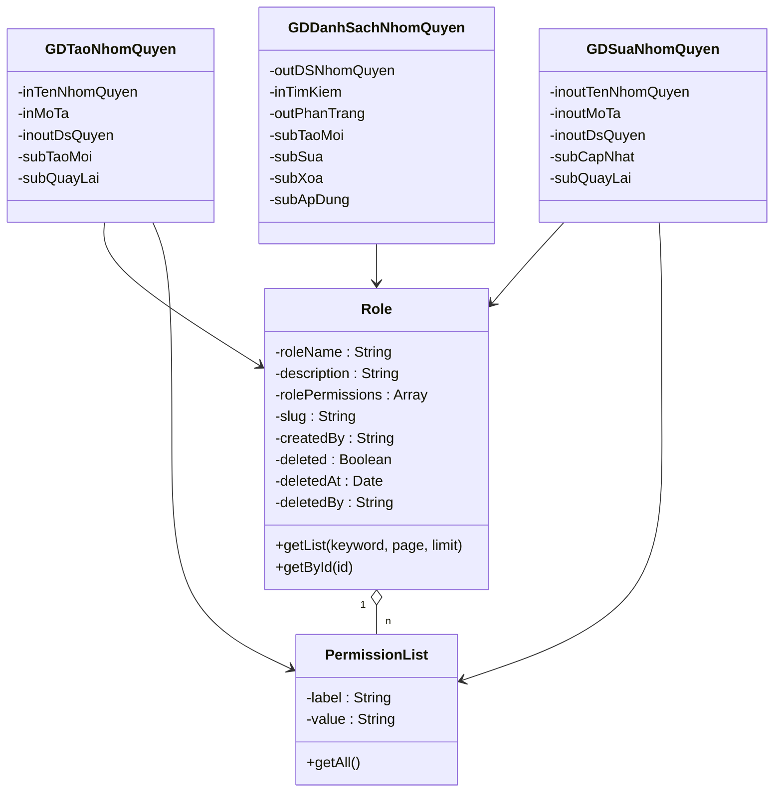
```mermaid
classDiagram
    direction TB

    class GDDanhSachNhomQuyen {
        -outDSNhomQuyen
        -inTimKiem
        -outPhanTrang
        -subTaoMoi
        -subSua
        -subXoa
        -subApDung
    }

    class GDTaoNhomQuyen {
        -inTenNhomQuyen
        -inMoTa
        -inoutDsQuyen
        -subTaoMoi
        -subQuayLai
    }

    class GDSuaNhomQuyen {
        -inoutTenNhomQuyen
        -inoutMoTa
        -inoutDsQuyen
        -subCapNhat
        -subQuayLai
    }

    class Role {
        -roleName : String
        -description : String
        -rolePermissions : Array
        -slug : String
        -createdBy : String
        -deleted : Boolean
        -deletedAt : Date
        -deletedBy : String
        +getList(keyword, page, limit)
        +getById(id)
    }

    class PermissionList {
        -label : String
        -value : String
        +getAll()
    }

    GDDanhSachNhomQuyen --> Role
    GDTaoNhomQuyen --> Role
    GDSuaNhomQuyen --> Role
    GDTaoNhomQuyen --> PermissionList
    GDSuaNhomQuyen --> PermissionList
    Role "1" o-- "n" PermissionList
```

---

### Module 2: Quản lý tài khoản quản trị (Use Case 2)

**Phân tích tĩnh module quản lý tài khoản quản trị:**

- **Bước 1:** Giao diện danh sách tài khoản -> đề xuất lớp `GDDanhSachTaiKhoan`, cần có các thành phần:
  - Bảng danh sách tài khoản: kiểu output.
  - Tìm kiếm, Lọc trạng thái, Lọc nhóm quyền, Phân trang: kiểu input/output.
  - Nút chọn Tạo mới, Sửa, Xoá, Áp dụng: kiểu submit.
  - Để lấy danh sách các Tài khoản cần xử lý:
    - Input: Bộ lọc, từ khóa, trang hiện tại.
    - Output: Danh sách tài khoản quản trị.
    - Đề xuất phương thức `getList()`, gán cho lớp `AccountAdmin`.

- **Bước 2:** Giao diện tạo tài khoản -> đề xuất lớp `GDTaoTaiKhoan`, cần có các thành phần:
  - Họ tên, Email, SĐT, Nhóm quyền, Chức vụ, Trạng thái, Mật khẩu, Avatar: kiểu input.
  - Nút chọn Tạo mới, Quay lại: kiểu submit.
  - Để lấy danh sách các Nhóm quyền hiển thị ở dropdown:
    - Đề xuất phương thức `getAll()`, gán cho lớp `Role`.

- **Bước 3:** Giao diện sửa tài khoản -> đề xuất lớp `GDSuaTaiKhoan`, cần có các thành phần:
  - Họ tên, Email, SĐT, Nhóm quyền, Chức vụ, Trạng thái, Avatar: kiểu inout.
  - Nút chọn Cập nhật, Quay lại: kiểu submit.
  - Để lấy thông tin chi tiết tài khoản cần sửa:
    - Input: ID tài khoản.
    - Output: Thông tin chi tiết tài khoản.
    - Đề xuất phương thức `getById()`, gán cho lớp `AccountAdmin`.

**Kết quả thu được từ biểu đồ lớp phân tích tĩnh module quản lý tài khoản quản trị:**

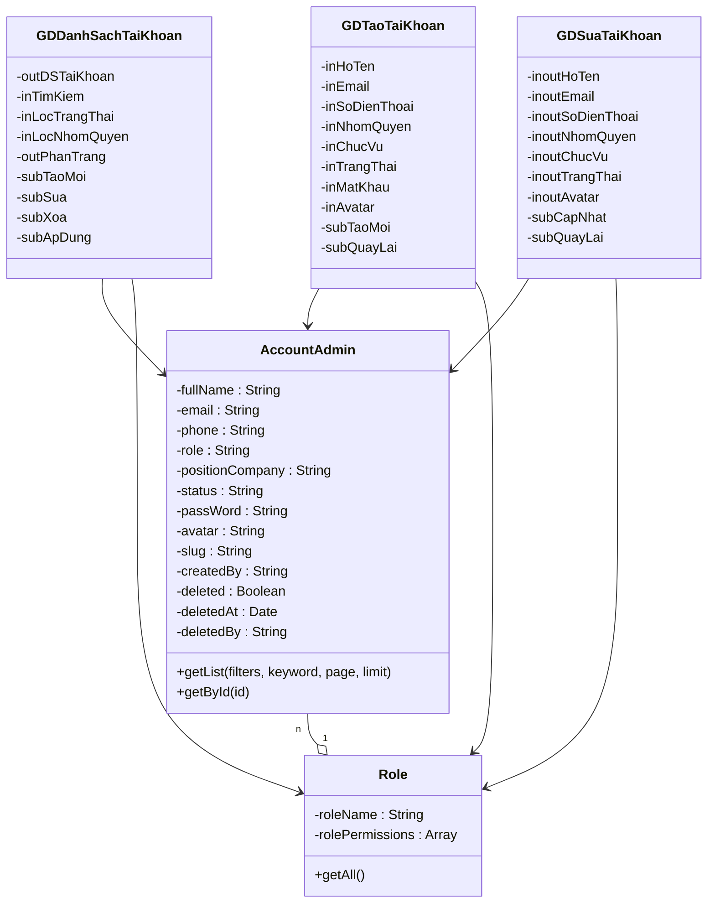
```mermaid
classDiagram
    direction TB

    class GDDanhSachTaiKhoan {
        -outDSTaiKhoan
        -inTimKiem
        -inLocTrangThai
        -inLocNhomQuyen
        -outPhanTrang
        -subTaoMoi
        -subSua
        -subXoa
        -subApDung
    }

    class GDTaoTaiKhoan {
        -inHoTen
        -inEmail
        -inSoDienThoai
        -inNhomQuyen
        -inChucVu
        -inTrangThai
        -inMatKhau
        -inAvatar
        -subTaoMoi
        -subQuayLai
    }

    class GDSuaTaiKhoan {
        -inoutHoTen
        -inoutEmail
        -inoutSoDienThoai
        -inoutNhomQuyen
        -inoutChucVu
        -inoutTrangThai
        -inoutAvatar
        -subCapNhat
        -subQuayLai
    }

    class AccountAdmin {
        -fullName : String
        -email : String
        -phone : String
        -role : String
        -positionCompany : String
        -status : String
        -passWord : String
        -avatar : String
        -slug : String
        -createdBy : String
        -deleted : Boolean
        -deletedAt : Date
        -deletedBy : String
        +getList(filters, keyword, page, limit)
        +getById(id)
    }

    class Role {
        -roleName : String
        -rolePermissions : Array
        +getAll()
    }

    GDDanhSachTaiKhoan --> AccountAdmin
    GDDanhSachTaiKhoan --> Role
    GDTaoTaiKhoan --> AccountAdmin
    GDTaoTaiKhoan --> Role
    GDSuaTaiKhoan --> AccountAdmin
    GDSuaTaiKhoan --> Role
    AccountAdmin "n" --o "1" Role
```

---

### Module 3: Quản lý thông tin website (Use Case 3)

**Phân tích tĩnh module quản lý thông tin website:**

- **Bước 1:** Giao diện thông tin website -> đề xuất lớp `GDThongTinWebsite`, cần có các thành phần:
  - Tên website, Số điện thoại, Email, Địa chỉ, Logo, Favicon: kiểu inout.
  - Nút chọn Cập nhật: kiểu submit.
  - Để lấy thông tin website hiện tại cần xử lý:
    - Output: Cấu hình thông tin website.
    - Đề xuất phương thức `getInfo()`, gán cho lớp `SettingWebsiteInfo`.
  - Để cập nhật thông tin website:
    - Input: Dữ liệu form cấu hình.
    - Đề xuất phương thức `updateInfo()`, gán cho lớp `SettingWebsiteInfo`.

**Kết quả thu được từ biểu đồ lớp phân tích tĩnh module quản lý thông tin website:**

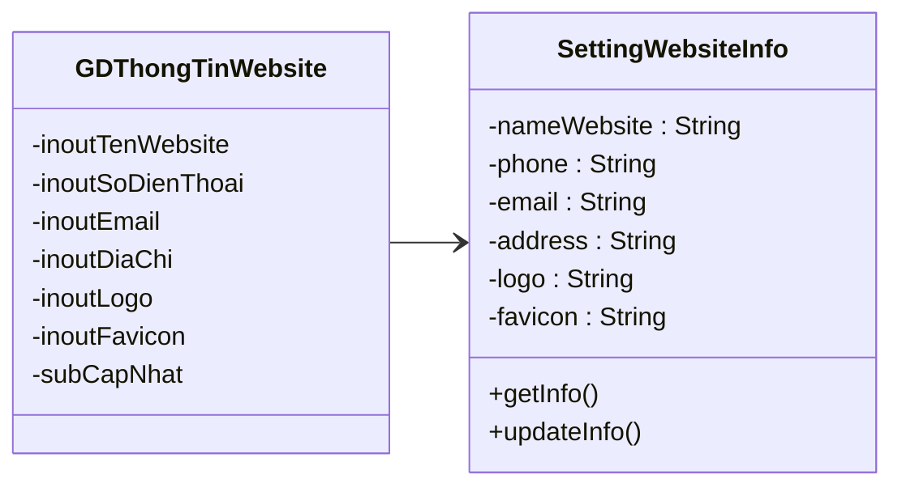
```mermaid
classDiagram
    direction LR

    class GDThongTinWebsite {
        -inoutTenWebsite
        -inoutSoDienThoai
        -inoutEmail
        -inoutDiaChi
        -inoutLogo
        -inoutFavicon
        -subCapNhat
    }

    class SettingWebsiteInfo {
        -nameWebsite : String
        -phone : String
        -email : String
        -address : String
        -logo : String
        -favicon : String
        +getInfo()
        +updateInfo()
    }

    GDThongTinWebsite --> SettingWebsiteInfo
```

---

### Module 4: Quản lý thông tin cá nhân (Use Case 4)

**Phân tích tĩnh module quản lý thông tin cá nhân:**

- **Bước 1:** Giao diện hồ sơ cá nhân -> đề xuất lớp `GDHoSoCaNhan`, cần có các thành phần:
  - Họ tên, Email, Số điện thoại, Avatar: kiểu inout.
  - Chức vụ, Nhóm quyền: kiểu output.
  - Nút chọn Cập nhật, Đổi mật khẩu: kiểu submit.
  - Để lấy thông tin cá nhân hiện tại:
    - Input: ID tài khoản đang đăng nhập.
    - Output: Thông tin chi tiết.
    - Đề xuất phương thức `getProfile()`, gán cho lớp `AccountAdmin`.
  - Để cập nhật thông tin cá nhân:
    - Input: Dữ liệu hồ sơ.
    - Đề xuất phương thức `updateProfile()`, gán cho lớp `AccountAdmin`.

- **Bước 2:** Giao diện đổi mật khẩu -> đề xuất lớp `GDDoiMatKhau`, cần có các thành phần:
  - Mật khẩu hiện tại, Mật khẩu mới, Xác nhận mật khẩu: kiểu input.
  - Nút chọn Lưu, Quay lại: kiểu submit.
  - Để cập nhật mật khẩu:
    - Input: ID tài khoản, mật khẩu mới.
    - Đề xuất phương thức `changePassword()`, gán cho lớp `AccountAdmin`.

**Kết quả thu được từ biểu đồ lớp phân tích tĩnh module quản lý thông tin cá nhân:**

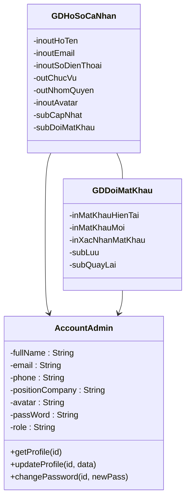
```mermaid
classDiagram
    direction TB

    class GDHoSoCaNhan {
        -inoutHoTen
        -inoutEmail
        -inoutSoDienThoai
        -outChucVu
        -outNhomQuyen
        -inoutAvatar
        -subCapNhat
        -subDoiMatKhau
    }

    class GDDoiMatKhau {
        -inMatKhauHienTai
        -inMatKhauMoi
        -inXacNhanMatKhau
        -subLuu
        -subQuayLai
    }

    class AccountAdmin {
        -fullName : String
        -email : String
        -phone : String
        -positionCompany : String
        -avatar : String
        -passWord : String
        -role : String
        +getProfile(id)
        +updateProfile(id, data)
        +changePassword(id, newPass)
    }

    GDHoSoCaNhan --> AccountAdmin
    GDDoiMatKhau --> AccountAdmin
    GDHoSoCaNhan -- GDDoiMatKhau
```

---

## 1.4 Phân tích động – Sơ đồ tuần tự (Analysis Sequence Diagram)

### Module 1: Quản lý nhóm quyền (Use Case 1)

**1. Biểu đồ tuần tự phân tích cho module quản lý nhóm quyền (Tạo nhóm quyền mới):**
1. Tại giao diện quản trị, Admin chọn menu quản lý nhóm quyền.
2. Lớp GDDanhSachNhomQuyen hiển thị danh sách nhóm quyền.
3. Admin nhấn nút "+ Tạo nhóm quyền".
4. Lớp GDDanhSachNhomQuyen gọi lớp GDTaoNhomQuyen.
5. Lớp GDTaoNhomQuyen hiển thị form tạo mới.
6. Admin nhập tên, mô tả, quyền và nhấn "Tạo mới".
7. Lớp GDTaoNhomQuyen gọi lớp Role.
8. Lớp Role xử lý lưu nhóm quyền mới.
9. Lớp Role trả kết quả cho lớp GDTaoNhomQuyen.
10. Lớp GDTaoNhomQuyen hiển thị thông báo thành công cho Admin.

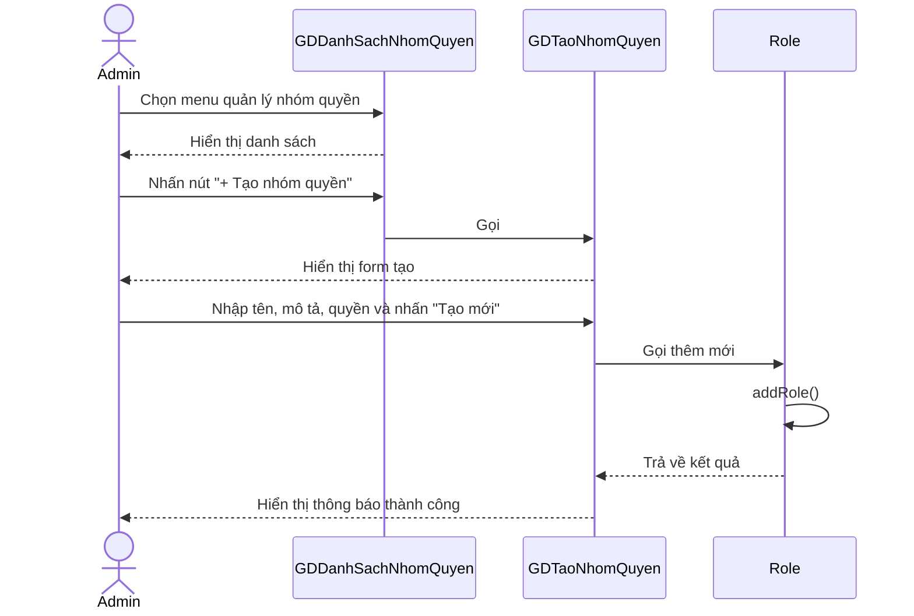
```mermaid
sequenceDiagram
    actor Admin
    participant GDDanhSachNhomQuyen
    participant GDTaoNhomQuyen
    participant Role

    Admin->>GDDanhSachNhomQuyen: Chọn menu quản lý nhóm quyền
    GDDanhSachNhomQuyen-->>Admin: Hiển thị danh sách
    Admin->>GDDanhSachNhomQuyen: Nhấn nút "+ Tạo nhóm quyền"
    GDDanhSachNhomQuyen->>GDTaoNhomQuyen: Gọi
    GDTaoNhomQuyen-->>Admin: Hiển thị form tạo
    Admin->>GDTaoNhomQuyen: Nhập tên, mô tả, quyền và nhấn "Tạo mới"
    GDTaoNhomQuyen->>Role: Gọi thêm mới
    Role->>Role: addRole()
    Role-->>GDTaoNhomQuyen: Trả về kết quả
    GDTaoNhomQuyen-->>Admin: Hiển thị thông báo thành công
```

**2. Biểu đồ tuần tự phân tích cho module quản lý nhóm quyền (Xem danh sách & Tìm kiếm):**
1. Tại giao diện quản trị, Admin chọn menu nhóm quyền.
2. Lớp GDDanhSachNhomQuyen gọi lớp Role yêu cầu lấy danh sách (có kèm từ khóa tìm kiếm và phân trang).
3. Lớp Role tìm các nhóm quyền trong cơ sở dữ liệu.
4. Lớp Role trả kết quả cho lớp GDDanhSachNhomQuyen.
5. Lớp GDDanhSachNhomQuyen hiển thị danh sách kết quả cho Admin.

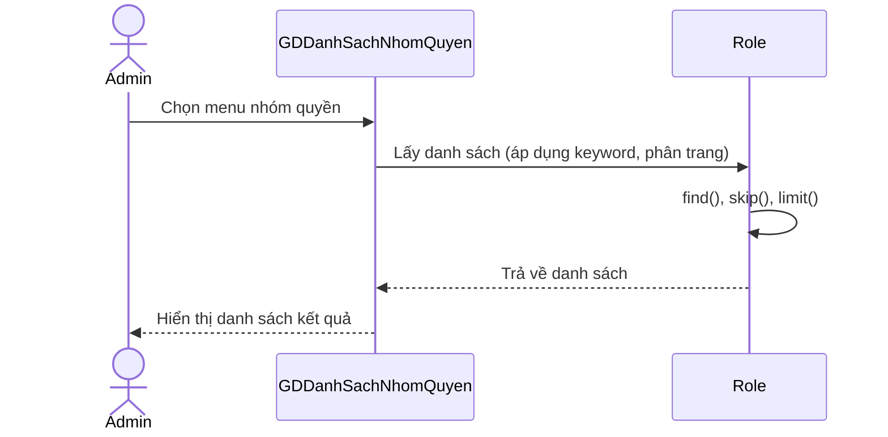
```mermaid
sequenceDiagram
    actor Admin
    participant GDDanhSachNhomQuyen
    participant Role

    Admin->>GDDanhSachNhomQuyen: Chọn menu nhóm quyền
    GDDanhSachNhomQuyen->>Role: Lấy danh sách (áp dụng keyword, phân trang)
    Role->>Role: find(), skip(), limit()
    Role-->>GDDanhSachNhomQuyen: Trả về danh sách
    GDDanhSachNhomQuyen-->>Admin: Hiển thị danh sách kết quả
```

**3. Biểu đồ tuần tự phân tích cho module quản lý nhóm quyền (Xóa hàng loạt):**
1. Tại giao diện danh sách nhóm quyền, Admin tích chọn các checkbox, chọn "Xoá" và nhấn "Áp dụng".
2. Lớp GDDanhSachNhomQuyen gọi lớp Role.
3. Lớp Role cập nhật trạng thái xóa cho các bản ghi được chọn.
4. Lớp Role trả kết quả cho lớp GDDanhSachNhomQuyen.
5. Lớp GDDanhSachNhomQuyen hiển thị thông báo thành công và làm mới danh sách.

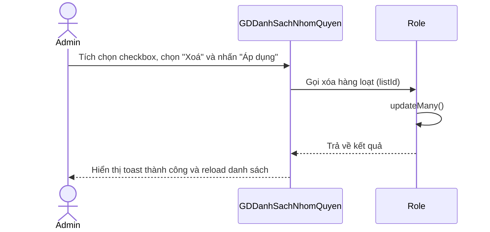
```mermaid
sequenceDiagram
    actor Admin
    participant GDDanhSachNhomQuyen
    participant Role

    Admin->>GDDanhSachNhomQuyen: Tích chọn checkbox, chọn "Xoá" và nhấn "Áp dụng"
    GDDanhSachNhomQuyen->>Role: Gọi xóa hàng loạt (listId)
    Role->>Role: updateMany()
    Role-->>GDDanhSachNhomQuyen: Trả về kết quả
    GDDanhSachNhomQuyen-->>Admin: Hiển thị toast thành công và reload danh sách
```

**4. Biểu đồ tuần tự phân tích cho module quản lý nhóm quyền (Chỉnh sửa nhóm quyền):**
1. Tại giao diện danh sách nhóm quyền, Admin nhấn nút "Sửa" trên một dòng.
2. Lớp GDDanhSachNhomQuyen gọi lớp Role yêu cầu thông tin chi tiết.
3. Lớp Role trả về thông tin nhóm quyền cho lớp GDDanhSachNhomQuyen.
4. Lớp GDDanhSachNhomQuyen gọi lớp GDSuaNhomQuyen.
5. Lớp GDSuaNhomQuyen hiển thị form đã điền sẵn dữ liệu.
6. Admin chỉnh sửa thông tin và nhấn "Cập nhật".
7. Lớp GDSuaNhomQuyen gọi lớp Role.
8. Lớp Role xử lý cập nhật nhóm quyền.
9. Lớp Role trả kết quả cho lớp GDSuaNhomQuyen.
10. Lớp GDSuaNhomQuyen hiển thị thông báo thành công cho Admin.

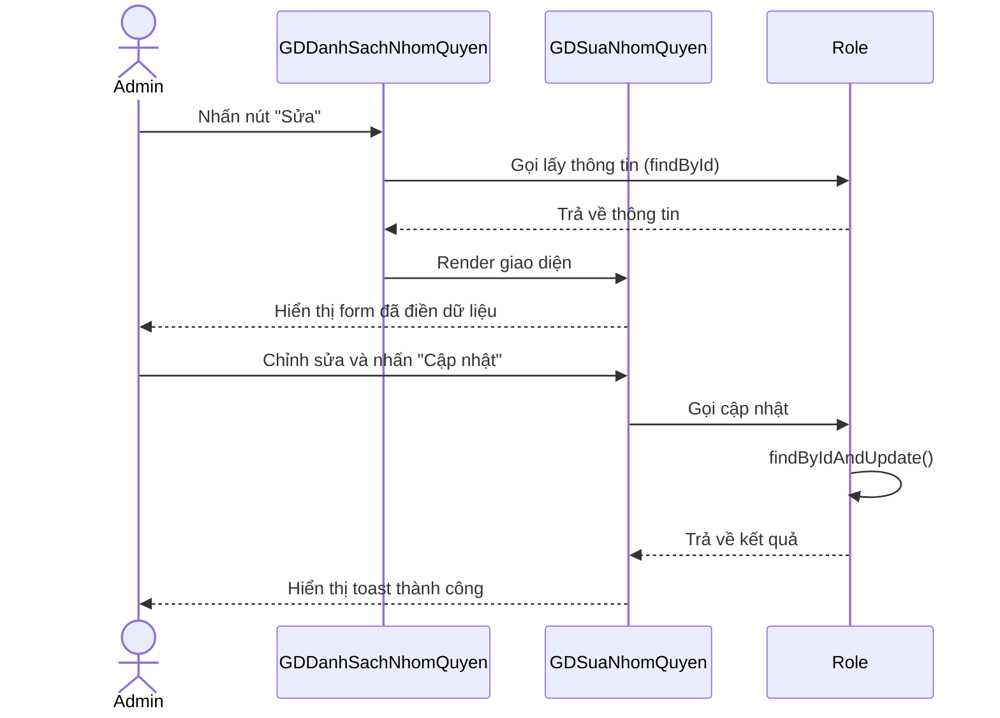
```mermaid
sequenceDiagram
    actor Admin
    participant GDDanhSachNhomQuyen
    participant GDSuaNhomQuyen
    participant Role

    Admin->>GDDanhSachNhomQuyen: Nhấn nút "Sửa"
    GDDanhSachNhomQuyen->>Role: Gọi lấy thông tin (findById)
    Role-->>GDDanhSachNhomQuyen: Trả về thông tin
    GDDanhSachNhomQuyen->>GDSuaNhomQuyen: Render giao diện
    GDSuaNhomQuyen-->>Admin: Hiển thị form đã điền dữ liệu
    Admin->>GDSuaNhomQuyen: Chỉnh sửa và nhấn "Cập nhật"
    GDSuaNhomQuyen->>Role: Gọi cập nhật
    Role->>Role: findByIdAndUpdate()
    Role-->>GDSuaNhomQuyen: Trả về kết quả
    GDSuaNhomQuyen-->>Admin: Hiển thị toast thành công
```

**5. Biểu đồ tuần tự phân tích cho module quản lý nhóm quyền (Xoá nhóm quyền - Soft Delete):**
1. Tại giao diện danh sách nhóm quyền, Admin nhấn nút "Xoá" trên một dòng và xác nhận.
2. Lớp GDDanhSachNhomQuyen gọi lớp Role.
3. Lớp Role cập nhật trạng thái xóa cho bản ghi đó.
4. Lớp Role trả kết quả cho lớp GDDanhSachNhomQuyen.
5. Lớp GDDanhSachNhomQuyen hiển thị thông báo thành công và xóa dòng khỏi giao diện.

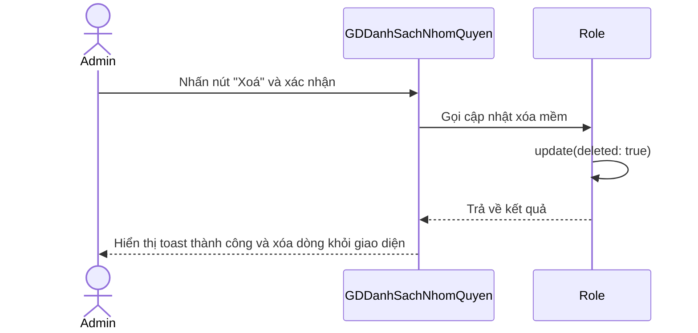
```mermaid
sequenceDiagram
    actor Admin
    participant GDDanhSachNhomQuyen
    participant Role

    Admin->>GDDanhSachNhomQuyen: Nhấn nút "Xoá" và xác nhận
    GDDanhSachNhomQuyen->>Role: Gọi cập nhật xóa mềm
    Role->>Role: update(deleted: true)
    Role-->>GDDanhSachNhomQuyen: Trả về kết quả
    GDDanhSachNhomQuyen-->>Admin: Hiển thị toast thành công và xóa dòng khỏi giao diện
```

---

### Module 2: Quản lý tài khoản quản trị (Use Case 2)

**1. Biểu đồ tuần tự phân tích cho module quản lý tài khoản (Tạo tài khoản):**
1. Tại giao diện quản trị, Admin chọn menu quản lý tài khoản quản trị.
2. Lớp GDDanhSachTaiKhoan hiển thị danh sách tài khoản.
3. Admin nhấn nút "+ Tạo tài khoản".
4. Lớp GDDanhSachTaiKhoan gọi lớp GDTaoTaiKhoan.
5. Lớp GDTaoTaiKhoan hiển thị form tạo mới.
6. Admin nhập thông tin, ảnh và nhấn "Tạo mới".
7. Lớp GDTaoTaiKhoan gọi lớp AccountAdmin.
8. Lớp AccountAdmin xử lý lưu tài khoản mới.
9. Lớp AccountAdmin trả kết quả cho lớp GDTaoTaiKhoan.
10. Lớp GDTaoTaiKhoan hiển thị thông báo thành công cho Admin.

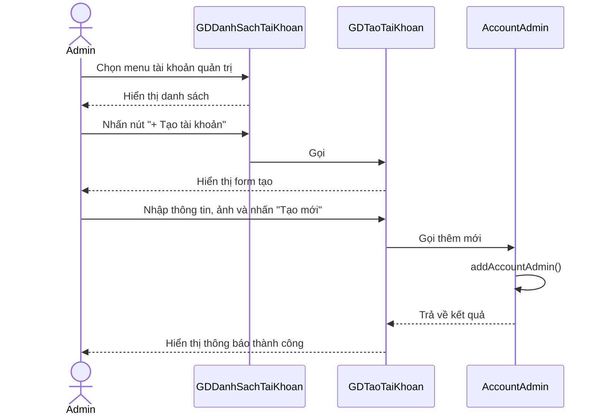
```mermaid
sequenceDiagram
    actor Admin
    participant GDDanhSachTaiKhoan
    participant GDTaoTaiKhoan
    participant AccountAdmin

    Admin->>GDDanhSachTaiKhoan: Chọn menu tài khoản quản trị
    GDDanhSachTaiKhoan-->>Admin: Hiển thị danh sách
    Admin->>GDDanhSachTaiKhoan: Nhấn nút "+ Tạo tài khoản"
    GDDanhSachTaiKhoan->>GDTaoTaiKhoan: Gọi
    GDTaoTaiKhoan-->>Admin: Hiển thị form tạo
    Admin->>GDTaoTaiKhoan: Nhập thông tin, ảnh và nhấn "Tạo mới"
    GDTaoTaiKhoan->>AccountAdmin: Gọi thêm mới
    AccountAdmin->>AccountAdmin: addAccountAdmin()
    AccountAdmin-->>GDTaoTaiKhoan: Trả về kết quả
    GDTaoTaiKhoan-->>Admin: Hiển thị thông báo thành công
```

**2. Biểu đồ tuần tự phân tích cho module quản lý tài khoản (Xem danh sách, Lọc & Tìm kiếm):**
1. Tại giao diện quản trị, Admin chọn menu tài khoản quản trị.
2. Lớp GDDanhSachTaiKhoan gọi lớp AccountAdmin yêu cầu lấy danh sách (áp dụng bộ lọc, tìm kiếm).
3. Lớp AccountAdmin tìm các tài khoản trong cơ sở dữ liệu.
4. Lớp AccountAdmin trả kết quả cho lớp GDDanhSachTaiKhoan.
5. Lớp GDDanhSachTaiKhoan gọi lớp Role yêu cầu danh sách tên nhóm quyền để map vào dữ liệu.
6. Lớp Role trả kết quả danh sách nhóm quyền.
7. Lớp GDDanhSachTaiKhoan hiển thị danh sách kết quả cho Admin.

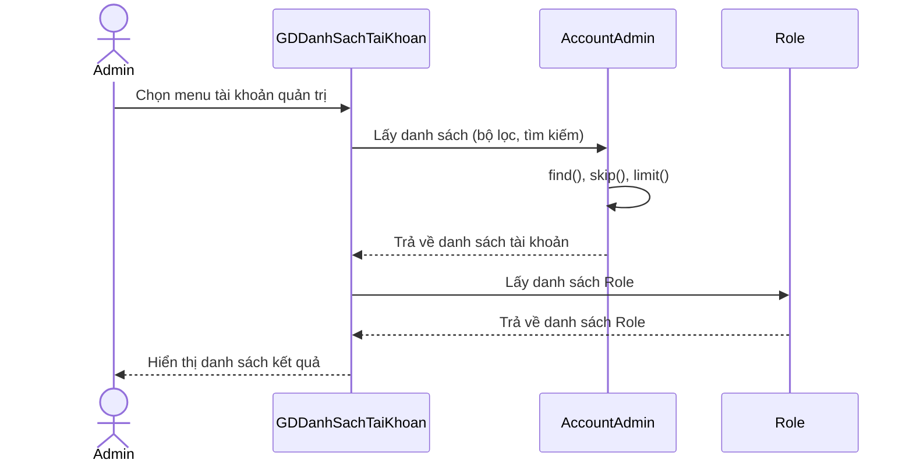
```mermaid
sequenceDiagram
    actor Admin
    participant GDDanhSachTaiKhoan
    participant AccountAdmin
    participant Role

    Admin->>GDDanhSachTaiKhoan: Chọn menu tài khoản quản trị
    GDDanhSachTaiKhoan->>AccountAdmin: Lấy danh sách (bộ lọc, tìm kiếm)
    AccountAdmin->>AccountAdmin: find(), skip(), limit()
    AccountAdmin-->>GDDanhSachTaiKhoan: Trả về danh sách tài khoản
    GDDanhSachTaiKhoan->>Role: Lấy danh sách Role
    Role-->>GDDanhSachTaiKhoan: Trả về danh sách Role
    GDDanhSachTaiKhoan-->>Admin: Hiển thị danh sách kết quả
```

**3. Biểu đồ tuần tự phân tích cho module quản lý tài khoản (Chỉnh sửa tài khoản):**
1. Tại giao diện danh sách tài khoản, Admin nhấn nút "Sửa" trên một dòng.
2. Lớp GDDanhSachTaiKhoan gọi lớp AccountAdmin yêu cầu thông tin chi tiết.
3. Lớp AccountAdmin trả về thông tin tài khoản cho lớp GDDanhSachTaiKhoan.
4. Lớp GDDanhSachTaiKhoan gọi lớp GDSuaTaiKhoan.
5. Lớp GDSuaTaiKhoan hiển thị form đã điền sẵn dữ liệu.
6. Admin chỉnh sửa thông tin, đổi ảnh và nhấn "Cập nhật".
7. Lớp GDSuaTaiKhoan gọi lớp AccountAdmin.
8. Lớp AccountAdmin xử lý cập nhật tài khoản.
9. Lớp AccountAdmin trả kết quả cho lớp GDSuaTaiKhoan.
10. Lớp GDSuaTaiKhoan hiển thị thông báo thành công cho Admin.

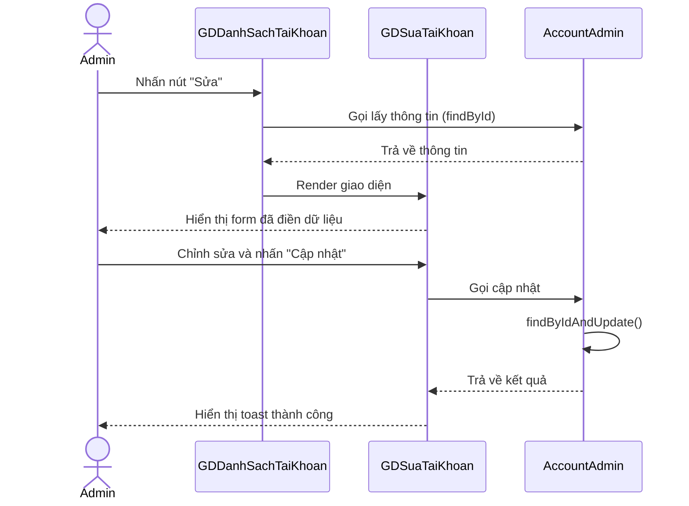
```mermaid
sequenceDiagram
    actor Admin
    participant GDDanhSachTaiKhoan
    participant GDSuaTaiKhoan
    participant AccountAdmin

    Admin->>GDDanhSachTaiKhoan: Nhấn nút "Sửa"
    GDDanhSachTaiKhoan->>AccountAdmin: Gọi lấy thông tin (findById)
    AccountAdmin-->>GDDanhSachTaiKhoan: Trả về thông tin
    GDDanhSachTaiKhoan->>GDSuaTaiKhoan: Render giao diện
    GDSuaTaiKhoan-->>Admin: Hiển thị form đã điền dữ liệu
    Admin->>GDSuaTaiKhoan: Chỉnh sửa và nhấn "Cập nhật"
    GDSuaTaiKhoan->>AccountAdmin: Gọi cập nhật
    AccountAdmin->>AccountAdmin: findByIdAndUpdate()
    AccountAdmin-->>GDSuaTaiKhoan: Trả về kết quả
    GDSuaTaiKhoan-->>Admin: Hiển thị toast thành công
```

**4. Biểu đồ tuần tự phân tích cho module quản lý tài khoản (Cập nhật trạng thái/Xóa hàng loạt):**
1. Tại giao diện danh sách tài khoản, Admin chọn nhiều checkbox, chọn action và nhấn "Áp dụng".
2. Lớp GDDanhSachTaiKhoan gọi lớp AccountAdmin.
3. Lớp AccountAdmin xử lý cập nhật hàng loạt (trạng thái hoặc deleted).
4. Lớp AccountAdmin trả kết quả cho lớp GDDanhSachTaiKhoan.
5. Lớp GDDanhSachTaiKhoan hiển thị thông báo thành công và reload danh sách.

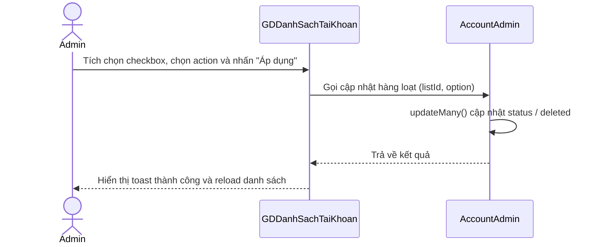
```mermaid
sequenceDiagram
    actor Admin
    participant GDDanhSachTaiKhoan
    participant AccountAdmin

    Admin->>GDDanhSachTaiKhoan: Tích chọn checkbox, chọn action và nhấn "Áp dụng"
    GDDanhSachTaiKhoan->>AccountAdmin: Gọi cập nhật hàng loạt (listId, option)
    AccountAdmin->>AccountAdmin: updateMany() cập nhật status / deleted
    AccountAdmin-->>GDDanhSachTaiKhoan: Trả về kết quả
    GDDanhSachTaiKhoan-->>Admin: Hiển thị toast thành công và reload danh sách
```

**5. Biểu đồ tuần tự phân tích cho module quản lý tài khoản (Xoá tài khoản - Soft Delete):**
1. Tại giao diện danh sách tài khoản, Admin nhấn nút "Xoá" trên một dòng và xác nhận.
2. Lớp GDDanhSachTaiKhoan gọi lớp AccountAdmin.
3. Lớp AccountAdmin cập nhật trạng thái xóa cho bản ghi đó.
4. Lớp AccountAdmin trả kết quả cho lớp GDDanhSachTaiKhoan.
5. Lớp GDDanhSachTaiKhoan hiển thị thông báo thành công và xóa dòng khỏi giao diện.

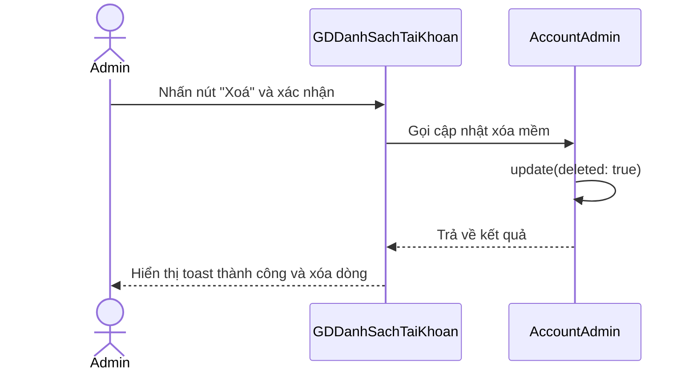
```mermaid
sequenceDiagram
    actor Admin
    participant GDDanhSachTaiKhoan
    participant AccountAdmin

    Admin->>GDDanhSachTaiKhoan: Nhấn nút "Xoá" và xác nhận
    GDDanhSachTaiKhoan->>AccountAdmin: Gọi cập nhật xóa mềm
    AccountAdmin->>AccountAdmin: update(deleted: true)
    AccountAdmin-->>GDDanhSachTaiKhoan: Trả về kết quả
    GDDanhSachTaiKhoan-->>Admin: Hiển thị toast thành công và xóa dòng
```

---

### Module 3: Quản lý thông tin website (Use Case 3)

**Biểu đồ tuần tự phân tích cho module quản lý thông tin website:**
1. Tại giao diện quản trị, Admin chọn menu sửa thông tin website.
2. Lớp GDThongTinWebsite gọi lớp SettingWebsiteInfo yêu cầu dữ liệu.
3. Lớp SettingWebsiteInfo tìm cấu hình website hiện tại.
4. Lớp SettingWebsiteInfo trả kết quả cho lớp GDThongTinWebsite.
5. Lớp GDThongTinWebsite hiển thị thông tin hiện tại cho Admin.
6. Admin sửa thông tin, chọn logo và nhấn "Cập nhật".
7. Lớp GDThongTinWebsite gọi lớp SettingWebsiteInfo.
8. Lớp SettingWebsiteInfo xử lý cập nhật thông tin.
9. Lớp SettingWebsiteInfo trả kết quả cho lớp GDThongTinWebsite.
10. Lớp GDThongTinWebsite hiển thị thông báo thành công cho Admin.

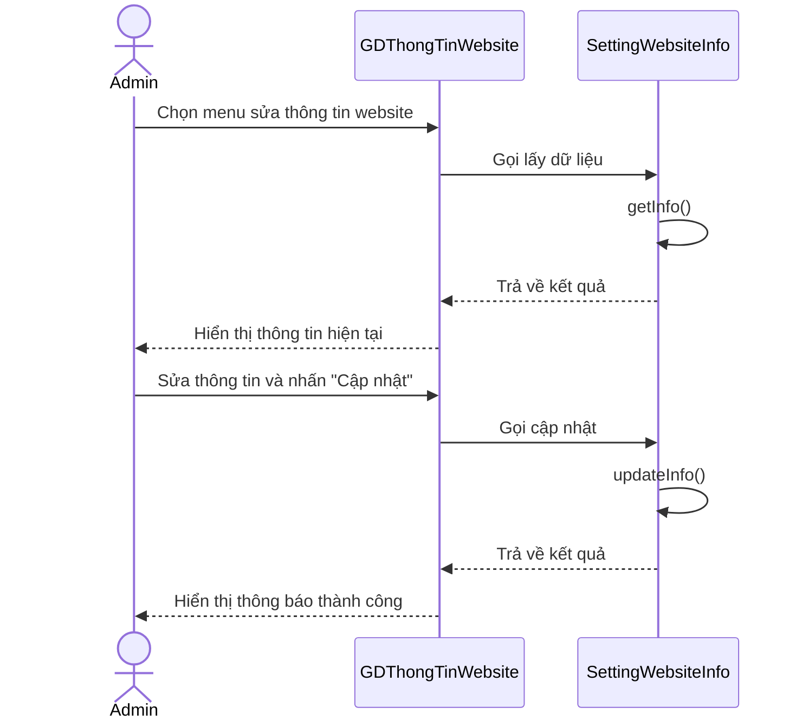
```mermaid
sequenceDiagram
    actor Admin
    participant GDThongTinWebsite
    participant SettingWebsiteInfo

    Admin->>GDThongTinWebsite: Chọn menu sửa thông tin website
    GDThongTinWebsite->>SettingWebsiteInfo: Gọi lấy dữ liệu
    SettingWebsiteInfo->>SettingWebsiteInfo: getInfo()
    SettingWebsiteInfo-->>GDThongTinWebsite: Trả về kết quả
    GDThongTinWebsite-->>Admin: Hiển thị thông tin hiện tại
    Admin->>GDThongTinWebsite: Sửa thông tin và nhấn "Cập nhật"
    GDThongTinWebsite->>SettingWebsiteInfo: Gọi cập nhật
    SettingWebsiteInfo->>SettingWebsiteInfo: updateInfo()
    SettingWebsiteInfo-->>GDThongTinWebsite: Trả về kết quả
    GDThongTinWebsite-->>Admin: Hiển thị thông báo thành công
```

---

### Module 4: Quản lý thông tin cá nhân (Use Case 4)

**Biểu đồ tuần tự phân tích cho module quản lý thông tin cá nhân:**
1. Tại giao diện quản trị, Admin chọn menu sửa thông tin cá nhân.
2. Lớp GDHoSoCaNhan gọi lớp AccountAdmin yêu cầu dữ liệu hồ sơ.
3. Lớp AccountAdmin tìm thông tin của Admin đang đăng nhập.
4. Lớp AccountAdmin trả kết quả cho lớp GDHoSoCaNhan.
5. Lớp GDHoSoCaNhan hiển thị thông hiện tại cho Admin.
6. Admin sửa thông tin và nhấn "Cập nhật".
7. Lớp GDHoSoCaNhan gọi lớp AccountAdmin.
8. Lớp AccountAdmin xử lý cập nhật hồ sơ.
9. Lớp AccountAdmin trả kết quả cho lớp GDHoSoCaNhan.
10. Lớp GDHoSoCaNhan hiển thị thông báo thành công cho Admin.
11. Admin nhấn nút "Đổi mật khẩu".
12. Lớp GDHoSoCaNhan gọi lớp GDDoiMatKhau hiển thị form.
13. Admin nhập mật khẩu cũ, mới và nhấn "Lưu".
14. Lớp GDDoiMatKhau gọi lớp AccountAdmin.
15. Lớp AccountAdmin xử lý cập nhật mật khẩu.
16. Lớp AccountAdmin trả kết quả cho lớp GDDoiMatKhau.
17. Lớp GDDoiMatKhau hiển thị thông báo thành công.

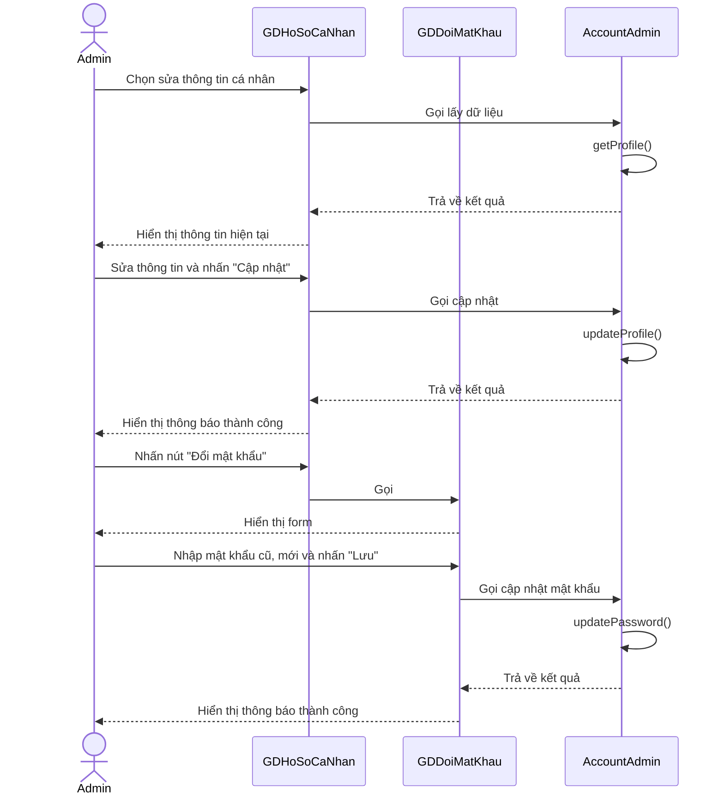
```mermaid
sequenceDiagram
    actor Admin
    participant GDHoSoCaNhan
    participant GDDoiMatKhau
    participant AccountAdmin

    Admin->>GDHoSoCaNhan: Chọn sửa thông tin cá nhân
    GDHoSoCaNhan->>AccountAdmin: Gọi lấy dữ liệu
    AccountAdmin->>AccountAdmin: getProfile()
    AccountAdmin-->>GDHoSoCaNhan: Trả về kết quả
    GDHoSoCaNhan-->>Admin: Hiển thị thông tin hiện tại
    Admin->>GDHoSoCaNhan: Sửa thông tin và nhấn "Cập nhật"
    GDHoSoCaNhan->>AccountAdmin: Gọi cập nhật
    AccountAdmin->>AccountAdmin: updateProfile()
    AccountAdmin-->>GDHoSoCaNhan: Trả về kết quả
    GDHoSoCaNhan-->>Admin: Hiển thị thông báo thành công

    Admin->>GDHoSoCaNhan: Nhấn nút "Đổi mật khẩu"
    GDHoSoCaNhan->>GDDoiMatKhau: Gọi
    GDDoiMatKhau-->>Admin: Hiển thị form
    Admin->>GDDoiMatKhau: Nhập mật khẩu cũ, mới và nhấn "Lưu"
    GDDoiMatKhau->>AccountAdmin: Gọi cập nhật mật khẩu
    AccountAdmin->>AccountAdmin: updatePassword()
    AccountAdmin-->>GDDoiMatKhau: Trả về kết quả
    GDDoiMatKhau-->>Admin: Hiển thị thông báo thành công
```

---

# PHẦN II – THIẾT KẾ (DESIGN)

## 2.1 Thiết kế lớp thực thể (Entity Classes Design)

### Lớp `AccountAdmin`

| Thuộc tính | Kiểu dữ liệu | Ràng buộc / Mô tả |
|---|---|---|
| `_id` | `ObjectId` | Khóa chính, tự sinh bởi MongoDB |
| `fullName` | `String` | Họ và tên đầy đủ |
| `email` | `String` | Email đăng nhập, không trùng lặp |
| `phone` | `String` | Số điện thoại, không trùng lặp |
| `role` | `String` (ref ObjectId) | ID nhóm quyền tham chiếu sang collection `roles` |
| `positionCompany` | `String` | Chức vụ trong công ty |
| `status` | `String` | Enum: `"initial"` / `"active"` / `"inactive"` |
| `passWord` | `String` | Mật khẩu đã hash bcrypt (cost factor = 10) |
| `avatar` | `String` | URL Cloudinary CDN |
| `slug` | `String` | Tự sinh từ `fullName`, unique, dùng để tìm kiếm regex |
| `createdBy` | `String` | ID admin tạo tài khoản này |
| `updatedBy` | `String` | ID admin sửa lần cuối |
| `deleted` | `Boolean` | Default `false`. Soft-delete flag |
| `deletedBy` | `String` | ID admin thực hiện xoá |
| `deletedAt` | `Date` | Thời điểm xoá |
| `createdAt` | `Date` | Tự sinh bởi `timestamps: true` |
| `updatedAt` | `Date` | Tự sinh bởi `timestamps: true` |

### Lớp `Role`

| Thuộc tính | Kiểu dữ liệu | Ràng buộc / Mô tả |
|---|---|---|
| `_id` | `ObjectId` | Khóa chính, tự sinh |
| `roleName` | `String` | Tên nhóm quyền |
| `description` | `String` | Mô tả ngắn về nhóm quyền |
| `rolePermissions` | `Array<String>` | Danh sách mã quyền, VD: `["dashboard-view","tour-edit"]` |
| `slug` | `String` | Tự sinh từ `roleName`, unique |
| `createdBy` | `String` | ID admin tạo |
| `updatedBy` | `String` | ID admin sửa lần cuối |
| `deleted` | `Boolean` | Default `false` |
| `deletedBy` | `String` | ID admin xoá |
| `deletedAt` | `Date` | Thời điểm xoá |
| `createdAt` | `Date` | Timestamps |
| `updatedAt` | `Date` | Timestamps |

### Lớp `SettingWebsiteInfo`

| Thuộc tính | Kiểu dữ liệu | Ràng buộc / Mô tả |
|---|---|---|
| `_id` | `ObjectId` | Khóa chính. Chỉ có 1 document duy nhất (singleton) |
| `nameWebsite` | `String` | Tên thương hiệu website |
| `phone` | `String` | Số điện thoại liên hệ chính |
| `email` | `String` | Email liên hệ chính |
| `address` | `String` | Địa chỉ công ty |
| `logo` | `String` | URL logo – Cloudinary CDN |
| `favicon` | `String` | URL favicon – Cloudinary CDN |
| `createdAt` | `Date` | Timestamps |
| `updatedAt` | `Date` | Timestamps |

### Bảng mã quyền (PermissionList – cấu hình tĩnh)

> Định nghĩa tại `configs/variable.config.js`, không lưu vào DB.

| Mã quyền (`value`) | Nhãn hiển thị (`label`) |
|---|---|
| `dashboard-view` | Xem trang tổng quan |
| `category-view` | Xem danh mục |
| `category-create` | Tạo danh mục |
| `category-edit` | Sửa danh mục |
| `category-delete` | Xoá danh mục |
| `tour-view` | Xem tour |
| `tour-create` | Tạo tour |
| `tour-edit` | Sửa tour |
| `tour-delete` | Xoá tour |

---

## 2.2 Thiết kế Cơ sở dữ liệu (Database Design)

> **DBMS:** MongoDB Atlas (NoSQL Document Store)  
> **ODM:** Mongoose v9.x  
> **Pattern:** Singleton document cho `setting-website-info`; Soft-delete pattern cho `accounts-admin` và `roles`.

### Sơ đồ ERD

```mermaid
erDiagram
    ACCOUNTS_ADMIN {
        ObjectId _id PK
        String fullName
        String email
        String phone
        String role FK
        String positionCompany
        String status
        String passWord
        String avatar
        String slug
        String createdBy
        String updatedBy
        Boolean deleted
        String deletedBy
        Date deletedAt
        Date createdAt
        Date updatedAt
    }

    ROLES {
        ObjectId _id PK
        String roleName
        String description
        Array rolePermissions
        String slug
        String createdBy
        String updatedBy
        Boolean deleted
        String deletedBy
        Date deletedAt
        Date createdAt
        Date updatedAt
    }

    SETTING_WEBSITE_INFO {
        ObjectId _id PK
        String nameWebsite
        String phone
        String email
        String address
        String logo
        String favicon
        Date createdAt
        Date updatedAt
    }

    FORGOT_PASSWORDS {
        ObjectId _id PK
        String email
        String otp
        Date expiredAt
        Date createdAt
    }

    ACCOUNTS_ADMIN }o--|| ROLES : "thuoc_nhom_role"
    ACCOUNTS_ADMIN ||--o{ ACCOUNTS_ADMIN : "createdBy_updatedBy"
```

### Bảng 1. Ánh xạ lớp thực thể sang collection
| Lớp thực thể | Collection | Cách lưu |
|---|---|---|
| AccountAdmin | `accounts-admin` | Collection riêng |
| Role | `roles` | Collection riêng |
| SettingWebsiteInfo | `setting-website-info` | Collection riêng, singleton (chỉ lưu 1 bản ghi duy nhất) |
| ForgotPassword | `forgot-passwords` | Collection riêng |

### Collection `accounts-admin`
Bảng 2. Cấu trúc collection `accounts-admin`
| Trường | Kiểu | Ràng buộc | Mô tả |
|---|---|---|---|
| `_id` | ObjectId | Khóa chính | Mã tài khoản. |
| `fullName` | String | Bắt buộc | Họ và tên đầy đủ. |
| `email` | String | Bắt buộc, duy nhất | Email đăng nhập. |
| `phone` | String | Duy nhất | Số điện thoại liên hệ. |
| `role` | String | ref roles | ID của nhóm quyền (lưu dạng String tham chiếu). |
| `positionCompany` | String | | Chức vụ trong công ty. |
| `status` | String | initial \| active \| inactive | Trạng thái hoạt động. |
| `passWord` | String | Bắt buộc | Mật khẩu (đã mã hoá bằng bcrypt). |
| `avatar` | String | | URL ảnh đại diện. |
| `slug` | String | Duy nhất, index | Tự sinh từ fullName, dùng để query tìm kiếm. |
| `createdBy` | String | ref accounts-admin | ID tài khoản tạo bản ghi này. |
| `updatedBy` | String | ref accounts-admin | ID tài khoản cập nhật lần cuối. |
| `deleted` | Boolean | Mặc định false, index | Cờ xóa mềm. |
| `deletedBy` | String | ref accounts-admin | ID tài khoản thực hiện xóa. |
| `deletedAt` | Date | | Thời điểm xóa. |
| `createdAt`, `updatedAt` | Date | timestamps | Thời điểm tạo và cập nhật. |

### Collection `roles`
Bảng 3. Cấu trúc collection `roles`
| Trường | Kiểu | Ràng buộc | Mô tả |
|---|---|---|---|
| `_id` | ObjectId | Khóa chính | Mã nhóm quyền. |
| `roleName` | String | Bắt buộc | Tên nhóm quyền. |
| `description` | String | | Mô tả ngắn gọn về nhóm quyền. |
| `rolePermissions` | Array | | Mảng chuỗi mã quyền. (VD: `["dashboard-view", "tour-edit"]`) |
| `slug` | String | Duy nhất, index | Tự sinh từ roleName. |
| `createdBy` | String | ref accounts-admin | ID tài khoản tạo. |
| `updatedBy` | String | ref accounts-admin | ID tài khoản cập nhật lần cuối. |
| `deleted` | Boolean | Mặc định false, index | Cờ xóa mềm. |
| `deletedBy` | String | ref accounts-admin | ID tài khoản thực hiện xóa. |
| `deletedAt` | Date | | Thời điểm xóa. |
| `createdAt`, `updatedAt` | Date | timestamps | Thời điểm tạo và cập nhật. |

### Collection `setting-website-info`
Bảng 4. Cấu trúc collection `setting-website-info`
| Trường | Kiểu | Ràng buộc | Mô tả |
|---|---|---|---|
| `_id` | ObjectId | Khóa chính | Mã cấu hình. |
| `nameWebsite` | String | Bắt buộc | Tên thương hiệu/website. |
| `phone` | String | | Số điện thoại liên hệ chính. |
| `email` | String | | Email liên hệ chính. |
| `address` | String | | Địa chỉ văn phòng. |
| `logo` | String | | URL hình ảnh logo (lưu trên Cloudinary). |
| `favicon` | String | | URL hình ảnh favicon. |
| `createdAt`, `updatedAt` | Date | timestamps | Thời điểm tạo và cập nhật. |

### Collection `forgot-passwords`
Bảng 5. Cấu trúc collection `forgot-passwords`
| Trường | Kiểu | Ràng buộc | Mô tả |
|---|---|---|---|
| `_id` | ObjectId | Khóa chính | Mã giao dịch OTP. |
| `email` | String | Bắt buộc, index | Email yêu cầu đặt lại mật khẩu. |
| `otp` | String | Bắt buộc | Mã OTP gửi qua email. |
| `expiredAt` | Date | expires | Thời điểm mã OTP hết hạn. |
| `createdAt` | Date | timestamps | Thời điểm tạo. |

---

## 2.3 Thiết kế tĩnh – Sơ đồ lớp (Design Class Diagram)

```mermaid
classDiagram
    direction TB

    %% View Classes
    class AdminHomeFrm {
        -btnManageRole : JButton
        -btnManageAccount : JButton
        -btnWebsiteInfo : JButton
        -btnProfile : JButton
        -user : AccountAdmin
        +AdminHomeFrm(u : AccountAdmin)
        +actionPerformed(e : ActionEvent) : void
    }

    class RoleManageFrm {
        -btnSearch : JButton
        -btnAddRole : JButton
        -btnEditRole : JButton
        -btnDeleteRole : JButton
        -btnDeleteMulti : JButton
        -tblRole : JTable
        -user : AccountAdmin
        +RoleManageFrm(u : AccountAdmin)
        +actionPerformed(e : ActionEvent) : void
    }

    class RoleEditFrm {
        -r : Role
        -txtRoleName : JTextField
        -txtDescription : JTextField
        -chkPermissions : JCheckBox[]
        -btnSave : JButton
        -btnReset : JButton
        -user : AccountAdmin
        +RoleEditFrm(u : AccountAdmin, r : Role)
        +actionPerformed(e : ActionEvent) : void
    }

    class AccountAdminManageFrm {
        -btnSearch : JButton
        -cbxFilterStatus : JComboBox
        -cbxFilterRole : JComboBox
        -btnAddAccount : JButton
        -btnEditAccount : JButton
        -btnDeleteAccount : JButton
        -btnApplyMulti : JButton
        -tblAccount : JTable
        -user : AccountAdmin
        +AccountAdminManageFrm(u : AccountAdmin)
        +actionPerformed(e : ActionEvent) : void
    }

    class AccountAdminEditFrm {
        -a : AccountAdmin
        -txtFullName : JTextField
        -txtEmail : JTextField
        -txtPhone : JTextField
        -cbxRole : JComboBox
        -txtPassword : JPasswordField
        -btnSave : JButton
        -btnReset : JButton
        -user : AccountAdmin
        +AccountAdminEditFrm(u : AccountAdmin, a : AccountAdmin)
        +actionPerformed(e : ActionEvent) : void
    }

    class WebsiteInfoEditFrm {
        -w : SettingWebsiteInfo
        -txtNameWebsite : JTextField
        -txtEmail : JTextField
        -txtPhone : JTextField
        -txtAddress : JTextField
        -btnSave : JButton
        -btnReset : JButton
        -user : AccountAdmin
        +WebsiteInfoEditFrm(u : AccountAdmin, w : SettingWebsiteInfo)
        +actionPerformed(e : ActionEvent) : void
    }

    class ProfileEditFrm {
        -a : AccountAdmin
        -txtFullName : JTextField
        -txtEmail : JTextField
        -txtPhone : JTextField
        -txtPassword : JPasswordField
        -btnSave : JButton
        -btnReset : JButton
        -user : AccountAdmin
        +ProfileEditFrm(u : AccountAdmin)
        +actionPerformed(e : ActionEvent) : void
    }

    %% DAO Classes
    class DAO {
        -con : Connection
        +DAO()
    }

    class RoleDAO {
        +RoleDAO()
        +getRoleList(keyword : String, page : int, limit : int) : Role[]
        +addRole(r : Role) : boolean
        +updateRole(r : Role) : boolean
        +deleteRole(id : String) : boolean
        +changeMultiRole(listId : String[], option : String) : boolean
    }

    class AccountAdminDAO {
        +AccountAdminDAO()
        +checkLogin(a : AccountAdmin) : boolean
        +getAccountList(filters : Object, keyword : String, page : int, limit : int) : AccountAdmin[]
        +addAccount(a : AccountAdmin) : boolean
        +updateAccount(a : AccountAdmin) : boolean
        +deleteAccount(id : String) : boolean
        +changeMultiAccount(listId : String[], option : String) : boolean
    }

    class WebsiteInfoDAO {
        +WebsiteInfoDAO()
        +getWebsiteInfo() : SettingWebsiteInfo
        +updateWebsiteInfo(w : SettingWebsiteInfo) : boolean
    }

    %% Entity Classes
    class Role {
        -id : String
        -roleName : String
        -description : String
        -rolePermissions : String[]
    }

    class PermissionList {
        -label : String
        -value : String
    }

    class AccountAdmin {
        -id : String
        -fullName : String
        -email : String
        -phone : String
        -role : String
        -status : String
        -passWord : String
        -avatar : String
    }

    class SettingWebsiteInfo {
        -id : String
        -nameWebsite : String
        -phone : String
        -email : String
        -address : String
        -logo : String
        -favicon : String
    }

    %% Relationships
    DAO <|-- RoleDAO
    DAO <|-- AccountAdminDAO
    DAO <|-- WebsiteInfoDAO

    RoleDAO -- Role
    AccountAdminDAO -- AccountAdmin
    WebsiteInfoDAO -- SettingWebsiteInfo

    AdminHomeFrm -- RoleManageFrm
    AdminHomeFrm -- AccountAdminManageFrm
    AdminHomeFrm -- WebsiteInfoEditFrm
    AdminHomeFrm -- ProfileEditFrm

    RoleManageFrm -- RoleEditFrm
    RoleManageFrm -- RoleDAO
    RoleEditFrm -- RoleDAO

    AccountAdminManageFrm -- AccountAdminEditFrm
    AccountAdminManageFrm -- AccountAdminDAO
    AccountAdminEditFrm -- AccountAdminDAO

    WebsiteInfoEditFrm -- WebsiteInfoDAO
    ProfileEditFrm -- AccountAdminDAO

    RoleEditFrm o-- Role
    AccountAdminEditFrm o-- AccountAdmin
    WebsiteInfoEditFrm o-- SettingWebsiteInfo
    ProfileEditFrm o-- AccountAdmin

    Role o-- PermissionList
    AccountAdmin o-- Role

    RoleManageFrm o-- AccountAdmin
    RoleEditFrm o-- AccountAdmin
    AccountAdminManageFrm o-- AccountAdmin
    WebsiteInfoEditFrm o-- AccountAdmin
    AdminHomeFrm o-- AccountAdmin
```

---

## 2.4 Thiết kế động – Sơ đồ tuần tự (Design Sequence Diagram)

### Module 1: Quản lý nhóm quyền (Use Case 1)

**1. Biểu đồ tuần tự thiết kế cho module quản lý nhóm quyền (Tạo nhóm quyền mới):**
1. Tại giao diện, Admin nhấn nút btnAddRole trên lớp RoleManageFrm.
2. Lớp RoleManageFrm bắt sự kiện `actionPerformed(e)` và khởi tạo giao diện RoleEditFrm(user, null).
3. Lớp RoleEditFrm hiển thị giao diện cho Admin.
4. Admin nhập thông tin và nhấn btnSave.
5. Lớp RoleEditFrm bắt sự kiện `actionPerformed(e)` và khởi tạo đối tượng Role mới.
6. Lớp RoleEditFrm gọi phương thức `addRole(r)` của lớp RoleDAO.
7. Lớp RoleDAO thực thi câu lệnh SQL INSERT vào cơ sở dữ liệu.
8. Lớp RoleDAO trả kết quả thành công về cho RoleEditFrm.
9. Lớp RoleEditFrm hiển thị thông báo thành công cho Admin.

```mermaid
sequenceDiagram
    actor Admin
    participant RMF as RoleManageFrm
    participant REF as RoleEditFrm
    participant RDAO as RoleDAO
    participant R as Role

    Admin->>RMF: Nhấn nút btnAddRole
    RMF->>RMF: actionPerformed(e)
    RMF->>REF: new RoleEditFrm(user, null)
    REF-->>Admin: Hiển thị giao diện

    Admin->>REF: Nhập thông tin và nhấn btnSave
    REF->>REF: actionPerformed(e)
    REF->>R: new Role(tên, mô tả, quyền)
    REF->>RDAO: addRole(r)
    RDAO->>RDAO: execute SQL INSERT
    RDAO-->>REF: true
    REF-->>Admin: Hiển thị thông báo thành công
```

**2. Biểu đồ tuần tự thiết kế cho module quản lý nhóm quyền (Xem danh sách, tìm kiếm & phân trang):**
1. Tại giao diện, Admin truy cập trang hoặc nhập keyword tìm kiếm.
2. Lớp RoleManageFrm bắt sự kiện `actionPerformed(e)`.
3. Lớp RoleManageFrm gọi phương thức `getRoleList(keyword, page, limit)` của lớp RoleDAO.
4. Lớp RoleDAO thực thi câu lệnh SQL SELECT (với LIMIT, OFFSET).
5. Lớp RoleDAO trả về mảng danh sách các đối tượng Role.
6. Lớp RoleManageFrm cập nhật dữ liệu lên bảng (tblRole).
7. Lớp RoleManageFrm hiển thị danh sách kết quả cho Admin.

```mermaid
sequenceDiagram
    actor Admin
    participant RMF as RoleManageFrm
    participant RDAO as RoleDAO

    Admin->>RMF: Truy cập trang hoặc nhập keyword tìm kiếm
    RMF->>RMF: actionPerformed(e)
    RMF->>RDAO: getRoleList(keyword, page, limit)
    RDAO->>RDAO: execute SQL SELECT (với LIMIT, OFFSET)
    RDAO-->>RMF: roles : Role[]
    RMF->>RMF: Cập nhật dữ liệu lên bảng (tblRole)
    RMF-->>Admin: Hiển thị danh sách kết quả
```

**3. Biểu đồ tuần tự thiết kế cho module quản lý nhóm quyền (Chỉnh sửa nhóm quyền):**
1. Tại giao diện, Admin chọn nhóm quyền và nhấn btnEdit trên lớp RoleManageFrm.
2. Lớp RoleManageFrm bắt sự kiện `actionPerformed(e)`.
3. Lớp RoleManageFrm gọi phương thức `getRoleById(id)` của lớp RoleDAO.
4. Lớp RoleDAO trả về đối tượng Role tương ứng.
5. Lớp RoleManageFrm khởi tạo giao diện RoleEditFrm(user, r).
6. Lớp RoleEditFrm hiển thị giao diện với dữ liệu đã điền sẵn cho Admin.
7. Admin sửa thông tin và nhấn btnSave.
8. Lớp RoleEditFrm bắt sự kiện `actionPerformed(e)` và cập nhật thuộc tính cho đối tượng Role.
9. Lớp RoleEditFrm gọi phương thức `updateRole(r)` của lớp RoleDAO.
10. Lớp RoleDAO thực thi câu lệnh SQL UPDATE vào cơ sở dữ liệu.
11. Lớp RoleDAO trả kết quả thành công về cho RoleEditFrm.
12. Lớp RoleEditFrm hiển thị thông báo thành công cho Admin.

```mermaid
sequenceDiagram
    actor Admin
    participant RMF as RoleManageFrm
    participant REF as RoleEditFrm
    participant RDAO as RoleDAO
    participant R as Role

    Admin->>RMF: Chọn nhóm quyền và nhấn btnEdit
    RMF->>RMF: actionPerformed(e)
    RMF->>RDAO: getRoleById(id)
    RDAO-->>RMF: r : Role
    RMF->>REF: new RoleEditFrm(user, r)
    REF-->>Admin: Hiển thị giao diện với dữ liệu

    Admin->>REF: Sửa thông tin và nhấn btnSave
    REF->>REF: actionPerformed(e)
    REF->>R: Cập nhật các thuộc tính của r
    REF->>RDAO: updateRole(r)
    RDAO->>RDAO: execute SQL UPDATE
    RDAO-->>REF: true
    REF-->>Admin: Hiển thị thông báo thành công
```

**4. Biểu đồ tuần tự thiết kế cho module quản lý nhóm quyền (Xoá nhóm quyền):**
1. Tại giao diện, Admin chọn nhóm quyền và nhấn btnDelete trên lớp RoleManageFrm.
2. Lớp RoleManageFrm bắt sự kiện `actionPerformed(e)`.
3. Lớp RoleManageFrm gọi phương thức `deleteRole(id)` của lớp RoleDAO.
4. Lớp RoleDAO thực thi câu lệnh SQL UPDATE (soft delete).
5. Lớp RoleDAO trả kết quả thành công về cho RoleManageFrm.
6. Lớp RoleManageFrm hiển thị thông báo thành công và cập nhật JTable.

```mermaid
sequenceDiagram
    actor Admin
    participant RMF as RoleManageFrm
    participant RDAO as RoleDAO

    Admin->>RMF: Chọn nhóm quyền và nhấn btnDelete
    RMF->>RMF: actionPerformed(e)
    RMF->>RDAO: deleteRole(id)
    RDAO->>RDAO: execute SQL UPDATE (soft delete)
    RDAO-->>RMF: true
    RMF-->>Admin: Hiển thị thông báo thành công và cập nhật JTable
```

**5. Biểu đồ tuần tự thiết kế cho module quản lý nhóm quyền (Xóa hàng loạt nhóm quyền):**
1. Tại giao diện, Admin tích chọn nhiều nhóm quyền và nhấn "Áp dụng" Xóa.
2. Lớp RoleManageFrm bắt sự kiện `actionPerformed(e)`.
3. Lớp RoleManageFrm gọi phương thức `changeMultiRole(listId, "delete")` của lớp RoleDAO.
4. Lớp RoleDAO thực thi câu lệnh SQL UPDATE (soft delete với toán tử IN).
5. Lớp RoleDAO trả kết quả thành công về cho RoleManageFrm.
6. Lớp RoleManageFrm hiển thị thông báo thành công và cập nhật JTable.

```mermaid
sequenceDiagram
    actor Admin
    participant RMF as RoleManageFrm
    participant RDAO as RoleDAO

    Admin->>RMF: Tích chọn nhiều nhóm quyền và nhấn "Áp dụng" Xóa
    RMF->>RMF: actionPerformed(e)
    RMF->>RDAO: changeMultiRole(listId, "delete")
    RDAO->>RDAO: execute SQL UPDATE (soft delete với toán tử IN)
    RDAO-->>RMF: true
    RMF-->>Admin: Hiển thị thông báo thành công và cập nhật JTable
```

### Module 2: Quản lý tài khoản quản trị (Use Case 2)

**1. Biểu đồ tuần tự thiết kế cho module quản lý tài khoản (Tạo tài khoản quản trị):**
1. Tại giao diện, Admin nhấn nút btnAddAccount trên lớp AccountAdminManageFrm.
2. Lớp AccountAdminManageFrm bắt sự kiện `actionPerformed(e)` và khởi tạo giao diện AccountAdminEditFrm(user, null).
3. Lớp AccountAdminEditFrm hiển thị giao diện cho Admin.
4. Admin nhập thông tin và nhấn btnSave.
5. Lớp AccountAdminEditFrm bắt sự kiện `actionPerformed(e)` và khởi tạo đối tượng AccountAdmin mới.
6. Lớp AccountAdminEditFrm gọi phương thức `addAccount(a)` của lớp AccountAdminDAO.
7. Lớp AccountAdminDAO thực thi câu lệnh SQL INSERT vào cơ sở dữ liệu.
8. Lớp AccountAdminDAO trả kết quả thành công về cho AccountAdminEditFrm.
9. Lớp AccountAdminEditFrm hiển thị thông báo thành công cho Admin.

```mermaid
sequenceDiagram
    actor Admin
    participant AMF as AccountAdminManageFrm
    participant AEF as AccountAdminEditFrm
    participant ADAO as AccountAdminDAO
    participant A as AccountAdmin

    Admin->>AMF: Nhấn nút btnAddAccount
    AMF->>AMF: actionPerformed(e)
    AMF->>AEF: new AccountAdminEditFrm(user, null)
    AEF-->>Admin: Hiển thị giao diện

    Admin->>AEF: Nhập thông tin và nhấn btnSave
    AEF->>AEF: actionPerformed(e)
    AEF->>A: new AccountAdmin(thông tin, avatar...)
    AEF->>ADAO: addAccount(a)
    ADAO->>ADAO: execute SQL INSERT
    ADAO-->>AEF: true
    AEF-->>Admin: Hiển thị thông báo thành công
```

**2. Biểu đồ tuần tự thiết kế cho module quản lý tài khoản (Xem danh sách, lọc & tìm kiếm):**
1. Tại giao diện, Admin truy cập trang, chọn bộ lọc (status, role) hoặc tìm kiếm.
2. Lớp AccountAdminManageFrm bắt sự kiện `actionPerformed(e)`.
3. Lớp AccountAdminManageFrm gọi phương thức `getAccountList(filters, keyword, page, limit)` của lớp AccountAdminDAO.
4. Lớp AccountAdminDAO thực thi câu lệnh SQL SELECT.
5. Lớp AccountAdminDAO trả về mảng danh sách AccountAdmin.
6. Lớp AccountAdminManageFrm gọi phương thức `getAllRoles()` của lớp RoleDAO.
7. Lớp RoleDAO trả về mảng danh sách Role.
8. Lớp AccountAdminManageFrm thực hiện ánh xạ (map) tên Role vào từng đối tượng AccountAdmin.
9. Lớp AccountAdminManageFrm cập nhật dữ liệu lên bảng (tblAccount).
10. Lớp AccountAdminManageFrm hiển thị danh sách kết quả cho Admin.

```mermaid
sequenceDiagram
    actor Admin
    participant AMF as AccountAdminManageFrm
    participant ADAO as AccountAdminDAO
    participant RDAO as RoleDAO

    Admin->>AMF: Truy cập trang, chọn bộ lọc (status, role) hoặc tìm kiếm
    AMF->>AMF: actionPerformed(e)
    AMF->>ADAO: getAccountList(filters, keyword, page, limit)
    ADAO->>ADAO: execute SQL SELECT
    ADAO-->>AMF: accounts : AccountAdmin[]
    AMF->>RDAO: getAllRoles()
    RDAO-->>AMF: roles : Role[]
    AMF->>AMF: Map tên Role vào từng AccountAdmin
    AMF->>AMF: Cập nhật dữ liệu lên bảng (tblAccount)
    AMF-->>Admin: Hiển thị danh sách kết quả
```

**3. Biểu đồ tuần tự thiết kế cho module quản lý tài khoản (Chỉnh sửa tài khoản quản trị):**
1. Tại giao diện, Admin chọn tài khoản và nhấn btnEdit.
2. Lớp AccountAdminManageFrm bắt sự kiện `actionPerformed(e)`.
3. Lớp AccountAdminManageFrm gọi phương thức `getAccountById(id)` của lớp AccountAdminDAO.
4. Lớp AccountAdminDAO trả về đối tượng AccountAdmin.
5. Lớp AccountAdminManageFrm khởi tạo giao diện AccountAdminEditFrm(user, a).
6. Lớp AccountAdminEditFrm hiển thị giao diện với dữ liệu đã điền sẵn cho Admin.
7. Admin sửa thông tin và nhấn btnSave.
8. Lớp AccountAdminEditFrm bắt sự kiện `actionPerformed(e)` và cập nhật thuộc tính cho đối tượng AccountAdmin.
9. Lớp AccountAdminEditFrm gọi phương thức `updateAccount(a)` của lớp AccountAdminDAO.
10. Lớp AccountAdminDAO thực thi câu lệnh SQL UPDATE.
11. Lớp AccountAdminDAO trả kết quả thành công về cho AccountAdminEditFrm.
12. Lớp AccountAdminEditFrm hiển thị thông báo thành công cho Admin.

```mermaid
sequenceDiagram
    actor Admin
    participant AMF as AccountAdminManageFrm
    participant AEF as AccountAdminEditFrm
    participant ADAO as AccountAdminDAO
    participant A as AccountAdmin

    Admin->>AMF: Chọn tài khoản và nhấn btnEdit
    AMF->>AMF: actionPerformed(e)
    AMF->>ADAO: getAccountById(id)
    ADAO-->>AMF: a : AccountAdmin
    AMF->>AEF: new AccountAdminEditFrm(user, a)
    AEF-->>Admin: Hiển thị giao diện với dữ liệu

    Admin->>AEF: Sửa thông tin và nhấn btnSave
    AEF->>AEF: actionPerformed(e)
    AEF->>A: Cập nhật các thuộc tính của a
    AEF->>ADAO: updateAccount(a)
    ADAO->>ADAO: execute SQL UPDATE
    ADAO-->>AEF: true
    AEF-->>Admin: Hiển thị thông báo thành công
```

**4. Biểu đồ tuần tự thiết kế cho module quản lý tài khoản (Xoá tài khoản quản trị):**
1. Tại giao diện, Admin chọn tài khoản và nhấn btnDelete.
2. Lớp AccountAdminManageFrm bắt sự kiện `actionPerformed(e)`.
3. Lớp AccountAdminManageFrm gọi phương thức `deleteAccount(id)` của lớp AccountAdminDAO.
4. Lớp AccountAdminDAO thực thi câu lệnh SQL UPDATE (soft delete).
5. Lớp AccountAdminDAO trả kết quả thành công về cho AccountAdminManageFrm.
6. Lớp AccountAdminManageFrm hiển thị thông báo thành công và cập nhật JTable.

```mermaid
sequenceDiagram
    actor Admin
    participant AMF as AccountAdminManageFrm
    participant ADAO as AccountAdminDAO

    Admin->>AMF: Chọn tài khoản và nhấn btnDelete
    AMF->>AMF: actionPerformed(e)
    AMF->>ADAO: deleteAccount(id)
    ADAO->>ADAO: execute SQL UPDATE (soft delete)
    ADAO-->>AMF: true
    AMF-->>Admin: Hiển thị thông báo thành công và cập nhật JTable
```

**5. Biểu đồ tuần tự thiết kế cho module quản lý tài khoản (Cập nhật trạng thái / Xóa hàng loạt):**
1. Tại giao diện, Admin tích chọn nhiều tài khoản, chọn Action (active/inactive/delete) và nhấn Áp dụng.
2. Lớp AccountAdminManageFrm bắt sự kiện `actionPerformed(e)`.
3. Lớp AccountAdminManageFrm gọi phương thức `changeMultiAccount(listId, option)` của lớp AccountAdminDAO.
4. Lớp AccountAdminDAO thực thi câu lệnh SQL UPDATE (cập nhật status / soft delete với toán tử IN).
5. Lớp AccountAdminDAO trả kết quả thành công về cho AccountAdminManageFrm.
6. Lớp AccountAdminManageFrm hiển thị thông báo thành công và cập nhật JTable.

```mermaid
sequenceDiagram
    actor Admin
    participant AMF as AccountAdminManageFrm
    participant ADAO as AccountAdminDAO

    Admin->>AMF: Tích chọn nhiều tài khoản, chọn Action (active/inactive/delete)
    AMF->>AMF: actionPerformed(e)
    AMF->>ADAO: changeMultiAccount(listId, option)
    ADAO->>ADAO: execute SQL UPDATE (cập nhật status / soft delete với toán tử IN)
    ADAO-->>AMF: true
    AMF-->>Admin: Hiển thị thông báo thành công và cập nhật JTable
```

### Module 3: Quản lý thông tin website (Use Case 3)

**Biểu đồ tuần tự thiết kế cho module quản lý thông tin website:**
1. Tại giao diện, Admin nhấn nút btnWebsiteInfo trên lớp AdminHomeFrm.
2. Lớp AdminHomeFrm bắt sự kiện `actionPerformed(e)`.
3. Lớp AdminHomeFrm gọi phương thức `getWebsiteInfo()` của lớp WebsiteInfoDAO.
4. Lớp WebsiteInfoDAO trả về đối tượng SettingWebsiteInfo.
5. Lớp AdminHomeFrm khởi tạo giao diện WebsiteInfoEditFrm(user, w).
6. Lớp WebsiteInfoEditFrm hiển thị giao diện với dữ liệu hiện tại cho Admin.
7. Admin chỉnh sửa thông tin và nhấn btnSave.
8. Lớp WebsiteInfoEditFrm bắt sự kiện `actionPerformed(e)` và cập nhật thuộc tính cho đối tượng SettingWebsiteInfo.
9. Lớp WebsiteInfoEditFrm gọi phương thức `updateWebsiteInfo(w)` của lớp WebsiteInfoDAO.
10. Lớp WebsiteInfoDAO thực thi câu lệnh SQL UPDATE.
11. Lớp WebsiteInfoDAO trả kết quả thành công về cho WebsiteInfoEditFrm.
12. Lớp WebsiteInfoEditFrm hiển thị thông báo thành công cho Admin.

```mermaid
sequenceDiagram
    actor Admin
    participant AHF as AdminHomeFrm
    participant WEF as WebsiteInfoEditFrm
    participant WDAO as WebsiteInfoDAO
    participant W as SettingWebsiteInfo

    Admin->>AHF: Nhấn nút btnWebsiteInfo
    AHF->>AHF: actionPerformed(e)
    AHF->>WDAO: getWebsiteInfo()
    WDAO-->>AHF: w : SettingWebsiteInfo
    AHF->>WEF: new WebsiteInfoEditFrm(user, w)
    WEF-->>Admin: Hiển thị giao diện với dữ liệu hiện tại

    Admin->>WEF: Chỉnh sửa thông tin và nhấn btnSave
    WEF->>WEF: actionPerformed(e)
    WEF->>W: Cập nhật các trường dữ liệu của đối tượng w
    WEF->>WDAO: updateWebsiteInfo(w)
    WDAO->>WDAO: execute SQL UPDATE
    WDAO-->>WEF: true
    WEF-->>Admin: Hiển thị thông báo thành công
```

### Module 4: Quản lý thông tin cá nhân (Use Case 4)

**Biểu đồ tuần tự thiết kế cho module quản lý thông tin cá nhân:**
1. Tại giao diện, Admin nhấn nút btnProfile trên lớp AdminHomeFrm.
2. Lớp AdminHomeFrm bắt sự kiện `actionPerformed(e)`.
3. Lớp AdminHomeFrm khởi tạo giao diện ProfileEditFrm(user).
4. Lớp ProfileEditFrm hiển thị giao diện với dữ liệu hiện tại của user cho Admin.
5. Admin chỉnh sửa thông tin (tên, mật khẩu...) và nhấn btnSave.
6. Lớp ProfileEditFrm bắt sự kiện `actionPerformed(e)` và gọi các setter của đối tượng user (`setFullName`, `setPassword`...).
7. Lớp ProfileEditFrm gọi phương thức `updateAccount(user)` của lớp AccountAdminDAO.
8. Lớp AccountAdminDAO thực thi câu lệnh SQL UPDATE.
9. Lớp AccountAdminDAO trả kết quả thành công về cho ProfileEditFrm.
10. Lớp ProfileEditFrm hiển thị thông báo thành công cho Admin.

```mermaid
sequenceDiagram
    actor Admin
    participant AHF as AdminHomeFrm
    participant PEF as ProfileEditFrm
    participant ADAO as AccountAdminDAO
    participant A as AccountAdmin

    Admin->>AHF: Nhấn nút btnProfile
    AHF->>AHF: actionPerformed(e)
    AHF->>PEF: new ProfileEditFrm(user)
    PEF-->>Admin: Hiển thị giao diện với dữ liệu của user

    Admin->>PEF: Chỉnh sửa thông tin và nhấn btnSave
    PEF->>PEF: actionPerformed(e)
    PEF->>A: user.setFullName(), user.setPassword()...
    PEF->>ADAO: updateAccount(user)
    ADAO->>ADAO: execute SQL UPDATE
    ADAO-->>PEF: true
    PEF-->>Admin: Hiển thị thông báo thành công
```

---

## Phụ lục: Sơ đồ Use Case Tổng quát

```mermaid
graph TD
    subgraph System["He thong Admin Panel"]
        UC1["Quan ly nhom quyen"]
        UC2["Quan ly tai khoan quan tri"]
        UC3["Chinh sua thong tin website"]
        UC4["Quan ly thong tin ca nhan"]
        UC5["Dang nhap he thong"]
        UC6["Quen mat khau OTP"]
    end

    Admin((Admin))
    Employee((Employee))

    Admin -->|thuc hien| UC1
    Admin -->|thuc hien| UC2
    Admin -->|thuc hien| UC3
    Admin -->|thuc hien| UC5
    Admin -->|thuc hien| UC6

    Employee -->|ke thua| Admin
    Employee -->|thuc hien| UC4

    UC4 -.->|include| UC5
    UC1 -.->|include| UC5
    UC2 -.->|include| UC5
    UC3 -.->|include| UC5
```

---

## Phụ lục 2: Phân tích & Thiết kế Module Quản lý khách hàng

### 1. PHÂN TÍCH (ANALYSIS)

#### 1.1 Sơ đồ lớp phân tích (Analysis Class Diagram)

Sơ đồ này chỉ bao gồm các lớp Giao diện (Boundary) và lớp Thực thể (Entity).

```mermaid
classDiagram
    direction TB

    %% Boundary Classes (Giao diện)
    class GDDanhSachKhachHang {
        -btnSearch : submit
        -cbxStatusFilter : select
        -btnViewDetail : button
        -btnEdit : button
        -btnToggleStatus : submit
        -btnDelete : submit
        +hienThiDanhSach(list: User[])
    }

    class GDChiTietKhachHang {
        -lblFullName : output
        -lblEmail : output
        -lblPhone : output
        -lblAddress : output
        -lblStatus : output
        -btnBack : button
        +hienThiChiTiet(u: User)
    }

    class GDSuaKhachHang {
        -txtFullName : input
        -txtPhone : input
        -txtAddress : input
        -btnSave : submit
        +hienThiForm(u: User)
    }

    %% Entity Class (Thực thể)
    class User {
        -id : String
        -fullName : String
        -email : String
        -phone : String
        -address : String
        -status : String
        -avatar : String
        -deleted : Boolean
        +getUsers(keyword, status, page) : User[]
        +getUserById(id) : User
        +updateUser(u: User) : Boolean
        +updateStatus(id, status) : Boolean
        +deleteUser(id) : Boolean
    }

    %% Relationships
    GDDanhSachKhachHang "1" --> "1..*" User : Giao tiếp
    GDChiTietKhachHang "1" --> "1" User : Giao tiếp
    GDSuaKhachHang "1" --> "1" User : Giao tiếp
```

#### 1.2 Phân tích động – Sơ đồ tuần tự (Analysis Sequence Diagram)

**1. Sơ đồ tuần tự phân tích (Xem danh sách, tìm kiếm & lọc khách hàng):**
1. Tại giao diện quản trị, Admin chọn menu khách hàng.
2. Lớp `GDDanhSachKhachHang` gọi lớp `User` yêu cầu lấy danh sách (kèm từ khóa, bộ lọc trạng thái).
3. Lớp `User` truy xuất cơ sở dữ liệu.
4. Lớp `User` trả về kết quả danh sách.
5. Lớp `GDDanhSachKhachHang` hiển thị danh sách cho Admin.

```mermaid
sequenceDiagram
    actor Admin
    participant GDDanhSachKhachHang
    participant User

    Admin->>GDDanhSachKhachHang: Truy cập trang (hoặc nhập tìm kiếm, lọc)
    GDDanhSachKhachHang->>User: Gọi lấy danh sách (keyword, status)
    User->>User: find(), skip(), limit()
    User-->>GDDanhSachKhachHang: Trả về danh sách User
    GDDanhSachKhachHang-->>Admin: Hiển thị danh sách kết quả
```

**2. Sơ đồ tuần tự phân tích (Xem chi tiết khách hàng):**
1. Tại giao diện, Admin chọn khách hàng và nhấn "Xem chi tiết".
2. Lớp `GDDanhSachKhachHang` gọi lớp `User` để yêu cầu lấy thông tin.
3. Lớp `User` trả về thông tin chi tiết.
4. Lớp `GDDanhSachKhachHang` gọi lớp `GDChiTietKhachHang` để render giao diện.
5. Lớp `GDChiTietKhachHang` hiển thị thông tin cho Admin.

```mermaid
sequenceDiagram
    actor Admin
    participant GDDanhSachKhachHang
    participant GDChiTietKhachHang
    participant User

    Admin->>GDDanhSachKhachHang: Nhấn nút "Xem chi tiết"
    GDDanhSachKhachHang->>User: Gọi lấy thông tin (findById)
    User-->>GDDanhSachKhachHang: Trả về thông tin chi tiết
    GDDanhSachKhachHang->>GDChiTietKhachHang: Gọi render giao diện
    GDChiTietKhachHang-->>Admin: Hiển thị giao diện chi tiết tài khoản
```

**3. Sơ đồ tuần tự phân tích (Thay đổi trạng thái / Xóa mềm tài khoản):**
1. Tại giao diện, Admin chọn tài khoản và nhấn "Khóa/Mở khóa" hoặc "Xóa".
2. Lớp `GDDanhSachKhachHang` gọi lớp `User` để cập nhật trạng thái.
3. Lớp `User` cập nhật trạng thái hoặc chuyển `deleted` thành `true`.
4. Lớp `User` trả kết quả cho lớp `GDDanhSachKhachHang`.
5. Lớp `GDDanhSachKhachHang` hiển thị thông báo thành công cho Admin.

```mermaid
sequenceDiagram
    actor Admin
    participant GDDanhSachKhachHang
    participant User

    Admin->>GDDanhSachKhachHang: Chọn tài khoản và nhấn "Khóa/Mở khóa" hoặc "Xóa"
    GDDanhSachKhachHang->>User: Gọi cập nhật (update status hoặc deleted: true)
    User->>User: update()
    User-->>GDDanhSachKhachHang: Trả về kết quả
    GDDanhSachKhachHang-->>Admin: Hiển thị thông báo thành công và reload danh sách
```

---

### 2. THIẾT KẾ (DESIGN)

#### 2.1 Thiết kế tĩnh – Sơ đồ lớp (Design Class Diagram)

Sơ đồ lớp thiết kế chi tiết theo mô hình 3 lớp (Giao diện `...Frm`, Truy xuất dữ liệu `...DAO`, và Thực thể `Entity`).

```mermaid
classDiagram
    direction TB

    %% View Classes (Giao diện)
    class AdminHomeFrm {
        -btnManageCustomer : JButton
        +actionPerformed(e : ActionEvent) : void
    }

    class CustomerManageFrm {
        -btnSearch : JButton
        -cbxFilterStatus : JComboBox
        -btnViewDetail : JButton
        -btnEditCustomer : JButton
        -btnToggleStatus : JButton
        -btnDeleteCustomer : JButton
        -tblCustomer : JTable
        -user : AccountAdmin
        +CustomerManageFrm(u : AccountAdmin)
        +actionPerformed(e : ActionEvent) : void
    }

    class CustomerDetailFrm {
        -c : User
        -lblInfo : JLabel
        -tblOrderHistory : JTable
        -btnClose : JButton
        +CustomerDetailFrm(c : User)
    }

    class CustomerEditFrm {
        -c : User
        -txtFullName : JTextField
        -txtPhone : JTextField
        -txtAddress : JTextField
        -btnSave : JButton
        -btnReset : JButton
        +CustomerEditFrm(u : AccountAdmin, c : User)
        +actionPerformed(e : ActionEvent) : void
    }

    %% DAO Classes (Xử lý DB)
    class DAO {
        -con : Connection
        +DAO()
    }

    class UserDAO {
        +UserDAO()
        +getCustomerList(keyword: String, status: String, page: int) : User[]
        +getCustomerById(id : String) : User
        +updateCustomer(u : User) : boolean
        +updateStatus(id : String, status : String) : boolean
        +deleteCustomer(id : String) : boolean
    }

    %% Entity Class (Thực thể)
    class User {
        -id : String
        -fullName : String
        -email : String
        -phone : String
        -address : String
        -status : String
        -avatar : String
        -deleted : boolean
    }

    %% Relationships
    DAO <|-- UserDAO
    UserDAO -- User

    AdminHomeFrm -- CustomerManageFrm
    CustomerManageFrm -- CustomerDetailFrm
    CustomerManageFrm -- CustomerEditFrm
    
    CustomerManageFrm -- UserDAO
    CustomerEditFrm -- UserDAO

    CustomerDetailFrm o-- User
    CustomerEditFrm o-- User
    CustomerManageFrm o-- User
```

#### 2.2 Thiết kế động – Sơ đồ tuần tự (Design Sequence Diagram)

**1. Biểu đồ tuần tự thiết kế cho module quản lý khách hàng (Xem danh sách, tìm kiếm & phân trang):**
1. Tại giao diện, Admin chọn bộ lọc hoặc tìm kiếm.
2. Lớp `CustomerManageFrm` bắt sự kiện `actionPerformed(e)`.
3. Lớp `CustomerManageFrm` gọi hàm `getCustomerList()` của `UserDAO`.
4. Lớp `UserDAO` thực thi câu lệnh SQL SELECT.
5. Lớp `UserDAO` trả về mảng `customers : User[]`.
6. Lớp `CustomerManageFrm` cập nhật dữ liệu lên bảng (JTable) và hiển thị cho Admin.

```mermaid
sequenceDiagram
    actor Admin
    participant CMF as CustomerManageFrm
    participant UDAO as UserDAO

    Admin->>CMF: Truy cập trang, chọn bộ lọc hoặc tìm kiếm
    CMF->>CMF: actionPerformed(e)
    CMF->>UDAO: getCustomerList(keyword, status, page, limit)
    UDAO->>UDAO: execute SQL SELECT
    UDAO-->>CMF: customers : User[]
    CMF->>CMF: Cập nhật dữ liệu lên bảng (tblCustomer)
    CMF-->>Admin: Hiển thị danh sách kết quả
```

**2. Biểu đồ tuần tự thiết kế cho module quản lý khách hàng (Xem chi tiết khách hàng):**
1. Tại giao diện, Admin chọn khách hàng và nhấn btnViewDetail.
2. Lớp `CustomerManageFrm` bắt sự kiện `actionPerformed(e)`.
3. Lớp `CustomerManageFrm` gọi hàm `getCustomerById(id)` của `UserDAO`.
4. Lớp `UserDAO` thực thi câu lệnh SQL SELECT.
5. Lớp `UserDAO` trả về đối tượng `c : User`.
6. Lớp `CustomerManageFrm` khởi tạo giao diện `CustomerDetailFrm(c)`.
7. Lớp `CustomerDetailFrm` hiển thị chi tiết tài khoản cho Admin.

```mermaid
sequenceDiagram
    actor Admin
    participant CMF as CustomerManageFrm
    participant CDF as CustomerDetailFrm
    participant UDAO as UserDAO

    Admin->>CMF: Chọn khách hàng và nhấn btnViewDetail
    CMF->>CMF: actionPerformed(e)
    CMF->>UDAO: getCustomerById(id)
    UDAO->>UDAO: execute SQL SELECT
    UDAO-->>CMF: c : User
    CMF->>CDF: new CustomerDetailFrm(c)
    CDF-->>Admin: Hiển thị giao diện chi tiết tài khoản
```

**3. Biểu đồ tuần tự thiết kế cho module quản lý khách hàng (Khóa / Mở khóa tài khoản):**
1. Tại giao diện, Admin chọn tài khoản và nhấn btnToggleStatus.
2. Lớp `CustomerManageFrm` bắt sự kiện `actionPerformed(e)`.
3. Lớp `CustomerManageFrm` gọi hàm `updateStatus(id, newStatus)` của `UserDAO`.
4. Lớp `UserDAO` thực thi câu lệnh SQL UPDATE.
5. Lớp `UserDAO` trả kết quả `true` về cho `CustomerManageFrm`.
6. Lớp `CustomerManageFrm` hiển thị thông báo thành công và cập nhật lại JTable.

```mermaid
sequenceDiagram
    actor Admin
    participant CMF as CustomerManageFrm
    participant UDAO as UserDAO

    Admin->>CMF: Chọn tài khoản và nhấn btnToggleStatus
    CMF->>CMF: actionPerformed(e)
    CMF->>UDAO: updateStatus(id, newStatus)
    UDAO->>UDAO: execute SQL UPDATE
    UDAO-->>CMF: true
    CMF-->>Admin: Hiển thị thông báo thành công và cập nhật lại JTable
```

**4. Biểu đồ tuần tự thiết kế cho module quản lý khách hàng (Chỉnh sửa thông tin):**
1. Tại giao diện, Admin chọn tài khoản và nhấn btnEditCustomer.
2. Lớp `CustomerManageFrm` bắt sự kiện `actionPerformed(e)`.
3. Lớp `CustomerManageFrm` gọi hàm `getCustomerById(id)` của `UserDAO`.
4. Lớp `UserDAO` trả về đối tượng `c : User`.
5. Lớp `CustomerManageFrm` khởi tạo giao diện `CustomerEditFrm(user, c)`.
6. Lớp `CustomerEditFrm` hiển thị giao diện với dữ liệu đã điền sẵn cho Admin.
7. Admin sửa thông tin (SĐT, Địa chỉ) và nhấn btnSave.
8. Lớp `CustomerEditFrm` bắt sự kiện `actionPerformed(e)`.
9. Lớp `CustomerEditFrm` cập nhật các thuộc tính của `c`.
10. Lớp `CustomerEditFrm` gọi hàm `updateCustomer(c)` của `UserDAO`.
11. Lớp `UserDAO` thực thi câu lệnh SQL UPDATE.
12. Lớp `UserDAO` trả kết quả `true` về cho `CustomerEditFrm`.
13. Lớp `CustomerEditFrm` hiển thị thông báo thành công cho Admin.

```mermaid
sequenceDiagram
    actor Admin
    participant CMF as CustomerManageFrm
    participant CEF as CustomerEditFrm
    participant UDAO as UserDAO
    participant U as User

    Admin->>CMF: Chọn tài khoản và nhấn btnEditCustomer
    CMF->>CMF: actionPerformed(e)
    CMF->>UDAO: getCustomerById(id)
    UDAO-->>CMF: c : User
    CMF->>CEF: new CustomerEditFrm(user, c)
    CEF-->>Admin: Hiển thị giao diện với dữ liệu đã điền sẵn

    Admin->>CEF: Sửa thông tin (SĐT, Địa chỉ) và nhấn btnSave
    CEF->>CEF: actionPerformed(e)
    CEF->>U: Cập nhật các thuộc tính của c
    CEF->>UDAO: updateCustomer(c)
    UDAO->>UDAO: execute SQL UPDATE
    UDAO-->>CEF: true
    CEF-->>Admin: Hiển thị thông báo thành công
```

---

## Phụ lục 3: Thiết kế chức năng Đăng ký, Phê duyệt & Phân quyền người dùng (RBAC)

Chức năng này là sự kết hợp chặt chẽ giữa việc Quản lý tài khoản và Phân quyền người dùng. Thay vì Admin trực tiếp tạo tài khoản mới ngay từ đầu, luồng hệ thống được bảo mật thông qua 2 giai đoạn:
1. **Nhân viên đăng ký tài khoản mới:** Tài khoản sẽ ở trạng thái chờ duyệt (inactive) và chưa được phân quyền (role_id rỗng).
2. **Quản trị viên phê duyệt & cấp quyền:** Quản trị viên cấp cao sẽ xét duyệt, kích hoạt trạng thái (active) và gán Nhóm quyền cho tài khoản đó thông qua giao diện. Từ đây, `auth.middleware.js` mới cho phép nhân viên đăng nhập và thao tác dựa trên quyền được cấp.

### 1. Sơ đồ Use Case chi tiết

Sơ đồ được chia thành 2 phần: Tạo tài khoản quản trị (dành cho Nhân viên) và Phân quyền & xác thực tài khoản quản trị (dành cho Admin).

**1.1. Sơ đồ Use case Tạo tài khoản quản trị**

```mermaid
graph LR
    Employee((Nhân viên))
    UC_Reg(("Tạo tài khoản\nquản trị"))

    Employee --- UC_Reg
```

**1.2. Sơ đồ Use case Phân quyền và xác thực tài khoản quản trị**

```mermaid
graph LR
    Admin((Admin))
    
    UC_Login(("Đăng nhập"))
    UC_Main(("Phân quyền và\nxác thực tài khoản"))

    UC_Approve(("Phê duyệt\ntài khoản (Active)"))
    UC_Assign(("Cấp nhóm quyền\n(Role)"))
    UC_Check(("Hệ thống ngầm\nkiểm tra quyền"))

    Admin --- UC_Main

    UC_Main -.->|<<Include>>| UC_Login
    
    UC_Approve -.->|<<Extend>>| UC_Main
    UC_Assign -.->|<<Extend>>| UC_Main
    UC_Check -.->|<<Extend>>| UC_Main
```

### 2. Kịch bản (Scenario)

#### Kịch bản 3.1: Nhân viên đăng ký tài khoản quản trị (Chờ phê duyệt)
| Trường | Nội dung |
| :--- | :--- |
| **Use Case** | Đăng ký tài khoản quản trị |
| **Actor** | Nhân viên mới |
| **Tiền điều kiện** | Nhân viên truy cập vào trang Đăng ký tài khoản quản trị (Admin Register). |
| **Hậu điều kiện** | Tài khoản được tạo trong CSDL với trạng thái mặc định là `inactive` (Chưa phê duyệt) và `role_id` rỗng (Chưa cấp quyền). |
| **Kịch bản chính** | 1. Nhân viên điền thông tin vào form đăng ký (Họ tên, Email, Mật khẩu, Số điện thoại).<br>2. Nhân viên nhấn nút **Đăng ký**.<br>3. Hệ thống kiểm tra Email đã tồn tại hay chưa.<br>4. Nếu hợp lệ, hệ thống băm (hash) mật khẩu và lưu tài khoản mới với `status: "inactive"`, `role: null`.<br>5. Hệ thống hiển thị thông báo: *"Đăng ký thành công! Vui lòng chờ Quản trị viên phê duyệt để có thể đăng nhập."* |
| **Ngoại lệ** | - **Bước 3:** Email đã tồn tại ➔ Hệ thống báo lỗi "Email đã được sử dụng".<br>- **Sau Bước 5:** Nếu nhân viên cố tình đăng nhập ngay ➔ Hệ thống chặn và báo lỗi "Tài khoản của bạn chưa được phê duyệt!". |

#### Kịch bản 3.2: Admin phê duyệt và Cấp quyền (Phân quyền)
| Trường | Nội dung |
| :--- | :--- |
| **Use Case** | Phê duyệt và Cấp quyền tài khoản |
| **Actor** | Quản trị viên (Super Admin) |
| **Tiền điều kiện** | Quản trị viên đã đăng nhập và truy cập trang Quản lý tài khoản quản trị. |
| **Hậu điều kiện** | Tài khoản nhân viên được đổi trạng thái thành `active` và được gán một Nhóm quyền (Role) hợp lệ. |
| **Kịch bản chính** | 1. Admin truy cập danh sách tài khoản, lọc ra các tài khoản đang có trạng thái `inactive` (Chưa phê duyệt).<br>2. Admin chọn tài khoản của nhân viên mới và nhấn nút **Phê duyệt / Chỉnh sửa**.<br>3. Hệ thống hiển thị form với thông tin tài khoản, danh sách các Nhóm quyền (Roles) và Trạng thái.<br>4. Admin chuyển Trạng thái sang **"Hoạt động" (Active)** và chọn **Nhóm quyền** phù hợp.<br>5. Admin nhấn nút **Cập nhật**.<br>6. Lớp Controller gọi DAO để cập nhật `status` và `role_id` vào CSDL.<br>7. Hệ thống báo thành công. Nhân viên kia ngay lập tức nhận quyền và có thể đăng nhập. |
| **Ngoại lệ** | - **Bước 5:** Admin quên chọn Nhóm quyền nhưng bật "Hoạt động" ➔ Hệ thống chặn lại, yêu cầu: "Vui lòng phân quyền cho tài khoản trước khi kích hoạt!". |

### 3. Thiết kế tĩnh – Sơ đồ lớp (Design Class Diagram)

Sơ đồ lớp cho chức năng phê duyệt, phân quyền và kiểm tra quyền.

```mermaid
classDiagram
    direction TB

    class AdminHomeFrm {
        -btnManageRole : JButton
        -btnManageAccount : JButton
        -btnWebsiteInfo : JButton
        -btnProfile : JButton
        -user : AccountAdmin
        +AdminHomeFrm(u : AccountAdmin)
        +actionPerformed(e : ActionEvent) : void
    }

    class AccountAdminManageFrm {
        -btnSearch : JButton
        -cbxFilterStatus : JComboBox
        -cbxFilterRole : JComboBox
        -btnAddAccount : JButton
        -btnEditAccount : JButton
        -btnDeleteAccount : JButton
        -btnApplyMulti : JButton
        -tblAccount : JTable
        -user : AccountAdmin
        +AccountAdminManageFrm(u : AccountAdmin)
        +actionPerformed(e : ActionEvent) : void
    }

    class AccountAdminEditFrm {
        -a : AccountAdmin
        -txtFullName : JTextField
        -txtEmail : JTextField
        -txtPhone : JTextField
        -cbxStatus : JComboBox
        -cbxRole : JComboBox
        -txtPassword : JPasswordField
        -btnSave : JButton
        -btnReset : JButton
        -user : AccountAdmin
        +AccountAdminEditFrm(u : AccountAdmin, a : AccountAdmin)
        +actionPerformed(e : ActionEvent) : void
    }
    
    class RegisterAdminFrm {
        -txtFullName : JTextField
        -txtEmail : JTextField
        -txtPhone : JTextField
        -txtPassword : JPasswordField
        -btnRegister : JButton
        +RegisterAdminFrm()
        +actionPerformed(e : ActionEvent) : void
    }

    class AccountAdminDAO {
        +AccountAdminDAO()
        +checkLogin(a : AccountAdmin) : boolean
        +getAccountList(filters : Object, keyword : String, page : int, limit : int) : AccountAdmin[]
        +getAccountById(id : String) : AccountAdmin
        +checkEmailExist(email : String) : boolean
        +addAccount(a : AccountAdmin) : boolean
        +updateAccount(a : AccountAdmin) : boolean
        +deleteAccount(id : String) : boolean
        +changeMultiAccount(listId : String[], option : String) : boolean
    }

    class DAO {
        -con : Connection
        +DAO()
    }

    class AccountAdmin {
        -id : String
        -fullName : String
        -email : String
        -phone : String
        -role : String
        -positionCompany : String
        -status : String
        -passWord : String
        -avatar : String
        -slug : String
        -createdBy : String
        -deleted : Boolean
    }
    
    class RoleDAO {
        +getAllRoles() : Role[]
    }

    AdminHomeFrm --> AccountAdminManageFrm
    AccountAdminManageFrm --> AccountAdminEditFrm
    
    AccountAdminManageFrm --> AccountAdminDAO
    AccountAdminEditFrm --> AccountAdminDAO
    RegisterAdminFrm --> AccountAdminDAO
    AccountAdminEditFrm --> RoleDAO
    
    AccountAdminDAO --|> DAO
    
    AccountAdminDAO --> AccountAdmin
    AccountAdminEditFrm --> AccountAdmin
    AccountAdminManageFrm --> AccountAdmin
    AdminHomeFrm --> AccountAdmin
    RegisterAdminFrm --> AccountAdmin
```

### 4. Thiết kế động – Sơ đồ tuần tự (Design Sequence Diagram)

**Sơ đồ 4.1: Sơ đồ tuần tự thiết kế Đăng ký tài khoản và Phê duyệt cấp quyền**
*(Tương ứng với Kịch bản 3.1 và 3.2)*

```mermaid
sequenceDiagram
    actor Employee as Nhân viên
    actor Admin as Quản trị viên
    participant RegFrm as RegisterAdminFrm
    participant AMF as AccountAdminManageFrm
    participant AEF as AccountAdminEditFrm
    participant ADAO as AccountAdminDAO
    participant RDAO as RoleDAO
    participant A as AccountAdmin

    Note over Employee, A: Giai đoạn 1: Nhân viên đăng ký tài khoản (chờ phê duyệt)
    Employee->>RegFrm: Nhập thông tin (Tên, Email, Pass) và nhấn "Đăng ký"
    RegFrm->>RegFrm: actionPerformed(e)
    RegFrm->>ADAO: checkEmailExist(email)
    ADAO-->>RegFrm: false (Email chưa tồn tại)
    
    RegFrm->>A: new AccountAdmin(thông tin, status="inactive", role=null)
    RegFrm->>ADAO: addAccount(a)
    ADAO->>ADAO: execute SQL INSERT
    ADAO-->>RegFrm: true
    RegFrm-->>Employee: Hiển thị thông báo "Chờ phê duyệt"

    Note over Admin, A: Giai đoạn 2: Quản trị viên phê duyệt và cấp quyền
    Admin->>AMF: Chọn tài khoản "Chưa phê duyệt" và nhấn Phê duyệt/Edit
    AMF->>AMF: actionPerformed(e)
    AMF->>ADAO: getAccountById(id)
    ADAO-->>AMF: a : AccountAdmin (status=inactive, role=null)
    
    AMF->>RDAO: getAllRoles()
    RDAO-->>AMF: roles : Role[]
    
    AMF->>AEF: new AccountAdminEditFrm(a, roles)
    AEF-->>Admin: Hiển thị form Phê duyệt & Gán quyền

    Admin->>AEF: Đổi trạng thái -> "Active" & Chọn Nhóm quyền
    Admin->>AEF: Nhấn btnSave (Cập nhật)
    AEF->>AEF: actionPerformed(e)
    
    AEF->>A: Cập nhật status="active", role_id=selectedRole
    AEF->>ADAO: updateAccount(a)
    ADAO->>ADAO: execute SQL UPDATE
    ADAO-->>AEF: true
    AEF-->>Admin: Hiển thị thông báo Phê duyệt thành công
```

**Mô tả các bước (Sơ đồ 4.1):**

- **Chức năng đăng ký tài khoản quản trị**
1. Nhân viên nhập các thông tin cần thiết (Họ tên, Email, Mật khẩu) vào `RegisterAdminFrm` và nhấn nút "Đăng ký".
2. `RegisterAdminFrm` bắt sự kiện click thông qua hàm `actionPerformed(e)`.
3. Giao diện gọi hàm `checkEmailExist(email)` của `AccountAdminDAO` để kiểm tra xem email đã được đăng ký hay chưa.
4. `AccountAdminDAO` truy vấn cơ sở dữ liệu và trả về `false` (Email hợp lệ, chưa từng được sử dụng).
5. Giao diện khởi tạo đối tượng `AccountAdmin` bằng thông tin người dùng nhập vào, đồng thời gán cứng 2 giá trị bảo mật: `status="inactive"` (Chưa hoạt động) và `role=null` (Chưa có nhóm quyền).
6. Giao diện gọi hàm `addAccount(a)` của `AccountAdminDAO` và truyền đối tượng vừa tạo vào.
7. `AccountAdminDAO` thực thi câu lệnh truy vấn SQL INSERT để lưu bản ghi xuống cơ sở dữ liệu.
8. `AccountAdminDAO` trả về kết quả `true` (thêm thành công) cho giao diện.
9. Giao diện `RegisterAdminFrm` hiển thị thông báo thành công và nhắc nhở nhân viên đợi "Chờ phê duyệt" để có thể đăng nhập.

- **Chức năng phê duyệt và cấp quyền tài khoản quản trị**
1. Quản trị viên (Super Admin) chọn một tài khoản (hiện đang ở trạng thái chưa phê duyệt) trên giao diện `AccountAdminManageFrm` và nhấn nút Phê duyệt / Edit.
2. `AccountAdminManageFrm` bắt sự kiện thông qua hàm `actionPerformed(e)`.
3. Giao diện gọi hàm `getAccountById(id)` của `AccountAdminDAO` để lấy dữ liệu chi tiết của tài khoản đó.
4. `AccountAdminDAO` trả về đối tượng `AccountAdmin` tương ứng.
5. Giao diện tiếp tục gọi hàm `getAllRoles()` của `RoleDAO` để lấy toàn bộ danh sách các Nhóm quyền có sẵn trong hệ thống.
6. `RoleDAO` truy xuất và trả về danh sách đối tượng `Role[]`.
7. `AccountAdminManageFrm` tiến hành gọi khởi tạo giao diện `AccountAdminEditFrm`, truyền đối tượng tài khoản và danh sách quyền vào.
8. Giao diện `AccountAdminEditFrm` được render và hiển thị lên màn hình cho Quản trị viên.
9. Quản trị viên tiến hành đổi thuộc tính Trạng thái sang "Active" (Hoạt động), chọn một Nhóm quyền (Role) phù hợp và nhấn nút Lưu (btnSave).
10. Giao diện `AccountAdminEditFrm` bắt sự kiện nút Lưu qua `actionPerformed(e)`.
11. Giao diện trực tiếp cập nhật giá trị `status` và `role_id` mới vào đối tượng `AccountAdmin` hiện tại.
12. Giao diện gọi hàm `updateAccount(a)` của `AccountAdminDAO` để lưu bản ghi.
13. `AccountAdminDAO` thực thi câu lệnh SQL UPDATE xuống CSDL.
14. `AccountAdminDAO` trả kết quả `true` về cho giao diện.
15. Giao diện hiển thị thông báo "Phê duyệt thành công" cho Quản trị viên, từ lúc này tài khoản nhân viên đã có thể đăng nhập bình thường.

---

*Tài liệu được tổng hợp bởi System Architect – dựa trên phân tích mã nguồn dự án `project-5` và phương pháp thiết kế hướng đối tượng theo chuẩn [Software Design Blog](https://softwaredesign.home.blog/tutorials/hotel-reservation-management-application/).*

---

## Phụ lục 4: Sơ đồ Kiến trúc Tổng thể Hệ thống

Hệ thống **Travel Tour Booking** được xây dựng theo kiến trúc **MVC** trên nền **Node.js + Express**, sử dụng **MongoDB Atlas** là cơ sở dữ liệu và **Pug** để render giao diện phía server (SSR).

```mermaid
graph TB
    Browser["🖥️ Trình duyệt\n(Admin / Khách hàng)"]

    subgraph SERVER["🖧  Server – Node.js / Express 5 (Port 3000)"]
        direction TB

        Middleware["🛡️ Middleware\n─────────────────\nverifyToken (JWT)\ncheckPermission (RBAC)"]

        subgraph MVC["Kiến trúc MVC"]
            direction LR

            View["📄 View\n──────────\nPug SSR\n/views/admin\n/views/client"]

            Controller["⚙️ Controller\n──────────────────\nAdmin:\n account · setting\n tour · category\n promotion · profile\nClient:\n home · tour · cart"]

            Model["🗃️ Model (Mongoose)\n──────────────────\nAccountAdmin · Role\nTour · Category\nPromotion · City\nSettingWebsiteInfo\nForgotPassword"]
        end

        Helpers["🔧 Helpers / Services\n─────────────────────\nmail (OTP) · cloudinary\npermission · generate\ncategoryTree · tour"]
    end

    subgraph EXTERNAL["☁️  Dịch vụ ngoài"]
        MongoDB[("MongoDB Atlas\n(Cloud DB)")]
        Cloudinary["Cloudinary\n(Lưu ảnh)"]
        Gmail["Gmail SMTP\n(Gửi mail OTP)"]
    end

    Browser -->|"HTTP Request"| Middleware
    Middleware -->|"Xác thực & Phân quyền"| Controller
    Controller --> View
    Controller --> Model
    Controller --> Helpers
    View -->|"HTML Response"| Browser

    Model --> MongoDB
    Helpers --> Cloudinary
    Helpers --> Gmail
```


### Mô tả Kiến trúc

